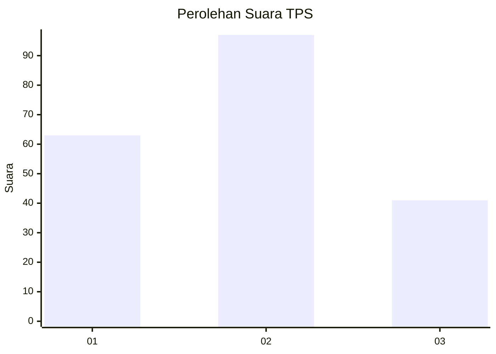
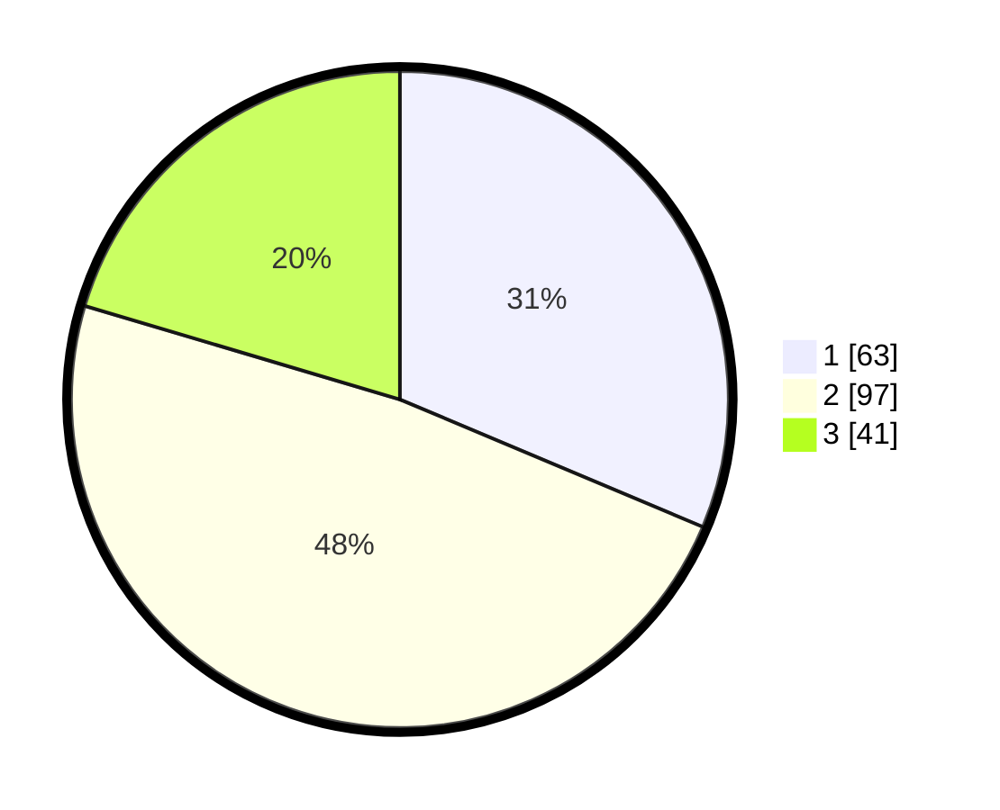

# Hasil

## Grafik

## Tabel

| No. | Nama Paslon    | Suara | Suara (raw) | Persentase |
|:--- |:-------------- | -----:| -----------:| ----------:|
| 1   | ANIES MUHAIMIN | 63    | [63][p-1]   | 31,34      |
| 2   | PRABOWO GIBRAN | 97    | [97][p-2]   | 48,26      |
| 3   | GANJAR MAHFUD  | 41    | [41][p-3]   | 20,40      |

[p-1]: https://github.com/gigit-pemilu/pemilu-2024/blob/main/pilpres/hitung-suara/sub/35-jawa-timur/sub/73-kota-malang/sub/03-kedungkandang/sub/1008-sawojajar/sub/054-tps/sub/paslon-1.txt
[p-2]: https://github.com/gigit-pemilu/pemilu-2024/blob/main/pilpres/hitung-suara/sub/35-jawa-timur/sub/73-kota-malang/sub/03-kedungkandang/sub/1008-sawojajar/sub/054-tps/sub/paslon-2.txt
[p-3]: https://github.com/gigit-pemilu/pemilu-2024/blob/main/pilpres/hitung-suara/sub/35-jawa-timur/sub/73-kota-malang/sub/03-kedungkandang/sub/1008-sawojajar/sub/054-tps/sub/paslon-3.txt

## Foto C Plano

https://sirekap-obj-formc.kpu.go.id/a4dd/pemilu/ppwp/35/73/03/10/08/3573031008054-20240214-232456--696e75ce-b464-47fd-885c-f578bff09a18.jpg

https://sirekap-obj-formc.kpu.go.id/a4dd/pemilu/ppwp/35/73/03/10/08/3573031008054-20240214-232750--bd81d724-79b7-48e8-baaf-74bd6d4c2557.jpg

https://sirekap-obj-formc.kpu.go.id/a4dd/pemilu/ppwp/35/73/03/10/08/3573031008054-20240214-232958--d4028cfc-351b-4a23-b56d-8cec0b020612.jpg

## Metadata

| Key        | Value               |
| ---------- | ------------------- |
| Time Stamp | 2024-02-24 22:31:28 |

