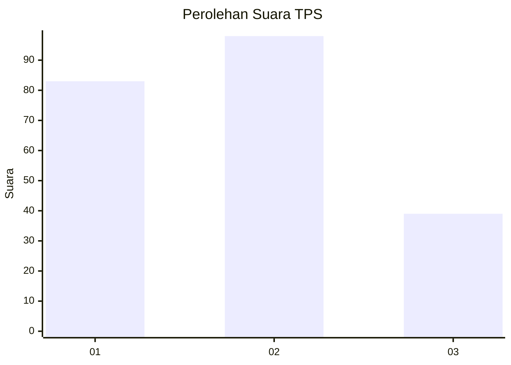
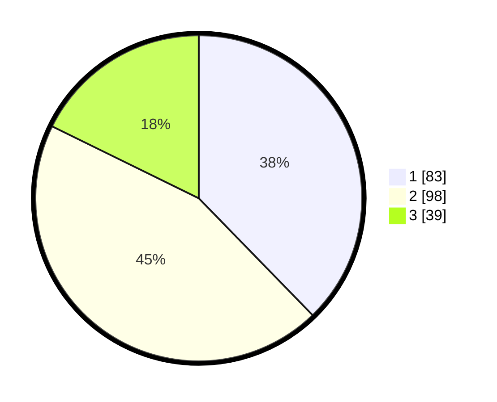

# Hasil

## Grafik

## Tabel

| No. | Nama Paslon    | Suara | Suara (raw) | Persentase |
|:--- |:-------------- | -----:| -----------:| ----------:|
| 1   | ANIES MUHAIMIN | 83    | [83][p-1]   | 37,73      |
| 2   | PRABOWO GIBRAN | 98    | [98][p-2]   | 44,55      |
| 3   | GANJAR MAHFUD  | 39    | [39][p-3]   | 17,73      |

[p-1]: https://github.com/gigit-pemilu/pemilu-2024-35-jawa-timur/blob/main/pilpres/hitung-suara/sub/35-jawa-timur/sub/73-kota-malang/sub/03-kedungkandang/sub/1008-sawojajar/sub/059-tps/sub/paslon-1.txt
[p-2]: https://github.com/gigit-pemilu/pemilu-2024-35-jawa-timur/blob/main/pilpres/hitung-suara/sub/35-jawa-timur/sub/73-kota-malang/sub/03-kedungkandang/sub/1008-sawojajar/sub/059-tps/sub/paslon-2.txt
[p-3]: https://github.com/gigit-pemilu/pemilu-2024-35-jawa-timur/blob/main/pilpres/hitung-suara/sub/35-jawa-timur/sub/73-kota-malang/sub/03-kedungkandang/sub/1008-sawojajar/sub/059-tps/sub/paslon-3.txt

## Foto C Plano

https://sirekap-obj-formc.kpu.go.id/88c0/pemilu/ppwp/35/73/03/10/08/3573031008059-20240214-191220--ad8cedf4-847a-400b-a42d-3cccf9458cb8.jpg

https://sirekap-obj-formc.kpu.go.id/88c0/pemilu/ppwp/35/73/03/10/08/3573031008059-20240214-194909--86963752-d6f7-4187-898f-3a88e3e52676.jpg

https://sirekap-obj-formc.kpu.go.id/88c0/pemilu/ppwp/35/73/03/10/08/3573031008059-20240214-195227--5580a1df-e9fa-4409-9535-0b7e381737bb.jpg

## Metadata

| Key        | Value               |
| ---------- | ------------------- |
| Time Stamp | 2024-02-24 22:31:28 |

