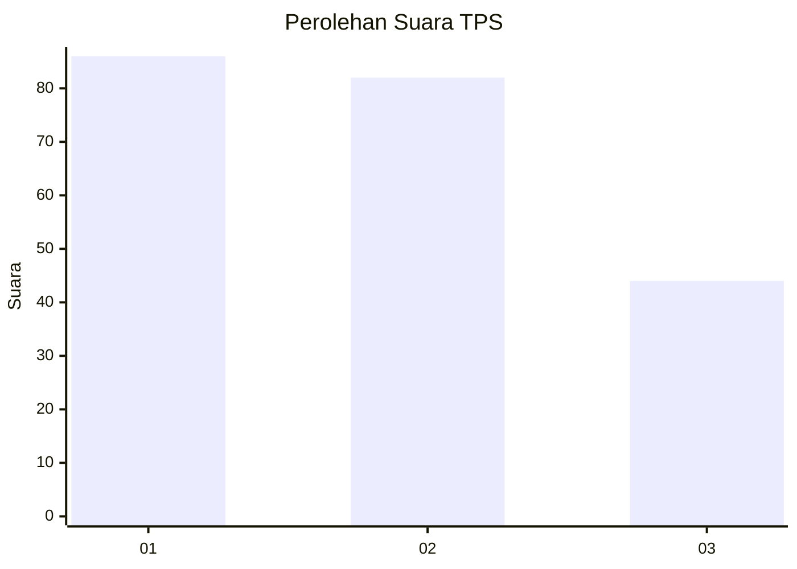
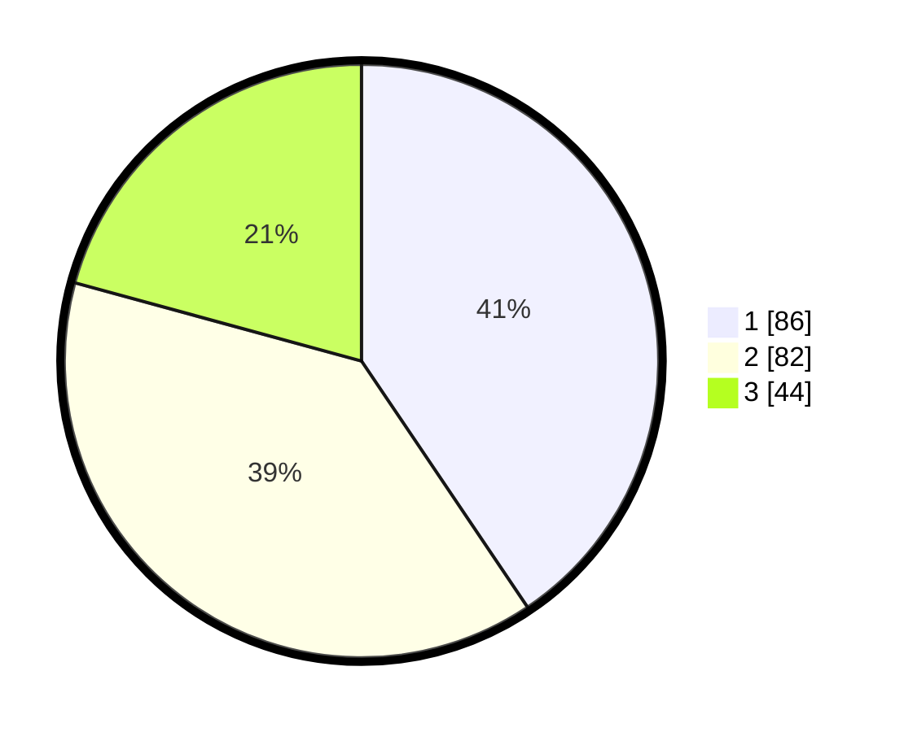

# Hasil

## Grafik

## Tabel

| No. | Nama Paslon    | Suara | Suara (raw) | Persentase |
|:--- |:-------------- | -----:| -----------:| ----------:|
| 1   | ANIES MUHAIMIN | 86    | [86][p-1]   | 40,57      |
| 2   | PRABOWO GIBRAN | 82    | [82][p-2]   | 38,68      |
| 3   | GANJAR MAHFUD  | 44    | [44][p-3]   | 20,75      |

[p-1]: https://github.com/gigit-pemilu/pemilu-2024-35-jawa-timur/blob/main/pilpres/hitung-suara/sub/35-jawa-timur/sub/73-kota-malang/sub/03-kedungkandang/sub/1008-sawojajar/sub/062-tps/sub/paslon-1.txt
[p-2]: https://github.com/gigit-pemilu/pemilu-2024-35-jawa-timur/blob/main/pilpres/hitung-suara/sub/35-jawa-timur/sub/73-kota-malang/sub/03-kedungkandang/sub/1008-sawojajar/sub/062-tps/sub/paslon-2.txt
[p-3]: https://github.com/gigit-pemilu/pemilu-2024-35-jawa-timur/blob/main/pilpres/hitung-suara/sub/35-jawa-timur/sub/73-kota-malang/sub/03-kedungkandang/sub/1008-sawojajar/sub/062-tps/sub/paslon-3.txt

## Foto C Plano

https://sirekap-obj-formc.kpu.go.id/94fa/pemilu/ppwp/35/73/03/10/08/3573031008062-20240215-194145--f2049378-15a4-4ea8-bcb4-c8cccdcfa2af.jpg

https://sirekap-obj-formc.kpu.go.id/94fa/pemilu/ppwp/35/73/03/10/08/3573031008062-20240215-194201--3f71ded1-9745-4849-b8dd-b2b9e7c78a6d.jpg

https://sirekap-obj-formc.kpu.go.id/94fa/pemilu/ppwp/35/73/03/10/08/3573031008062-20240215-194208--21ecde5c-fe21-4485-86ae-2761c0538de9.jpg

## Metadata

| Key        | Value               |
| ---------- | ------------------- |
| Time Stamp | 2024-02-25 12:00:00 |

