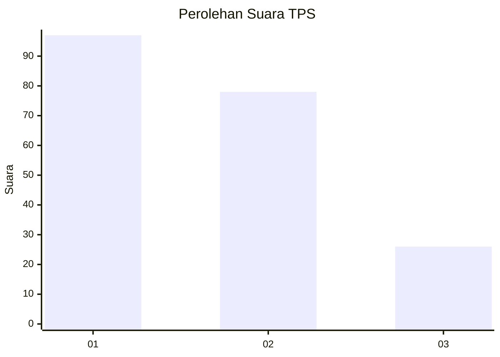
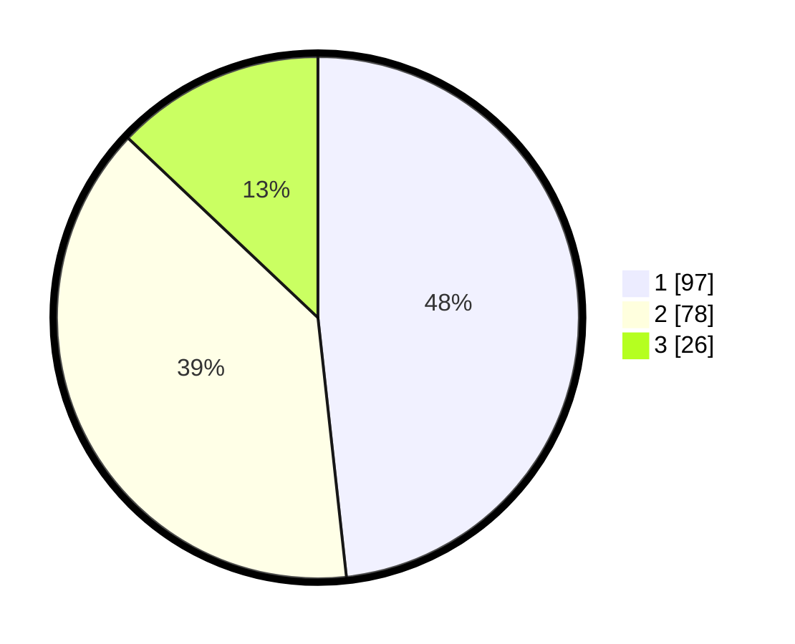

# Hasil

## Grafik

## Tabel

| No. | Nama Paslon    | Suara | Suara (raw) | Persentase |
|:--- |:-------------- | -----:| -----------:| ----------:|
| 1   | ANIES MUHAIMIN | 97    | [97][p-1]   | 48,26      |
| 2   | PRABOWO GIBRAN | 78    | [78][p-2]   | 38,81      |
| 3   | GANJAR MAHFUD  | 26    | [26][p-3]   | 12,94      |

[p-1]: https://github.com/gigit-pemilu/pemilu-2024/blob/main/pilpres/hitung-suara/sub/35-jawa-timur/sub/73-kota-malang/sub/03-kedungkandang/sub/1008-sawojajar/sub/065-tps/sub/paslon-1.txt
[p-2]: https://github.com/gigit-pemilu/pemilu-2024/blob/main/pilpres/hitung-suara/sub/35-jawa-timur/sub/73-kota-malang/sub/03-kedungkandang/sub/1008-sawojajar/sub/065-tps/sub/paslon-2.txt
[p-3]: https://github.com/gigit-pemilu/pemilu-2024/blob/main/pilpres/hitung-suara/sub/35-jawa-timur/sub/73-kota-malang/sub/03-kedungkandang/sub/1008-sawojajar/sub/065-tps/sub/paslon-3.txt

## Foto C Plano

https://sirekap-obj-formc.kpu.go.id/a70f/pemilu/ppwp/35/73/03/10/08/3573031008065-20240214-231644--9f2826d2-6b89-4379-8119-9dda89073452.jpg

https://sirekap-obj-formc.kpu.go.id/a70f/pemilu/ppwp/35/73/03/10/08/3573031008065-20240214-231746--70f3e6dc-a355-4731-bdcb-6183af80646f.jpg

https://sirekap-obj-formc.kpu.go.id/a70f/pemilu/ppwp/35/73/03/10/08/3573031008065-20240214-225617--de92d367-c713-4fb4-95d7-b3fcde1a64cf.jpg

## Metadata

| Key        | Value               |
| ---------- | ------------------- |
| Time Stamp | 2024-02-24 22:31:28 |

