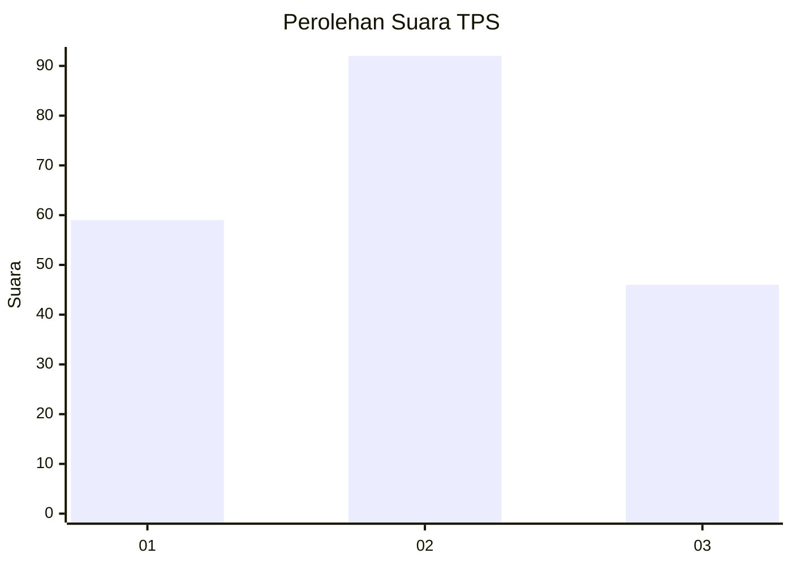
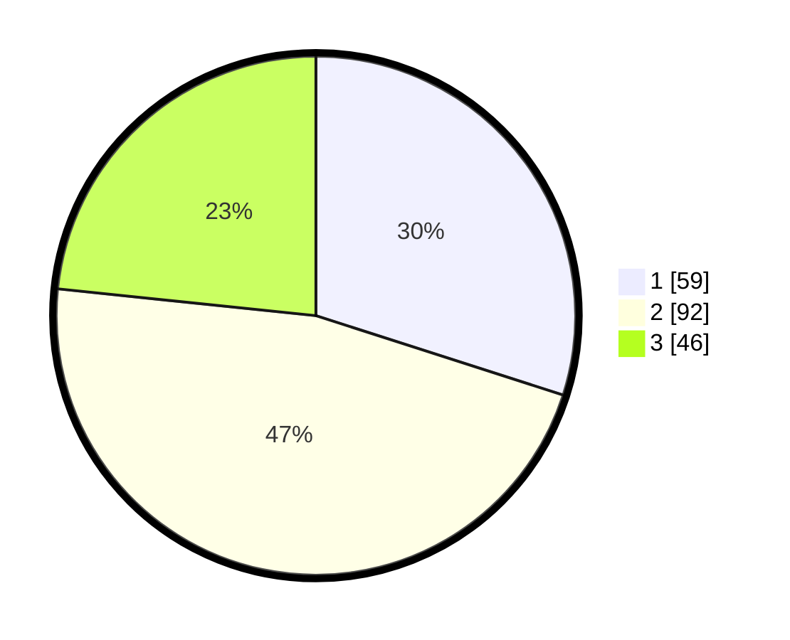

# Hasil

## Grafik

## Tabel

| No. | Nama Paslon    | Suara | Suara (raw) | Persentase |
|:--- |:-------------- | -----:| -----------:| ----------:|
| 1   | ANIES MUHAIMIN | 59    | [59][p-1]   | 29,95      |
| 2   | PRABOWO GIBRAN | 92    | [92][p-2]   | 46,70      |
| 3   | GANJAR MAHFUD  | 46    | [46][p-3]   | 23,35      |

[p-1]: https://github.com/gigit-pemilu/pemilu-2024-35-jawa-timur/blob/main/pilpres/hitung-suara/sub/35-jawa-timur/sub/73-kota-malang/sub/03-kedungkandang/sub/1008-sawojajar/sub/069-tps/sub/paslon-1.txt
[p-2]: https://github.com/gigit-pemilu/pemilu-2024-35-jawa-timur/blob/main/pilpres/hitung-suara/sub/35-jawa-timur/sub/73-kota-malang/sub/03-kedungkandang/sub/1008-sawojajar/sub/069-tps/sub/paslon-2.txt
[p-3]: https://github.com/gigit-pemilu/pemilu-2024-35-jawa-timur/blob/main/pilpres/hitung-suara/sub/35-jawa-timur/sub/73-kota-malang/sub/03-kedungkandang/sub/1008-sawojajar/sub/069-tps/sub/paslon-3.txt

## Foto C Plano

https://sirekap-obj-formc.kpu.go.id/7b0a/pemilu/ppwp/35/73/03/10/08/3573031008069-20240214-230757--72eb524d-e8d1-458b-afd6-78b6902ca4a6.jpg

https://sirekap-obj-formc.kpu.go.id/7b0a/pemilu/ppwp/35/73/03/10/08/3573031008069-20240214-230832--6f6961b3-2ca4-4460-ba0e-ce860a8d866b.jpg

https://sirekap-obj-formc.kpu.go.id/7b0a/pemilu/ppwp/35/73/03/10/08/3573031008069-20240214-230903--fd8c1144-17d8-40f9-b2eb-e9a74aa8c7d6.jpg

## Metadata

| Key        | Value               |
| ---------- | ------------------- |
| Time Stamp | 2024-02-25 11:00:00 |

