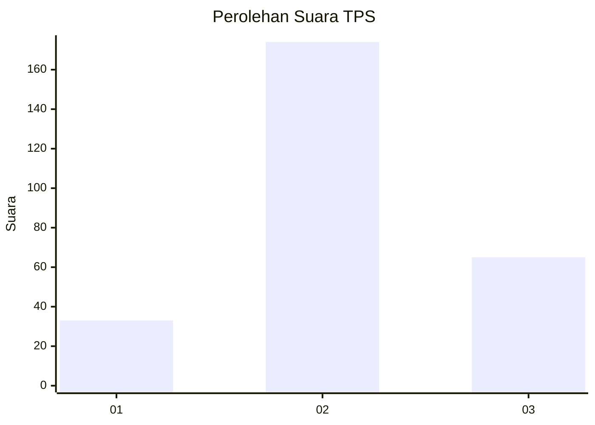
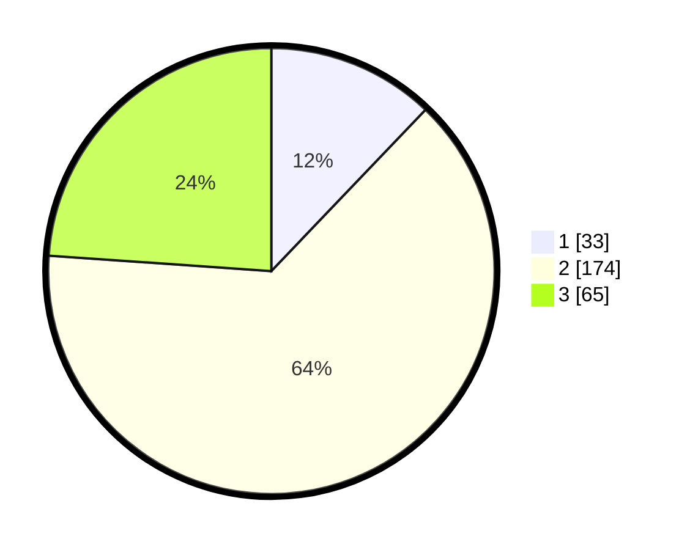

# Hasil

## Grafik

## Tabel

| No. | Nama Paslon    | Suara | Suara (raw) | Persentase |
|:--- |:-------------- | -----:| -----------:| ----------:|
| 1   | ANIES MUHAIMIN | 33    | [33][p-1]   | 12,13      |
| 2   | PRABOWO GIBRAN | 174   | [174][p-2]  | 63,97      |
| 3   | GANJAR MAHFUD  | 65    | [65][p-3]   | 23,90      |

[p-1]: https://github.com/gigit-pemilu/pemilu-2024/blob/main/pilpres/hitung-suara/sub/35-jawa-timur/sub/73-kota-malang/sub/03-kedungkandang/sub/1010-cemorokandang/sub/015-tps/sub/paslon-1.txt
[p-2]: https://github.com/gigit-pemilu/pemilu-2024/blob/main/pilpres/hitung-suara/sub/35-jawa-timur/sub/73-kota-malang/sub/03-kedungkandang/sub/1010-cemorokandang/sub/015-tps/sub/paslon-2.txt
[p-3]: https://github.com/gigit-pemilu/pemilu-2024/blob/main/pilpres/hitung-suara/sub/35-jawa-timur/sub/73-kota-malang/sub/03-kedungkandang/sub/1010-cemorokandang/sub/015-tps/sub/paslon-3.txt

## Foto C Plano

https://sirekap-obj-formc.kpu.go.id/3621/pemilu/ppwp/35/73/03/10/10/3573031010015-20240214-212404--79dbfd02-ebf0-40e8-a0d7-790a3887403f.jpg

https://sirekap-obj-formc.kpu.go.id/3621/pemilu/ppwp/35/73/03/10/10/3573031010015-20240214-212647--30592cc9-b0ec-4a2c-b5b1-058410ed3ac0.jpg

https://sirekap-obj-formc.kpu.go.id/3621/pemilu/ppwp/35/73/03/10/10/3573031010015-20240214-213014--d6445852-0081-42d8-8429-6c009067104e.jpg

## Metadata

| Key        | Value               |
| ---------- | ------------------- |
| Time Stamp | 2024-02-24 22:31:28 |

