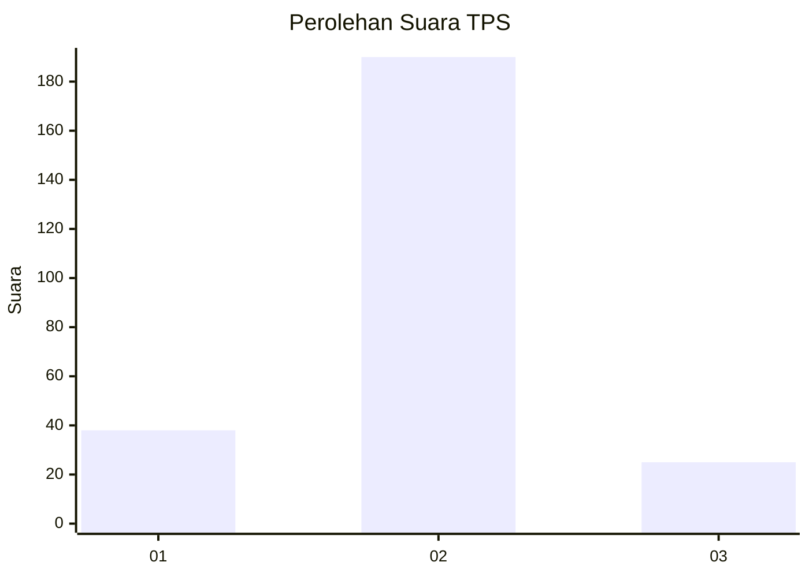
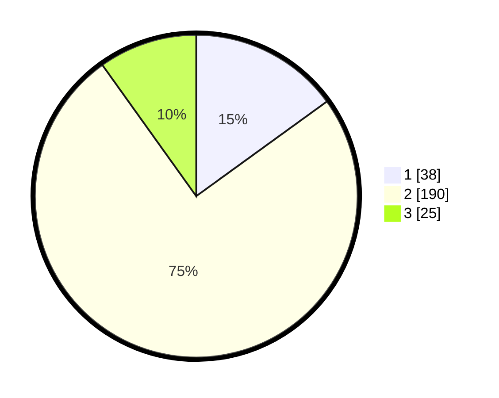

# Hasil

## Grafik

## Tabel

| No. | Nama Paslon    | Suara | Suara (raw) | Persentase |
|:--- |:-------------- | -----:| -----------:| ----------:|
| 1   | ANIES MUHAIMIN | 38    | [38][p-1]   | 15,02      |
| 2   | PRABOWO GIBRAN | 190   | [190][p-2]  | 75,10      |
| 3   | GANJAR MAHFUD  | 25    | [25][p-3]   | 9,88       |

[p-1]: https://github.com/gigit-pemilu/pemilu-2024/blob/main/pilpres/hitung-suara/sub/35-jawa-timur/sub/73-kota-malang/sub/04-sukun/sub/1001-ciptomulyo/sub/006-tps/sub/paslon-1.txt
[p-2]: https://github.com/gigit-pemilu/pemilu-2024/blob/main/pilpres/hitung-suara/sub/35-jawa-timur/sub/73-kota-malang/sub/04-sukun/sub/1001-ciptomulyo/sub/006-tps/sub/paslon-2.txt
[p-3]: https://github.com/gigit-pemilu/pemilu-2024/blob/main/pilpres/hitung-suara/sub/35-jawa-timur/sub/73-kota-malang/sub/04-sukun/sub/1001-ciptomulyo/sub/006-tps/sub/paslon-3.txt

## Foto C Plano

https://sirekap-obj-formc.kpu.go.id/cfbf/pemilu/ppwp/35/73/04/10/01/3573041001006-20240214-221400--fb1c42d6-6d6c-47fb-86e6-04b0cadae378.jpg

https://sirekap-obj-formc.kpu.go.id/cfbf/pemilu/ppwp/35/73/04/10/01/3573041001006-20240214-221752--77d45377-ace8-4fa2-a7ac-932ecf4fa6fd.jpg

https://sirekap-obj-formc.kpu.go.id/cfbf/pemilu/ppwp/35/73/04/10/01/3573041001006-20240214-221323--f537695b-d4de-4f2c-92b2-10c741ba1f6d.jpg

## Metadata

| Key        | Value               |
| ---------- | ------------------- |
| Time Stamp | 2024-02-24 22:31:28 |

