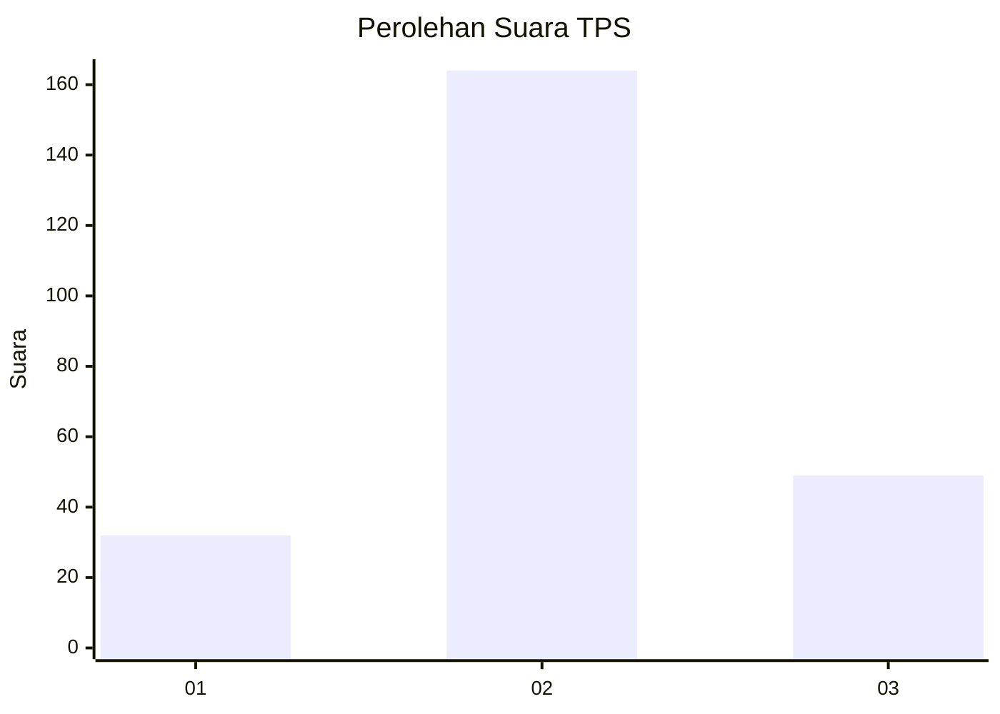
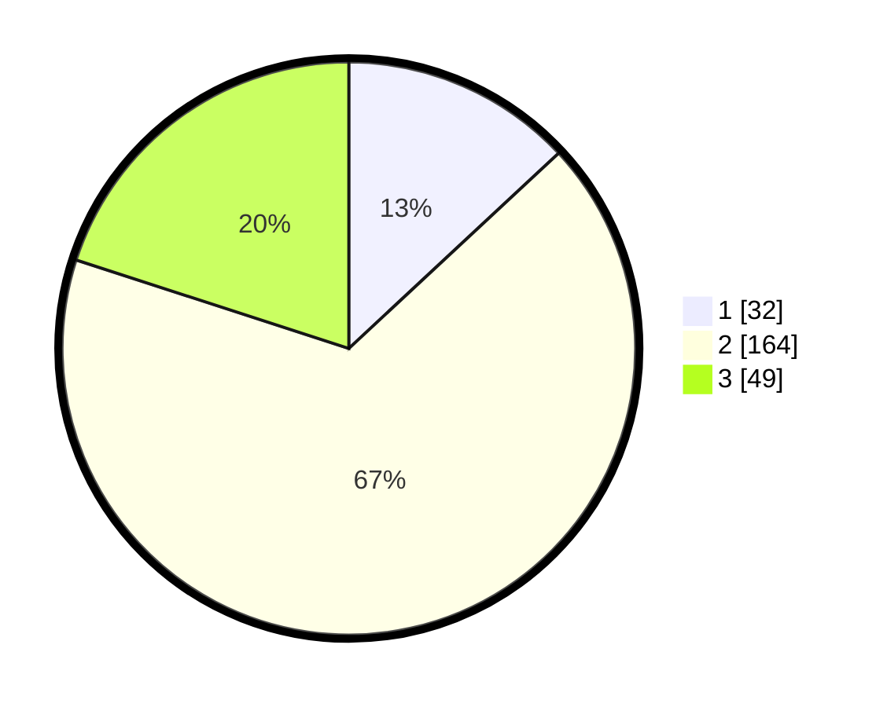

# Hasil

## Grafik

## Tabel

| No. | Nama Paslon    | Suara | Suara (raw) | Persentase |
|:--- |:-------------- | -----:| -----------:| ----------:|
| 1   | ANIES MUHAIMIN | 32    | [32][p-1]   | 13,06      |
| 2   | PRABOWO GIBRAN | 164   | [164][p-2]  | 66,94      |
| 3   | GANJAR MAHFUD  | 49    | [49][p-3]   | 20,00      |

[p-1]: https://github.com/gigit-pemilu/pemilu-2024-35-jawa-timur/blob/main/pilpres/hitung-suara/sub/35-jawa-timur/sub/73-kota-malang/sub/04-sukun/sub/1001-ciptomulyo/sub/019-tps/sub/paslon-1.txt
[p-2]: https://github.com/gigit-pemilu/pemilu-2024-35-jawa-timur/blob/main/pilpres/hitung-suara/sub/35-jawa-timur/sub/73-kota-malang/sub/04-sukun/sub/1001-ciptomulyo/sub/019-tps/sub/paslon-2.txt
[p-3]: https://github.com/gigit-pemilu/pemilu-2024-35-jawa-timur/blob/main/pilpres/hitung-suara/sub/35-jawa-timur/sub/73-kota-malang/sub/04-sukun/sub/1001-ciptomulyo/sub/019-tps/sub/paslon-3.txt

## Foto C Plano

https://sirekap-obj-formc.kpu.go.id/51d8/pemilu/ppwp/35/73/04/10/01/3573041001019-20240214-222904--c9b80f58-6d98-4570-9660-7e9968ed0df6.jpg

https://sirekap-obj-formc.kpu.go.id/51d8/pemilu/ppwp/35/73/04/10/01/3573041001019-20240214-223015--57db88c9-88e0-4345-9fb1-b08bc7102d7c.jpg

https://sirekap-obj-formc.kpu.go.id/51d8/pemilu/ppwp/35/73/04/10/01/3573041001019-20240214-223041--45677e68-6074-4a08-99e0-925c14144d4a.jpg

## Metadata

| Key        | Value               |
| ---------- | ------------------- |
| Time Stamp | 2024-02-25 12:00:00 |

