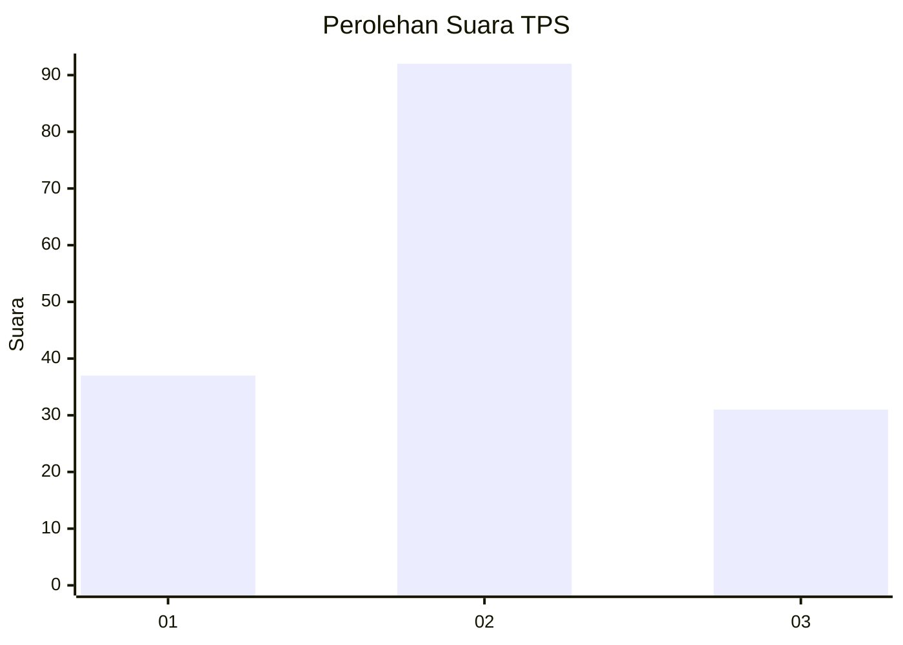
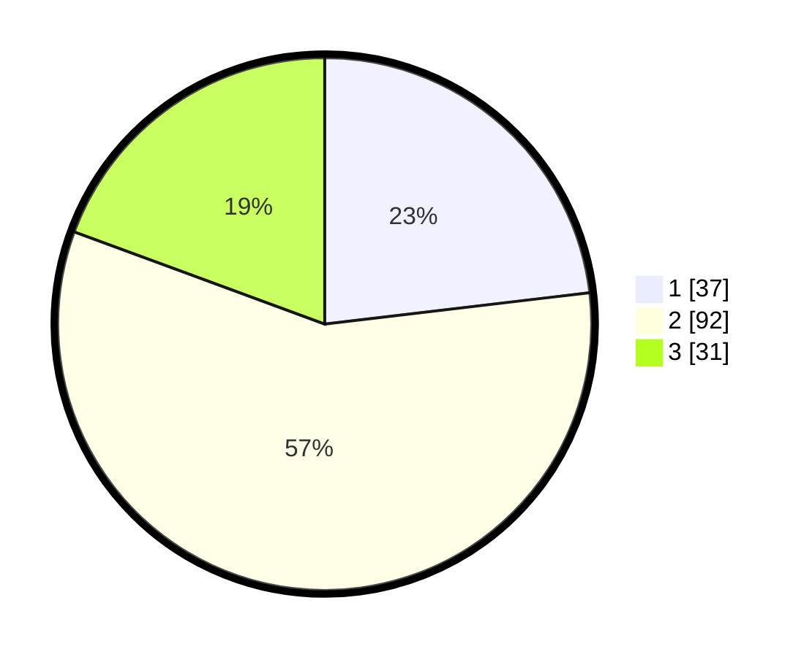

# Hasil

## Grafik

## Tabel

| No. | Nama Paslon    | Suara | Suara (raw) | Persentase |
|:--- |:-------------- | -----:| -----------:| ----------:|
| 1   | ANIES MUHAIMIN | 37    | [37][p-1]   | 23,13      |
| 2   | PRABOWO GIBRAN | 92    | [92][p-2]   | 57,50      |
| 3   | GANJAR MAHFUD  | 31    | [31][p-3]   | 19,38      |

[p-1]: https://github.com/gigit-pemilu/pemilu-2024/blob/main/pilpres/hitung-suara/sub/35-jawa-timur/sub/73-kota-malang/sub/04-sukun/sub/1001-ciptomulyo/sub/030-tps/sub/paslon-1.txt
[p-2]: https://github.com/gigit-pemilu/pemilu-2024/blob/main/pilpres/hitung-suara/sub/35-jawa-timur/sub/73-kota-malang/sub/04-sukun/sub/1001-ciptomulyo/sub/030-tps/sub/paslon-2.txt
[p-3]: https://github.com/gigit-pemilu/pemilu-2024/blob/main/pilpres/hitung-suara/sub/35-jawa-timur/sub/73-kota-malang/sub/04-sukun/sub/1001-ciptomulyo/sub/030-tps/sub/paslon-3.txt

## Foto C Plano

https://sirekap-obj-formc.kpu.go.id/b324/pemilu/ppwp/35/73/04/10/01/3573041001030-20240214-211609--143c6177-aea7-4475-871a-920bf2f85184.jpg

https://sirekap-obj-formc.kpu.go.id/b324/pemilu/ppwp/35/73/04/10/01/3573041001030-20240214-211805--ee6d58b9-06a7-45da-9367-6d2ebedd7808.jpg

https://sirekap-obj-formc.kpu.go.id/b324/pemilu/ppwp/35/73/04/10/01/3573041001030-20240214-211914--a8d3da37-872c-4ac9-a2f6-0bddcc8cb98f.jpg

## Metadata

| Key        | Value               |
| ---------- | ------------------- |
| Time Stamp | 2024-02-25 18:00:00 |

