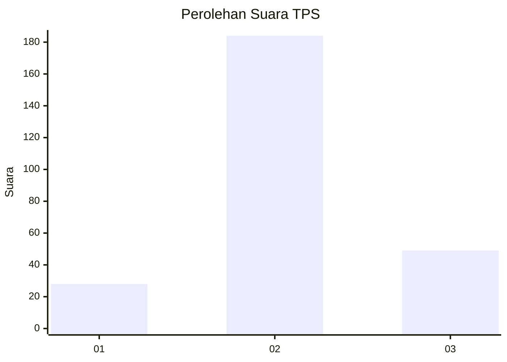
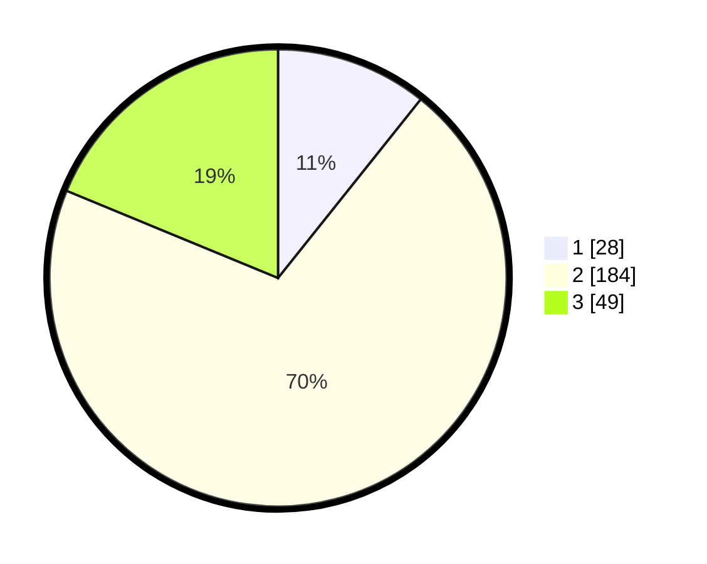

# Hasil

## Grafik

## Tabel

| No. | Nama Paslon    | Suara | Suara (raw) | Persentase |
|:--- |:-------------- | -----:| -----------:| ----------:|
| 1   | ANIES MUHAIMIN | 28    | [28][p-1]   | 10,73      |
| 2   | PRABOWO GIBRAN | 184   | [184][p-2]  | 70,50      |
| 3   | GANJAR MAHFUD  | 49    | [49][p-3]   | 18,77      |

[p-1]: https://github.com/gigit-pemilu/pemilu-2024-35-jawa-timur/blob/main/pilpres/hitung-suara/sub/35-jawa-timur/sub/73-kota-malang/sub/04-sukun/sub/1001-ciptomulyo/sub/033-tps/sub/paslon-1.txt
[p-2]: https://github.com/gigit-pemilu/pemilu-2024-35-jawa-timur/blob/main/pilpres/hitung-suara/sub/35-jawa-timur/sub/73-kota-malang/sub/04-sukun/sub/1001-ciptomulyo/sub/033-tps/sub/paslon-2.txt
[p-3]: https://github.com/gigit-pemilu/pemilu-2024-35-jawa-timur/blob/main/pilpres/hitung-suara/sub/35-jawa-timur/sub/73-kota-malang/sub/04-sukun/sub/1001-ciptomulyo/sub/033-tps/sub/paslon-3.txt

## Foto C Plano

https://sirekap-obj-formc.kpu.go.id/d535/pemilu/ppwp/35/73/04/10/01/3573041001033-20240214-214355--b827c240-965b-4e95-ab21-716536a0e52c.jpg

https://sirekap-obj-formc.kpu.go.id/d535/pemilu/ppwp/35/73/04/10/01/3573041001033-20240214-214546--75d3bc4c-afcd-4a9c-843e-2e805e4d82af.jpg

https://sirekap-obj-formc.kpu.go.id/d535/pemilu/ppwp/35/73/04/10/01/3573041001033-20240214-214644--5352e1d4-e7ab-4355-bf3b-82dd5e0b5ceb.jpg

## Metadata

| Key        | Value               |
| ---------- | ------------------- |
| Time Stamp | 2024-02-25 21:00:00 |

