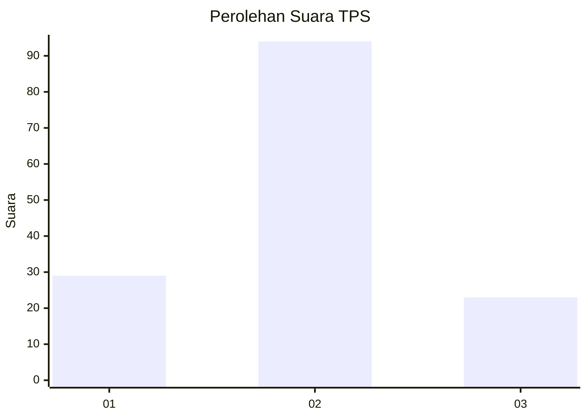
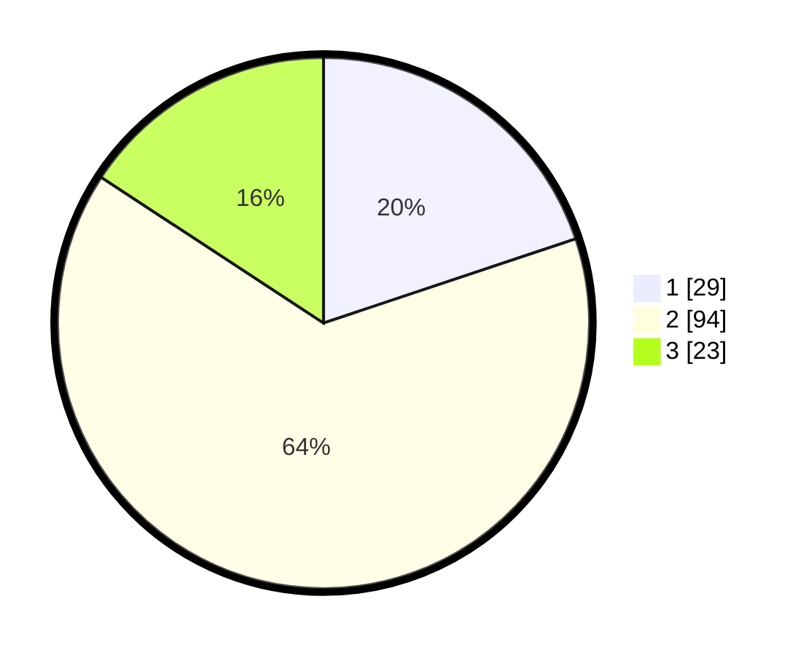

# Hasil

## Grafik

## Tabel

| No. | Nama Paslon    | Suara | Suara (raw) | Persentase |
|:--- |:-------------- | -----:| -----------:| ----------:|
| 1   | ANIES MUHAIMIN | 29    | [29][p-1]   | 19,86      |
| 2   | PRABOWO GIBRAN | 94    | [94][p-2]   | 64,38      |
| 3   | GANJAR MAHFUD  | 23    | [23][p-3]   | 15,75      |

[p-1]: https://github.com/gigit-pemilu/pemilu-2024-35-jawa-timur/blob/main/pilpres/hitung-suara/sub/35-jawa-timur/sub/73-kota-malang/sub/04-sukun/sub/1002-gadang/sub/056-tps/sub/paslon-1.txt
[p-2]: https://github.com/gigit-pemilu/pemilu-2024-35-jawa-timur/blob/main/pilpres/hitung-suara/sub/35-jawa-timur/sub/73-kota-malang/sub/04-sukun/sub/1002-gadang/sub/056-tps/sub/paslon-2.txt
[p-3]: https://github.com/gigit-pemilu/pemilu-2024-35-jawa-timur/blob/main/pilpres/hitung-suara/sub/35-jawa-timur/sub/73-kota-malang/sub/04-sukun/sub/1002-gadang/sub/056-tps/sub/paslon-3.txt

## Foto C Plano

https://sirekap-obj-formc.kpu.go.id/58ad/pemilu/ppwp/35/73/04/10/02/3573041002056-20240215-005412--7d375b48-d657-4bb8-b613-2d9ea2dbe2c7.jpg

https://sirekap-obj-formc.kpu.go.id/58ad/pemilu/ppwp/35/73/04/10/02/3573041002056-20240215-005458--489e0efb-7d01-4b94-ad40-8bf3e993139a.jpg

https://sirekap-obj-formc.kpu.go.id/58ad/pemilu/ppwp/35/73/04/10/02/3573041002056-20240215-005531--d4fbaeff-ead3-4578-b812-bd5869dcd2d6.jpg

## Metadata

| Key        | Value               |
| ---------- | ------------------- |
| Time Stamp | 2024-02-25 16:00:00 |

