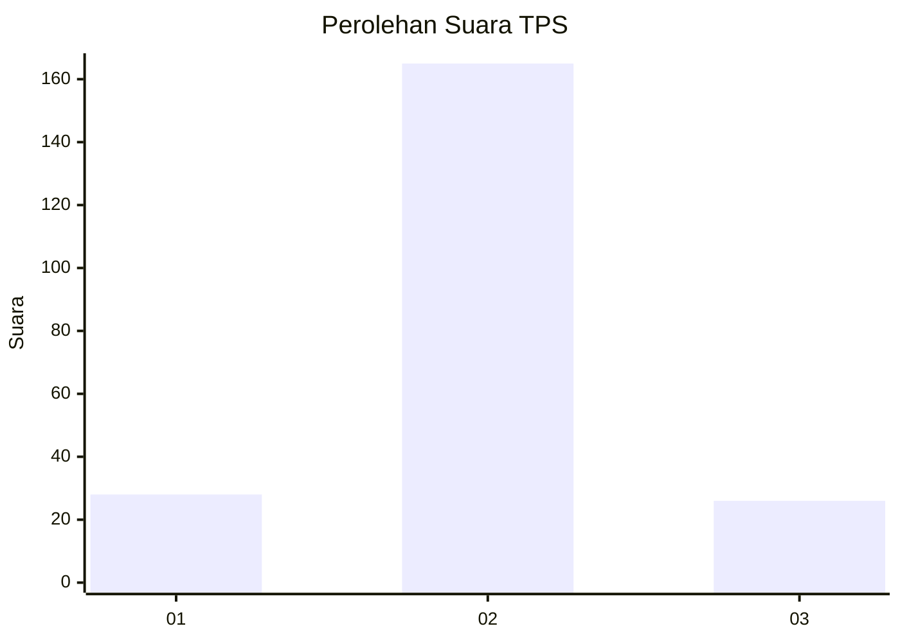
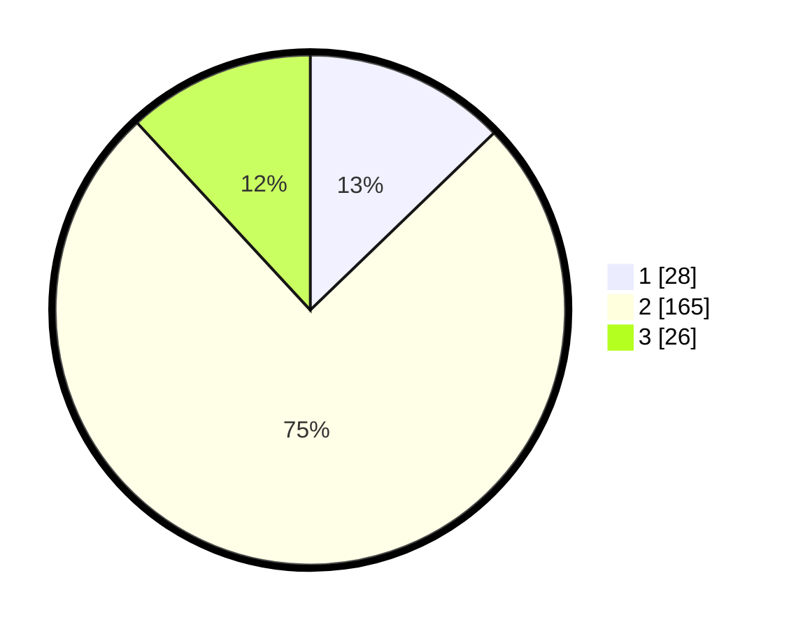

# Hasil

## Grafik

## Tabel

| No. | Nama Paslon    | Suara | Suara (raw) | Persentase |
|:--- |:-------------- | -----:| -----------:| ----------:|
| 1   | ANIES MUHAIMIN | 28    | [28][p-1]   | 12,79      |
| 2   | PRABOWO GIBRAN | 165   | [165][p-2]  | 75,34      |
| 3   | GANJAR MAHFUD  | 26    | [26][p-3]   | 11,87      |

[p-1]: https://github.com/gigit-pemilu/pemilu-2024/blob/main/pilpres/hitung-suara/sub/35-jawa-timur/sub/73-kota-malang/sub/04-sukun/sub/1004-bandungrejosari/sub/005-tps/sub/paslon-1.txt
[p-2]: https://github.com/gigit-pemilu/pemilu-2024/blob/main/pilpres/hitung-suara/sub/35-jawa-timur/sub/73-kota-malang/sub/04-sukun/sub/1004-bandungrejosari/sub/005-tps/sub/paslon-2.txt
[p-3]: https://github.com/gigit-pemilu/pemilu-2024/blob/main/pilpres/hitung-suara/sub/35-jawa-timur/sub/73-kota-malang/sub/04-sukun/sub/1004-bandungrejosari/sub/005-tps/sub/paslon-3.txt

## Foto C Plano

https://sirekap-obj-formc.kpu.go.id/7593/pemilu/ppwp/35/73/04/10/04/3573041004005-20240214-232329--bb6146aa-f159-4cd4-85e6-1f94b7620769.jpg

https://sirekap-obj-formc.kpu.go.id/7593/pemilu/ppwp/35/73/04/10/04/3573041004005-20240214-232401--1c7fae87-cb4a-4697-a76f-cb43fcbc7d20.jpg

https://sirekap-obj-formc.kpu.go.id/7593/pemilu/ppwp/35/73/04/10/04/3573041004005-20240214-232444--4d9f4ab1-e307-4e0a-b806-8bd0e40398ca.jpg

## Metadata

| Key        | Value               |
| ---------- | ------------------- |
| Time Stamp | 2024-02-25 16:00:00 |

