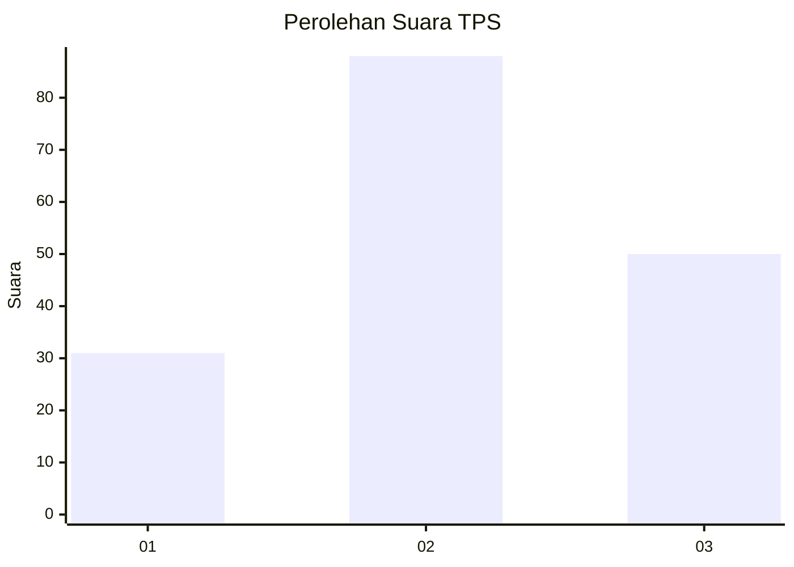
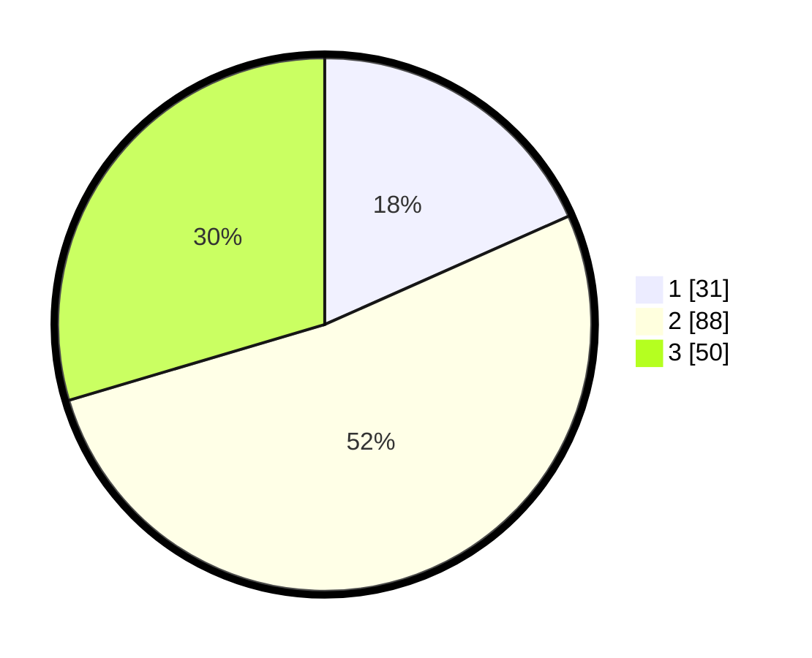

# Hasil

## Grafik

## Tabel

| No. | Nama Paslon    | Suara | Suara (raw) | Persentase |
|:--- |:-------------- | -----:| -----------:| ----------:|
| 1   | ANIES MUHAIMIN | 31    | [31][p-1]   | 18,34      |
| 2   | PRABOWO GIBRAN | 88    | [88][p-2]   | 52,07      |
| 3   | GANJAR MAHFUD  | 50    | [50][p-3]   | 29,59      |

[p-1]: https://github.com/gigit-pemilu/pemilu-2024/blob/main/pilpres/hitung-suara/sub/35-jawa-timur/sub/73-kota-malang/sub/04-sukun/sub/1006-tanjungrejo/sub/065-tps/sub/paslon-1.txt
[p-2]: https://github.com/gigit-pemilu/pemilu-2024/blob/main/pilpres/hitung-suara/sub/35-jawa-timur/sub/73-kota-malang/sub/04-sukun/sub/1006-tanjungrejo/sub/065-tps/sub/paslon-2.txt
[p-3]: https://github.com/gigit-pemilu/pemilu-2024/blob/main/pilpres/hitung-suara/sub/35-jawa-timur/sub/73-kota-malang/sub/04-sukun/sub/1006-tanjungrejo/sub/065-tps/sub/paslon-3.txt

## Foto C Plano

https://sirekap-obj-formc.kpu.go.id/1d88/pemilu/ppwp/35/73/04/10/06/3573041006065-20240214-231036--a56ac6ce-f680-44d3-ab2b-9b0ed7b8bb77.jpg

https://sirekap-obj-formc.kpu.go.id/1d88/pemilu/ppwp/35/73/04/10/06/3573041006065-20240214-230751--10c21676-7cc2-4575-ac11-8ffdcd2f639f.jpg

https://sirekap-obj-formc.kpu.go.id/1d88/pemilu/ppwp/35/73/04/10/06/3573041006065-20240214-230645--9f6bb459-0e1f-43a5-8656-f1fe45745b0e.jpg

## Metadata

| Key        | Value               |
| ---------- | ------------------- |
| Time Stamp | 2024-02-25 12:00:00 |

