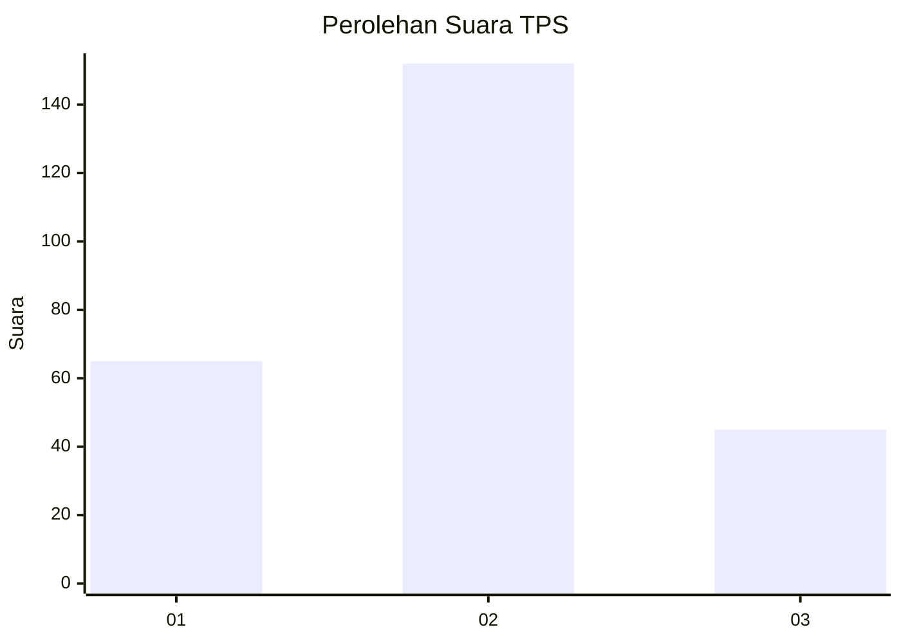
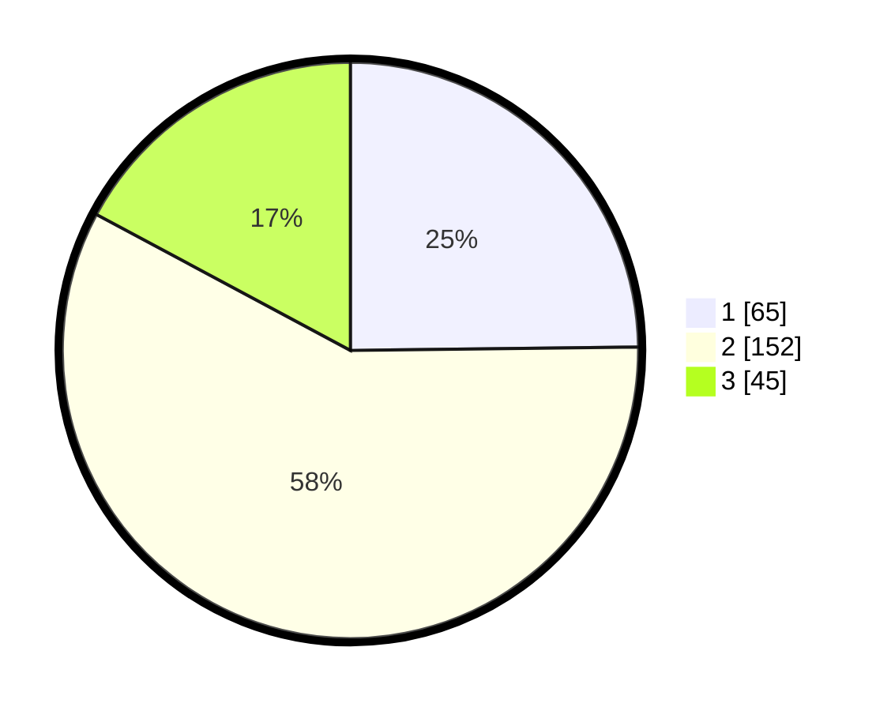

# Hasil

## Grafik

## Tabel

| No. | Nama Paslon    | Suara | Suara (raw) | Persentase |
|:--- |:-------------- | -----:| -----------:| ----------:|
| 1   | ANIES MUHAIMIN | 65    | [65][p-1]   | 24,81      |
| 2   | PRABOWO GIBRAN | 152   | [152][p-2]  | 58,02      |
| 3   | GANJAR MAHFUD  | 45    | [45][p-3]   | 17,18      |

[p-1]: https://github.com/gigit-pemilu/pemilu-2024/blob/main/pilpres/hitung-suara/sub/35-jawa-timur/sub/73-kota-malang/sub/04-sukun/sub/1007-pisangcandi/sub/021-tps/sub/paslon-1.txt
[p-2]: https://github.com/gigit-pemilu/pemilu-2024/blob/main/pilpres/hitung-suara/sub/35-jawa-timur/sub/73-kota-malang/sub/04-sukun/sub/1007-pisangcandi/sub/021-tps/sub/paslon-2.txt
[p-3]: https://github.com/gigit-pemilu/pemilu-2024/blob/main/pilpres/hitung-suara/sub/35-jawa-timur/sub/73-kota-malang/sub/04-sukun/sub/1007-pisangcandi/sub/021-tps/sub/paslon-3.txt

## Foto C Plano

https://sirekap-obj-formc.kpu.go.id/de9b/pemilu/ppwp/35/73/04/10/07/3573041007021-20240214-231336--f437fac5-6800-4fbb-ac73-0c768df3da8e.jpg

https://sirekap-obj-formc.kpu.go.id/de9b/pemilu/ppwp/35/73/04/10/07/3573041007021-20240214-231512--9efe7224-5f0b-44f6-b895-bd7b8b59b3f8.jpg

https://sirekap-obj-formc.kpu.go.id/de9b/pemilu/ppwp/35/73/04/10/07/3573041007021-20240214-231635--19bbd43e-bf9b-4c84-924c-f57e23e5f943.jpg

## Metadata

| Key        | Value               |
| ---------- | ------------------- |
| Time Stamp | 2024-02-25 13:00:00 |

