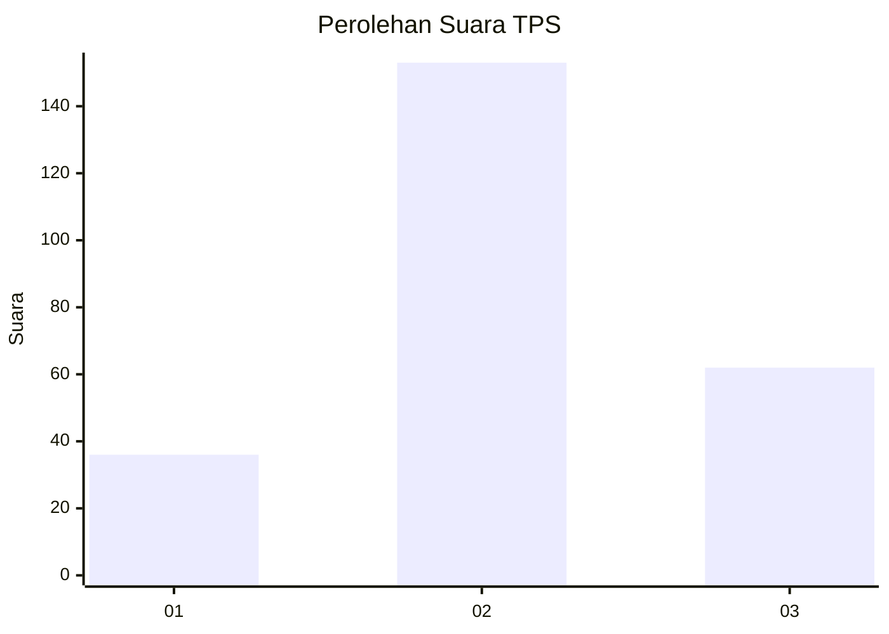
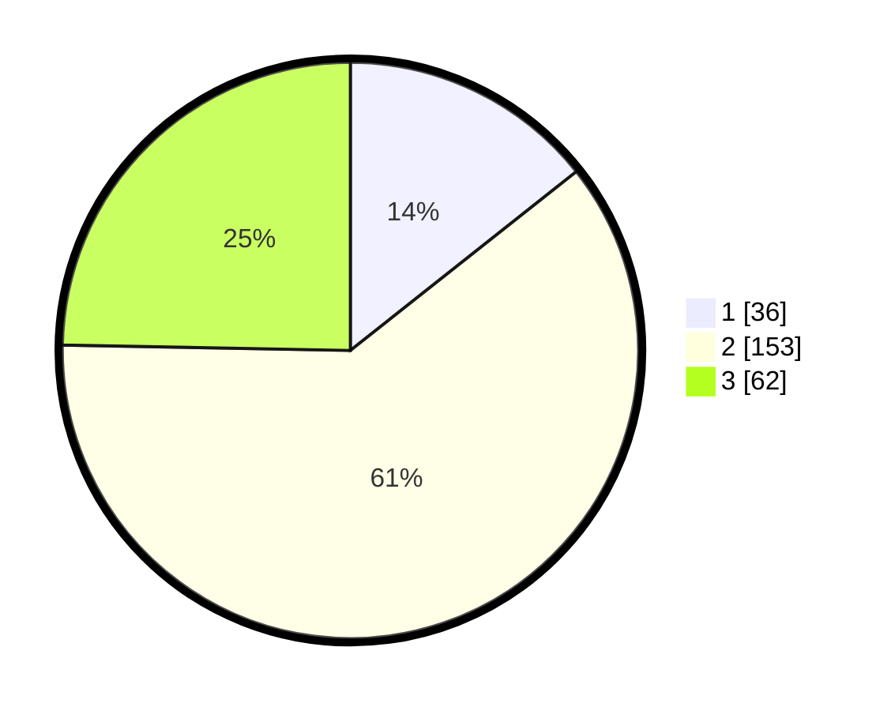

# Hasil

## Grafik

## Tabel

| No. | Nama Paslon    | Suara | Suara (raw) | Persentase |
|:--- |:-------------- | -----:| -----------:| ----------:|
| 1   | ANIES MUHAIMIN | 36    | [36][p-1]   | 14,34      |
| 2   | PRABOWO GIBRAN | 153   | [153][p-2]  | 60,96      |
| 3   | GANJAR MAHFUD  | 62    | [62][p-3]   | 24,70      |

[p-1]: https://github.com/gigit-pemilu/pemilu-2024/blob/main/pilpres/hitung-suara/sub/35-jawa-timur/sub/73-kota-malang/sub/04-sukun/sub/1007-pisangcandi/sub/022-tps/sub/paslon-1.txt
[p-2]: https://github.com/gigit-pemilu/pemilu-2024/blob/main/pilpres/hitung-suara/sub/35-jawa-timur/sub/73-kota-malang/sub/04-sukun/sub/1007-pisangcandi/sub/022-tps/sub/paslon-2.txt
[p-3]: https://github.com/gigit-pemilu/pemilu-2024/blob/main/pilpres/hitung-suara/sub/35-jawa-timur/sub/73-kota-malang/sub/04-sukun/sub/1007-pisangcandi/sub/022-tps/sub/paslon-3.txt

## Foto C Plano

https://sirekap-obj-formc.kpu.go.id/c7d6/pemilu/ppwp/35/73/04/10/07/3573041007022-20240215-001749--e781fe51-603c-418d-966c-09344759bd2f.jpg

https://sirekap-obj-formc.kpu.go.id/c7d6/pemilu/ppwp/35/73/04/10/07/3573041007022-20240215-002005--d068a92d-4616-47a2-ab8e-3fa0edec6dfc.jpg

https://sirekap-obj-formc.kpu.go.id/c7d6/pemilu/ppwp/35/73/04/10/07/3573041007022-20240215-002123--ebe712a8-7395-4b23-b826-78245ba07f6f.jpg

## Metadata

| Key        | Value               |
| ---------- | ------------------- |
| Time Stamp | 2024-02-25 13:00:00 |

