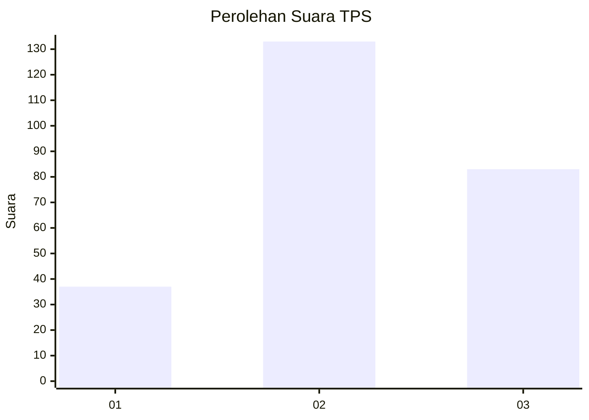
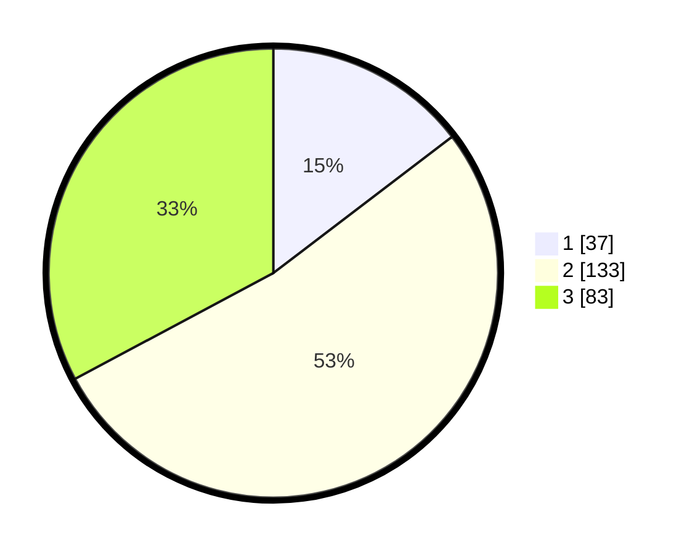

# Hasil

## Grafik

## Tabel

| No. | Nama Paslon    | Suara | Suara (raw) | Persentase |
|:--- |:-------------- | -----:| -----------:| ----------:|
| 1   | ANIES MUHAIMIN | 37    | [37][p-1]   | 14,62      |
| 2   | PRABOWO GIBRAN | 133   | [133][p-2]  | 52,57      |
| 3   | GANJAR MAHFUD  | 83    | [83][p-3]   | 32,81      |

[p-1]: https://github.com/gigit-pemilu/pemilu-2024-35-jawa-timur/blob/main/pilpres/hitung-suara/sub/35-jawa-timur/sub/73-kota-malang/sub/04-sukun/sub/1008-bandulan/sub/020-tps/sub/paslon-1.txt
[p-2]: https://github.com/gigit-pemilu/pemilu-2024-35-jawa-timur/blob/main/pilpres/hitung-suara/sub/35-jawa-timur/sub/73-kota-malang/sub/04-sukun/sub/1008-bandulan/sub/020-tps/sub/paslon-2.txt
[p-3]: https://github.com/gigit-pemilu/pemilu-2024-35-jawa-timur/blob/main/pilpres/hitung-suara/sub/35-jawa-timur/sub/73-kota-malang/sub/04-sukun/sub/1008-bandulan/sub/020-tps/sub/paslon-3.txt

## Foto C Plano

https://sirekap-obj-formc.kpu.go.id/092d/pemilu/ppwp/35/73/04/10/08/3573041008020-20240214-215840--09e80070-01ef-4d20-ad67-106d9f6d0079.jpg

https://sirekap-obj-formc.kpu.go.id/092d/pemilu/ppwp/35/73/04/10/08/3573041008020-20240214-215856--681e987c-1a4d-4fab-a858-9a1fbb6c2ec5.jpg

https://sirekap-obj-formc.kpu.go.id/092d/pemilu/ppwp/35/73/04/10/08/3573041008020-20240214-215913--da4f3baf-a2b0-4887-b22f-d4c113c09133.jpg

## Metadata

| Key        | Value               |
| ---------- | ------------------- |
| Time Stamp | 2024-02-24 22:31:28 |

