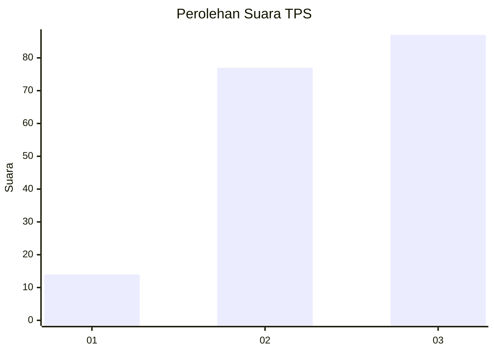
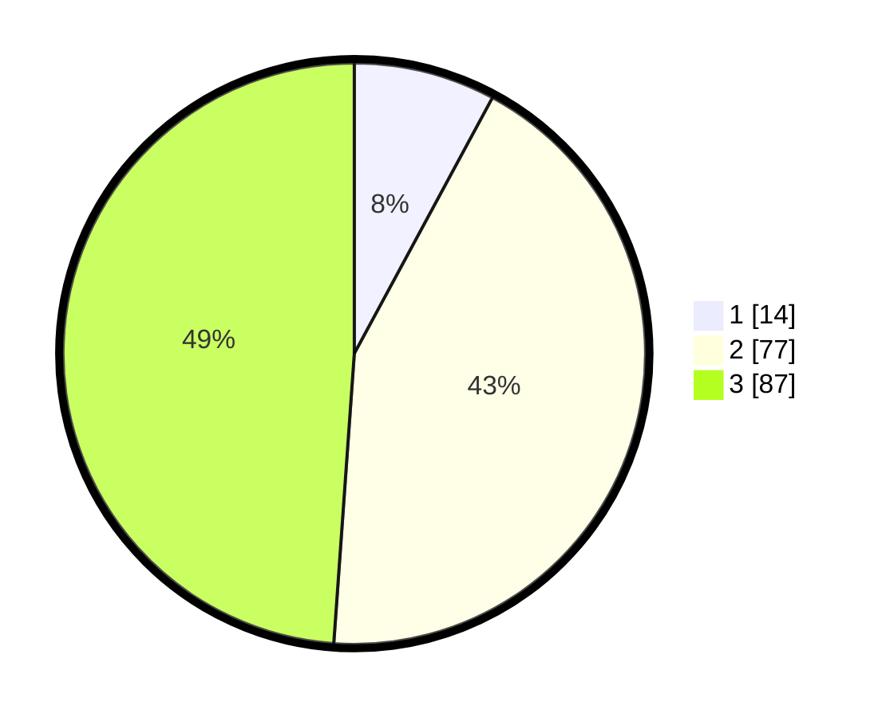

# Hasil

## Grafik

## Tabel

| No. | Nama Paslon    | Suara | Suara (raw) | Persentase |
|:--- |:-------------- | -----:| -----------:| ----------:|
| 1   | ANIES MUHAIMIN | 14    | [14][p-1]   | 7,87       |
| 2   | PRABOWO GIBRAN | 77    | [77][p-2]   | 43,26      |
| 3   | GANJAR MAHFUD  | 87    | [87][p-3]   | 48,88      |

[p-1]: https://github.com/gigit-pemilu/pemilu-2024-35-jawa-timur/blob/main/pilpres/hitung-suara/sub/35-jawa-timur/sub/73-kota-malang/sub/04-sukun/sub/1009-karangbesuki/sub/004-tps/sub/paslon-1.txt
[p-2]: https://github.com/gigit-pemilu/pemilu-2024-35-jawa-timur/blob/main/pilpres/hitung-suara/sub/35-jawa-timur/sub/73-kota-malang/sub/04-sukun/sub/1009-karangbesuki/sub/004-tps/sub/paslon-2.txt
[p-3]: https://github.com/gigit-pemilu/pemilu-2024-35-jawa-timur/blob/main/pilpres/hitung-suara/sub/35-jawa-timur/sub/73-kota-malang/sub/04-sukun/sub/1009-karangbesuki/sub/004-tps/sub/paslon-3.txt

## Foto C Plano

https://sirekap-obj-formc.kpu.go.id/6238/pemilu/ppwp/35/73/04/10/09/3573041009004-20240214-155446--5b75d3db-e678-4f17-b675-7e923a5218aa.jpg

https://sirekap-obj-formc.kpu.go.id/6238/pemilu/ppwp/35/73/04/10/09/3573041009004-20240214-162214--86d6bbc6-ead5-4729-aca8-7fc944b4ff84.jpg

https://sirekap-obj-formc.kpu.go.id/6238/pemilu/ppwp/35/73/04/10/09/3573041009004-20240214-190656--e12b9e14-5b7e-4689-af48-000128e7b33e.jpg

## Metadata

| Key        | Value               |
| ---------- | ------------------- |
| Time Stamp | 2024-02-14 21:46:01 |

## DATA PEMILIH TETAP

Jumlah pemilih dalam DPT: **216**.
 * L: **84**.
 * P: **132**.

## DATA PENGGUNA HAK PILIH

Jumlah pengguna hak pilih dalam DPT: **137**.
 * L: **53**.
 * P: **84**.

Jumlah pengguna hak pilih dalam DPTb: **26**.
 * L: **13**.
 * P: **13**.

Jumlah pengguna hak pilih dalam DPK: **17**.
 * L: **5**.
 * P: **12**.

Jumlah pengguna hak pilih: **180**.
 * L: **71**.
 * P: **109**.

## JUMLAH SUARA SAH DAN TIDAK SAH

JUMLAH SELURUH SUARA SAH: **178**.

JUMLAH SUARA TIDAK SAH: **2**.

JUMLAH SELURUH SUARA SAH DAN SUARA TIDAK SAH: **180**.

