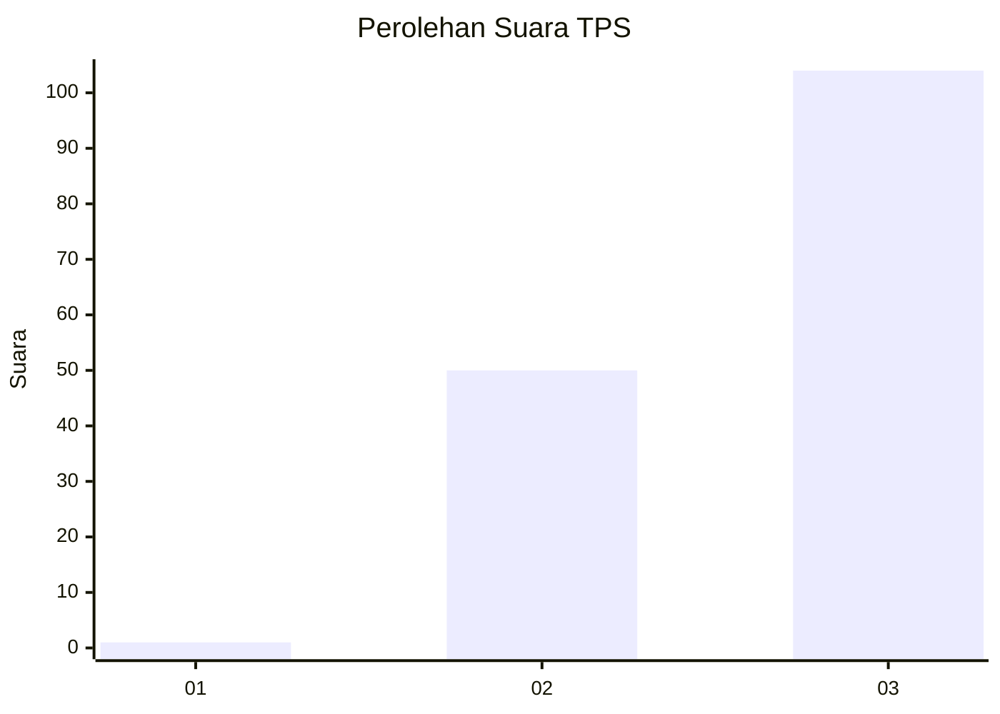
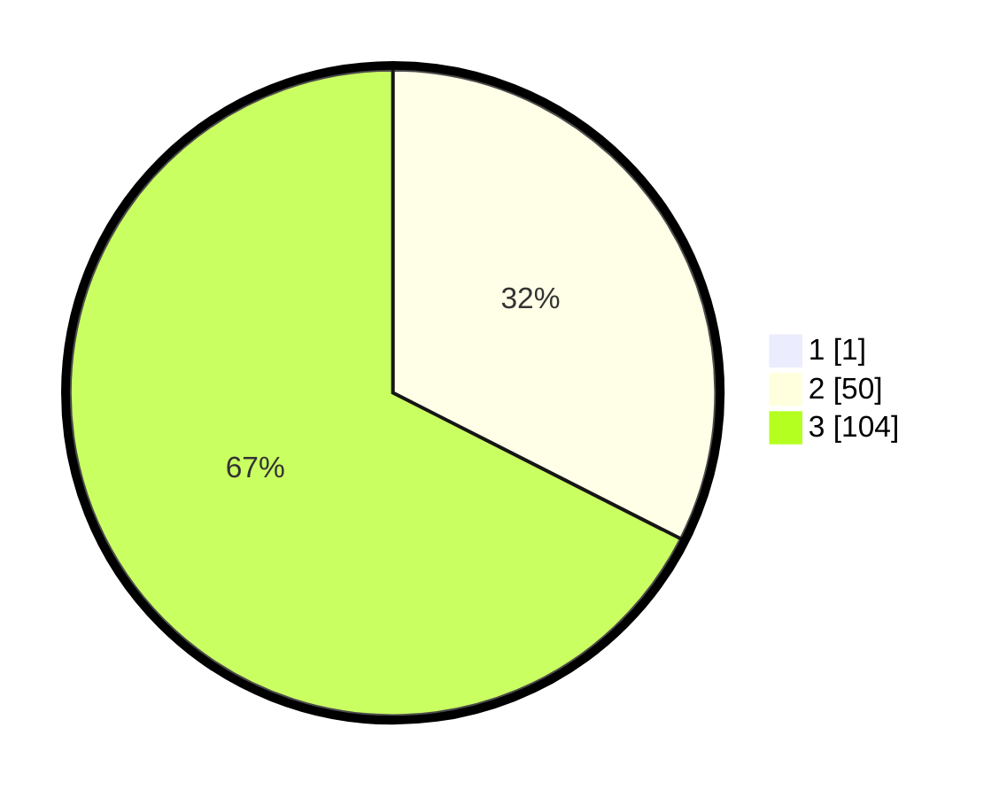

# Hasil

## Grafik

## Tabel

| No. | Nama Paslon    | Suara | Suara (raw) | Persentase |
|:--- |:-------------- | -----:| -----------:| ----------:|
| 1   | ANIES MUHAIMIN | 1     | [1][p-1]    | 0,65       |
| 2   | PRABOWO GIBRAN | 50    | [50][p-2]   | 32,26      |
| 3   | GANJAR MAHFUD  | 104   | [104][p-3]  | 67,10      |

[p-1]: https://github.com/gigit-pemilu/pemilu-2024-35-jawa-timur/blob/main/pilpres/hitung-suara/sub/35-jawa-timur/sub/73-kota-malang/sub/04-sukun/sub/1009-karangbesuki/sub/005-tps/sub/paslon-1.txt
[p-2]: https://github.com/gigit-pemilu/pemilu-2024-35-jawa-timur/blob/main/pilpres/hitung-suara/sub/35-jawa-timur/sub/73-kota-malang/sub/04-sukun/sub/1009-karangbesuki/sub/005-tps/sub/paslon-2.txt
[p-3]: https://github.com/gigit-pemilu/pemilu-2024-35-jawa-timur/blob/main/pilpres/hitung-suara/sub/35-jawa-timur/sub/73-kota-malang/sub/04-sukun/sub/1009-karangbesuki/sub/005-tps/sub/paslon-3.txt

## Foto C Plano

https://sirekap-obj-formc.kpu.go.id/3361/pemilu/ppwp/35/73/04/10/09/3573041009005-20240214-155511--1c7c5f30-b43d-429d-be4b-c628f98c0fff.jpg

https://sirekap-obj-formc.kpu.go.id/3361/pemilu/ppwp/35/73/04/10/09/3573041009005-20240214-155533--688bbedd-e87f-485f-b7e0-4d1f35ad96a7.jpg

https://sirekap-obj-formc.kpu.go.id/3361/pemilu/ppwp/35/73/04/10/09/3573041009005-20240214-155601--161eed0d-984e-4ce7-a471-4a6e7f0e7af0.jpg

## Metadata

| Key        | Value               |
| ---------- | ------------------- |
| Time Stamp | 2024-02-15 22:40:13 |

## DATA PEMILIH TETAP

Jumlah pemilih dalam DPT: **198**.
 * L: **136**.
 * P: **62**.

## DATA PENGGUNA HAK PILIH

Jumlah pengguna hak pilih dalam DPT: **116**.
 * L: **71**.
 * P: **45**.

Jumlah pengguna hak pilih dalam DPTb: **30**.
 * L: **13**.
 * P: **17**.

Jumlah pengguna hak pilih dalam DPK: **10**.
 * L: **10**.
 * P: **0**.

Jumlah pengguna hak pilih: **156**.
 * L: **94**.
 * P: **62**.

## JUMLAH SUARA SAH DAN TIDAK SAH

JUMLAH SELURUH SUARA SAH: **155**.

JUMLAH SUARA TIDAK SAH: **1**.

JUMLAH SELURUH SUARA SAH DAN SUARA TIDAK SAH: **156**.

