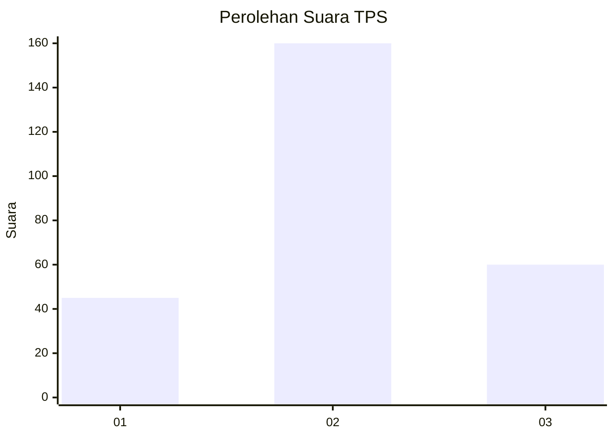
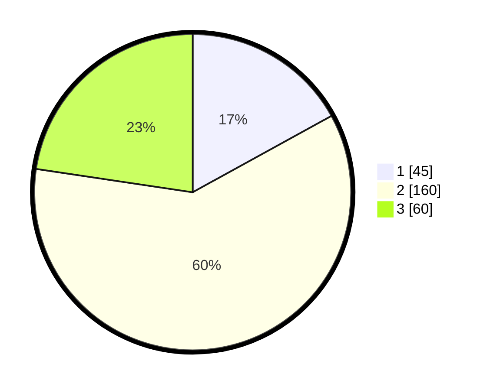

# Hasil

## Grafik

## Tabel

| No. | Nama Paslon    | Suara | Suara (raw) | Persentase |
|:--- |:-------------- | -----:| -----------:| ----------:|
| 1   | ANIES MUHAIMIN | 45    | [45][p-1]   | 16,98      |
| 2   | PRABOWO GIBRAN | 160   | [160][p-2]  | 60,38      |
| 3   | GANJAR MAHFUD  | 60    | [60][p-3]   | 22,64      |

[p-1]: https://github.com/gigit-pemilu/pemilu-2024-35-jawa-timur/blob/main/pilpres/hitung-suara/sub/35-jawa-timur/sub/73-kota-malang/sub/04-sukun/sub/1009-karangbesuki/sub/020-tps/sub/paslon-1.txt
[p-2]: https://github.com/gigit-pemilu/pemilu-2024-35-jawa-timur/blob/main/pilpres/hitung-suara/sub/35-jawa-timur/sub/73-kota-malang/sub/04-sukun/sub/1009-karangbesuki/sub/020-tps/sub/paslon-2.txt
[p-3]: https://github.com/gigit-pemilu/pemilu-2024-35-jawa-timur/blob/main/pilpres/hitung-suara/sub/35-jawa-timur/sub/73-kota-malang/sub/04-sukun/sub/1009-karangbesuki/sub/020-tps/sub/paslon-3.txt

## Foto C Plano

https://sirekap-obj-formc.kpu.go.id/44f8/pemilu/ppwp/35/73/04/10/09/3573041009020-20240214-184642--d1241752-619f-40d7-a72d-a4556a845086.jpg

https://sirekap-obj-formc.kpu.go.id/44f8/pemilu/ppwp/35/73/04/10/09/3573041009020-20240214-220941--bb53322a-1718-4d8c-bf6c-140a0335d15d.jpg

https://sirekap-obj-formc.kpu.go.id/44f8/pemilu/ppwp/35/73/04/10/09/3573041009020-20240214-220950--58170630-a9ef-4f5a-ad23-ff6280f9c895.jpg

## Metadata

| Key        | Value               |
| ---------- | ------------------- |
| Time Stamp | 2024-02-25 11:00:00 |

