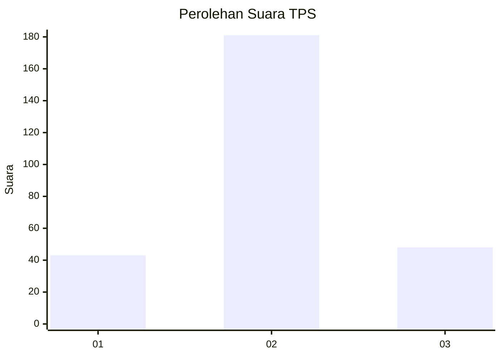
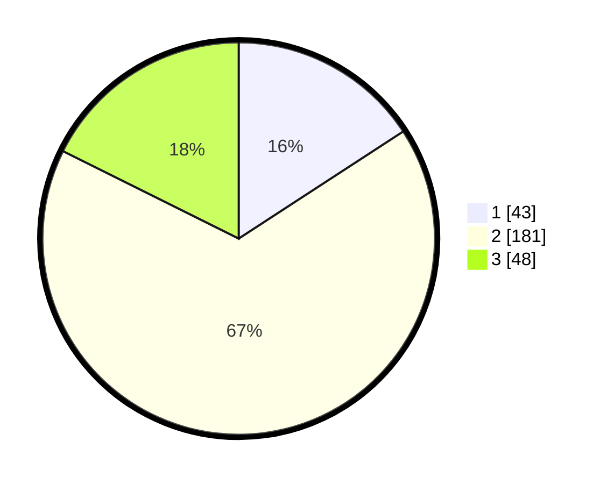

# Hasil

## Grafik

## Tabel

| No. | Nama Paslon    | Suara | Suara (raw) | Persentase |
|:--- |:-------------- | -----:| -----------:| ----------:|
| 1   | ANIES MUHAIMIN | 43    | [43][p-1]   | 15,81      |
| 2   | PRABOWO GIBRAN | 181   | [181][p-2]  | 66,54      |
| 3   | GANJAR MAHFUD  | 48    | [48][p-3]   | 17,65      |

[p-1]: https://github.com/gigit-pemilu/pemilu-2024-35-jawa-timur/blob/main/pilpres/hitung-suara/sub/35-jawa-timur/sub/73-kota-malang/sub/04-sukun/sub/1009-karangbesuki/sub/022-tps/sub/paslon-1.txt
[p-2]: https://github.com/gigit-pemilu/pemilu-2024-35-jawa-timur/blob/main/pilpres/hitung-suara/sub/35-jawa-timur/sub/73-kota-malang/sub/04-sukun/sub/1009-karangbesuki/sub/022-tps/sub/paslon-2.txt
[p-3]: https://github.com/gigit-pemilu/pemilu-2024-35-jawa-timur/blob/main/pilpres/hitung-suara/sub/35-jawa-timur/sub/73-kota-malang/sub/04-sukun/sub/1009-karangbesuki/sub/022-tps/sub/paslon-3.txt

## Foto C Plano

https://sirekap-obj-formc.kpu.go.id/305c/pemilu/ppwp/35/73/04/10/09/3573041009022-20240214-204655--7b61db82-75e7-4da2-bc8a-34e778838b94.jpg

https://sirekap-obj-formc.kpu.go.id/305c/pemilu/ppwp/35/73/04/10/09/3573041009022-20240214-204752--d22607c2-0384-404e-961b-e52160c8951e.jpg

https://sirekap-obj-formc.kpu.go.id/305c/pemilu/ppwp/35/73/04/10/09/3573041009022-20240214-204840--b2ba65ad-cb3f-4435-b961-50e78b4f857f.jpg

## Metadata

| Key        | Value               |
| ---------- | ------------------- |
| Time Stamp | 2024-02-25 17:00:00 |

