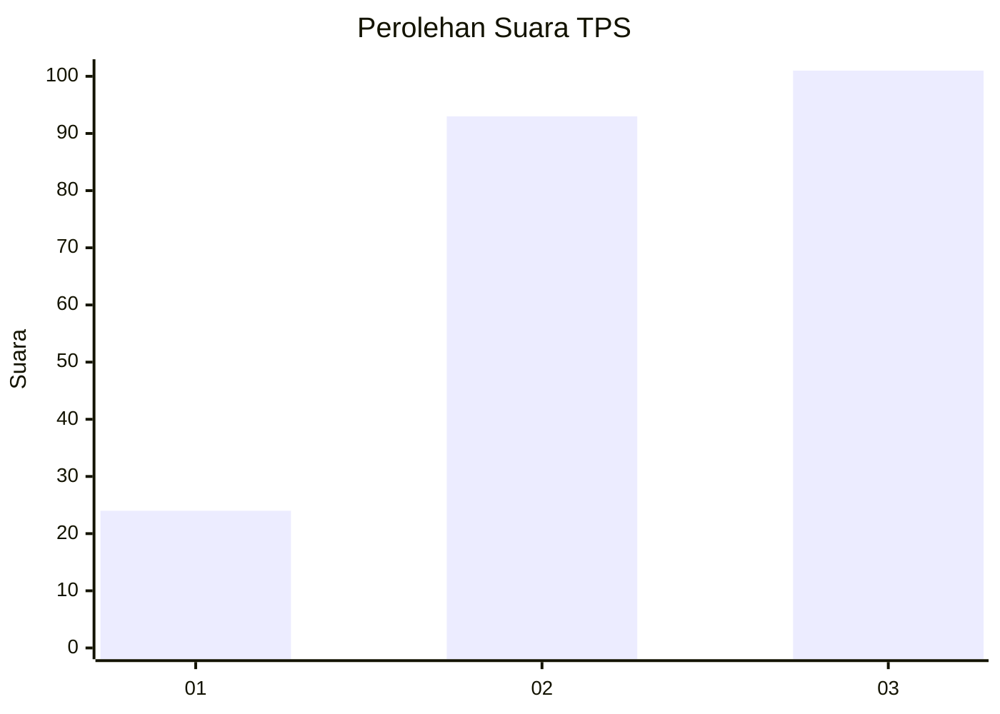
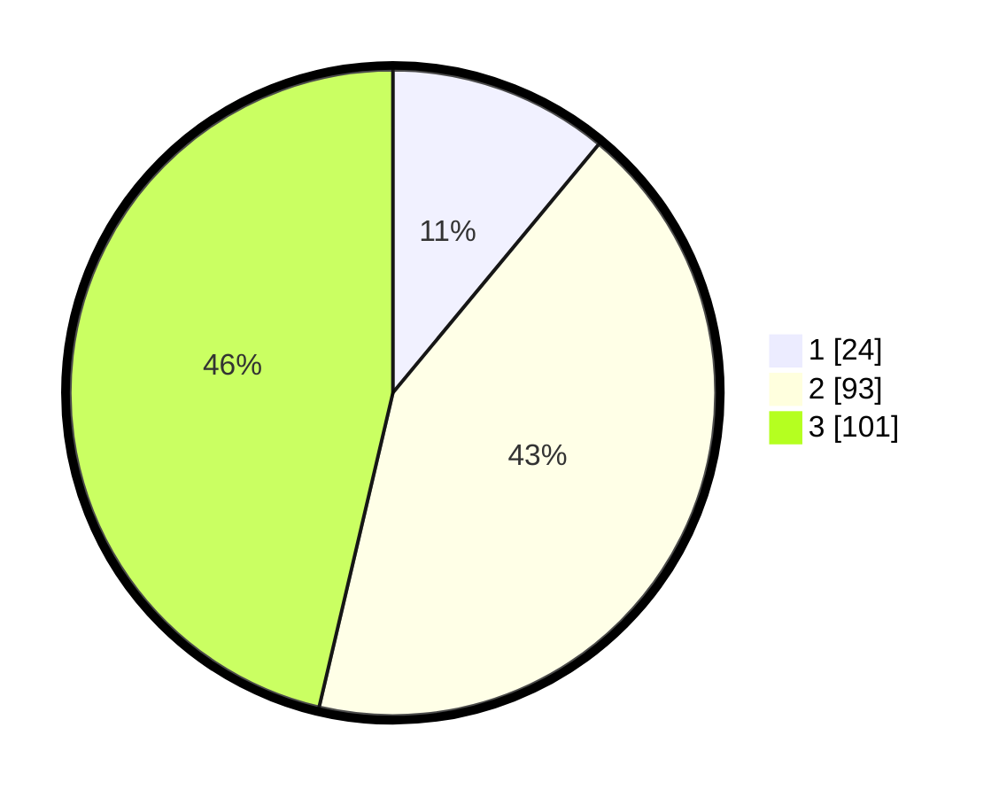

# Hasil

## Grafik

## Tabel

| No. | Nama Paslon    | Suara | Suara (raw) | Persentase |
|:--- |:-------------- | -----:| -----------:| ----------:|
| 1   | ANIES MUHAIMIN | 24    | [24][p-1]   | 11,01      |
| 2   | PRABOWO GIBRAN | 93    | [93][p-2]   | 42,66      |
| 3   | GANJAR MAHFUD  | 101   | [101][p-3]  | 46,33      |

[p-1]: https://github.com/gigit-pemilu/pemilu-2024/blob/main/pilpres/hitung-suara/sub/35-jawa-timur/sub/73-kota-malang/sub/04-sukun/sub/1009-karangbesuki/sub/046-tps/sub/paslon-1.txt
[p-2]: https://github.com/gigit-pemilu/pemilu-2024/blob/main/pilpres/hitung-suara/sub/35-jawa-timur/sub/73-kota-malang/sub/04-sukun/sub/1009-karangbesuki/sub/046-tps/sub/paslon-2.txt
[p-3]: https://github.com/gigit-pemilu/pemilu-2024/blob/main/pilpres/hitung-suara/sub/35-jawa-timur/sub/73-kota-malang/sub/04-sukun/sub/1009-karangbesuki/sub/046-tps/sub/paslon-3.txt

## Foto C Plano

https://sirekap-obj-formc.kpu.go.id/30fe/pemilu/ppwp/35/73/04/10/09/3573041009046-20240214-235041--c9504b99-72c8-420e-a2a4-9baf9e06360f.jpg

https://sirekap-obj-formc.kpu.go.id/30fe/pemilu/ppwp/35/73/04/10/09/3573041009046-20240214-235129--6464a3db-6c35-4e42-a9e2-32a865cec14c.jpg

https://sirekap-obj-formc.kpu.go.id/30fe/pemilu/ppwp/35/73/04/10/09/3573041009046-20240214-235210--fbaec961-30c3-4144-91f4-fe15b5455263.jpg

## Metadata

| Key        | Value               |
| ---------- | ------------------- |
| Time Stamp | 2024-02-25 12:00:00 |

