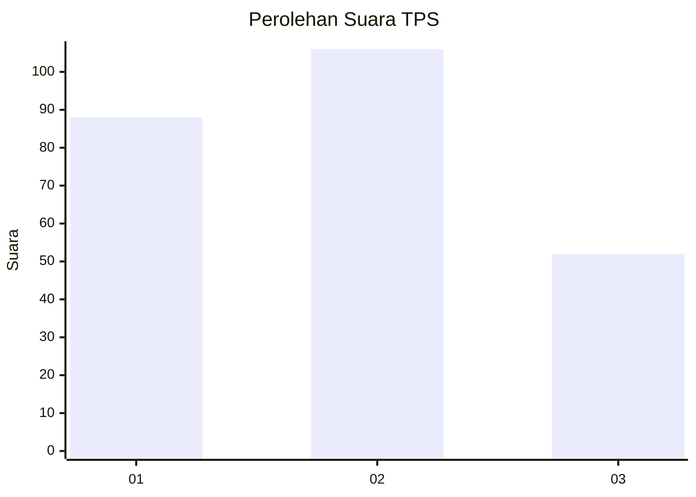
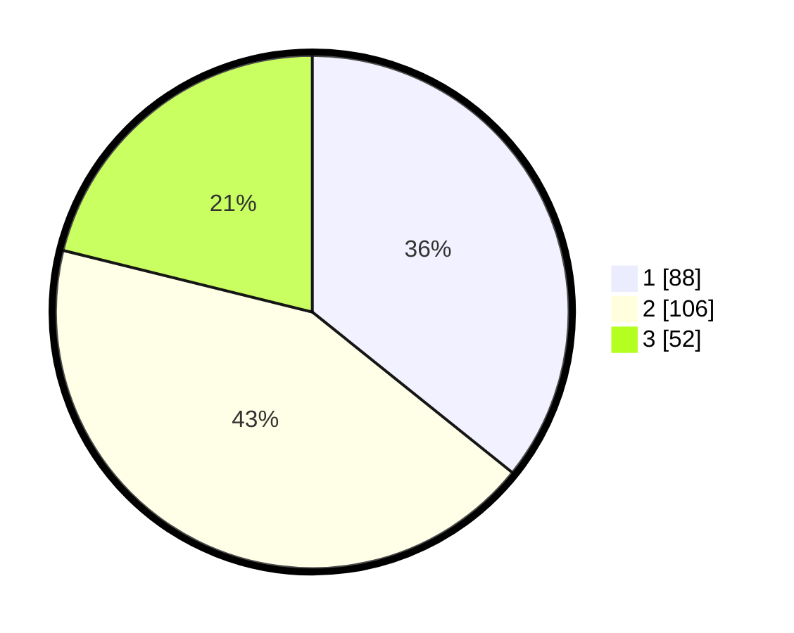

# Hasil

## Grafik

## Tabel

| No. | Nama Paslon    | Suara | Suara (raw) | Persentase |
|:--- |:-------------- | -----:| -----------:| ----------:|
| 1   | ANIES MUHAIMIN | 88    | [88][p-1]   | 35,77      |
| 2   | PRABOWO GIBRAN | 106   | [106][p-2]  | 43,09      |
| 3   | GANJAR MAHFUD  | 52    | [52][p-3]   | 21,14      |

[p-1]: https://github.com/gigit-pemilu/pemilu-2024-35-jawa-timur/blob/main/pilpres/hitung-suara/sub/35-jawa-timur/sub/73-kota-malang/sub/04-sukun/sub/1009-karangbesuki/sub/050-tps/sub/paslon-1.txt
[p-2]: https://github.com/gigit-pemilu/pemilu-2024-35-jawa-timur/blob/main/pilpres/hitung-suara/sub/35-jawa-timur/sub/73-kota-malang/sub/04-sukun/sub/1009-karangbesuki/sub/050-tps/sub/paslon-2.txt
[p-3]: https://github.com/gigit-pemilu/pemilu-2024-35-jawa-timur/blob/main/pilpres/hitung-suara/sub/35-jawa-timur/sub/73-kota-malang/sub/04-sukun/sub/1009-karangbesuki/sub/050-tps/sub/paslon-3.txt

## Foto C Plano

https://sirekap-obj-formc.kpu.go.id/ad5f/pemilu/ppwp/35/73/04/10/09/3573041009050-20240215-005513--33e8d8fb-4750-4c24-9e19-f7107f47ba45.jpg

https://sirekap-obj-formc.kpu.go.id/ad5f/pemilu/ppwp/35/73/04/10/09/3573041009050-20240215-004049--c1e1782a-800e-461f-a0e4-c54f7c7ccf1a.jpg

https://sirekap-obj-formc.kpu.go.id/ad5f/pemilu/ppwp/35/73/04/10/09/3573041009050-20240215-003916--cd6a684c-f1c3-4242-9c6a-845c9e7ca4f3.jpg

## Metadata

| Key        | Value               |
| ---------- | ------------------- |
| Time Stamp | 2024-02-25 13:00:00 |

