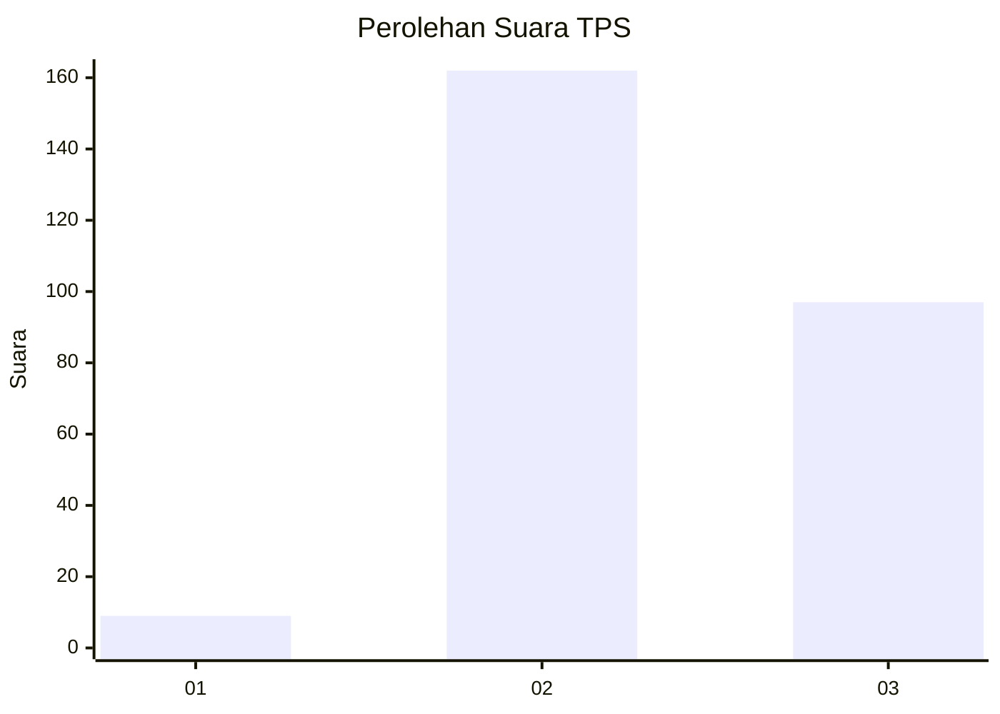
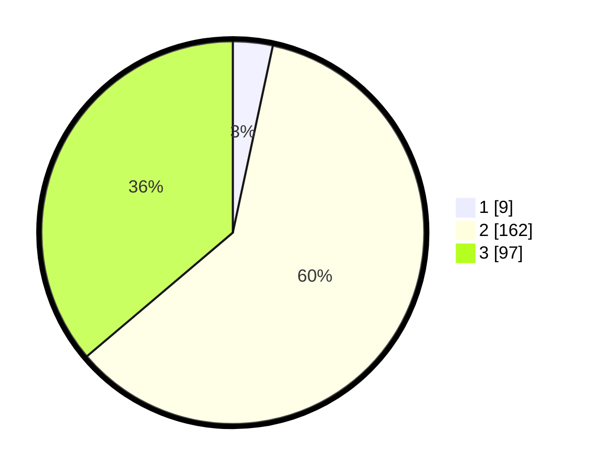

# Hasil

## Grafik

## Tabel

| No. | Nama Paslon    | Suara | Suara (raw) | Persentase |
|:--- |:-------------- | -----:| -----------:| ----------:|
| 1   | ANIES MUHAIMIN | 9     | [9][p-1]    | 3,36       |
| 2   | PRABOWO GIBRAN | 162   | [162][p-2]  | 60,45      |
| 3   | GANJAR MAHFUD  | 97    | [97][p-3]   | 36,19      |

[p-1]: https://github.com/gigit-pemilu/pemilu-2024/blob/main/pilpres/hitung-suara/sub/35-jawa-timur/sub/73-kota-malang/sub/04-sukun/sub/1010-mulyorejo/sub/013-tps/sub/paslon-1.txt
[p-2]: https://github.com/gigit-pemilu/pemilu-2024/blob/main/pilpres/hitung-suara/sub/35-jawa-timur/sub/73-kota-malang/sub/04-sukun/sub/1010-mulyorejo/sub/013-tps/sub/paslon-2.txt
[p-3]: https://github.com/gigit-pemilu/pemilu-2024/blob/main/pilpres/hitung-suara/sub/35-jawa-timur/sub/73-kota-malang/sub/04-sukun/sub/1010-mulyorejo/sub/013-tps/sub/paslon-3.txt

## Foto C Plano

https://sirekap-obj-formc.kpu.go.id/d12f/pemilu/ppwp/35/73/04/10/10/3573041010013-20240214-233607--81c74638-700f-49aa-aa07-436b251ce237.jpg

https://sirekap-obj-formc.kpu.go.id/d12f/pemilu/ppwp/35/73/04/10/10/3573041010013-20240214-234501--d91d86e4-011d-4f6a-b968-7a3cb5ce8594.jpg

https://sirekap-obj-formc.kpu.go.id/d12f/pemilu/ppwp/35/73/04/10/10/3573041010013-20240214-210621--bf707022-df10-4715-9248-5dfcc9a5dd75.jpg

## Metadata

| Key        | Value               |
| ---------- | ------------------- |
| Time Stamp | 2024-02-24 22:31:28 |

