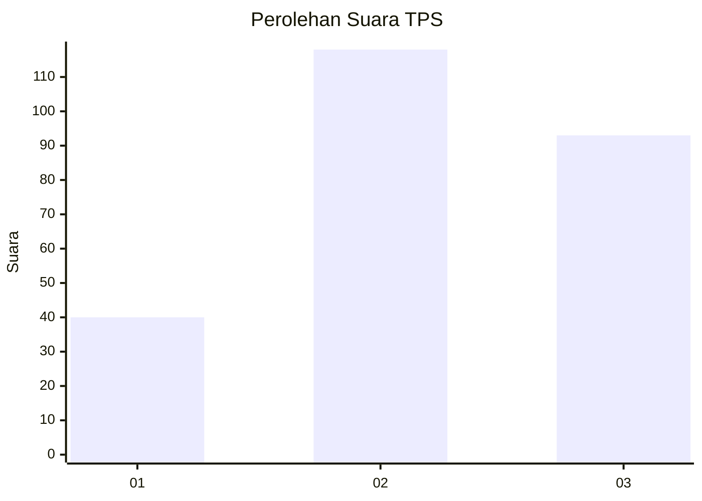
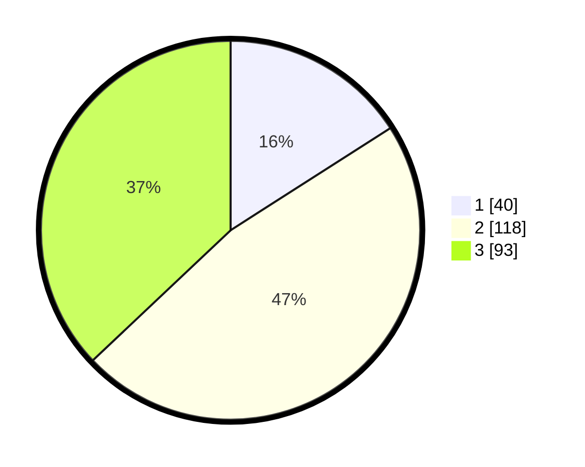

# Hasil

## Grafik

## Tabel

| No. | Nama Paslon    | Suara | Suara (raw) | Persentase |
|:--- |:-------------- | -----:| -----------:| ----------:|
| 1   | ANIES MUHAIMIN | 40    | [40][p-1]   | 15,94      |
| 2   | PRABOWO GIBRAN | 118   | [118][p-2]  | 47,01      |
| 3   | GANJAR MAHFUD  | 93    | [93][p-3]   | 37,05      |

[p-1]: https://github.com/gigit-pemilu/pemilu-2024-35-jawa-timur/blob/main/pilpres/hitung-suara/sub/35-jawa-timur/sub/73-kota-malang/sub/05-lowokwaru/sub/1001-tunggulwulung/sub/004-tps/sub/paslon-1.txt
[p-2]: https://github.com/gigit-pemilu/pemilu-2024-35-jawa-timur/blob/main/pilpres/hitung-suara/sub/35-jawa-timur/sub/73-kota-malang/sub/05-lowokwaru/sub/1001-tunggulwulung/sub/004-tps/sub/paslon-2.txt
[p-3]: https://github.com/gigit-pemilu/pemilu-2024-35-jawa-timur/blob/main/pilpres/hitung-suara/sub/35-jawa-timur/sub/73-kota-malang/sub/05-lowokwaru/sub/1001-tunggulwulung/sub/004-tps/sub/paslon-3.txt

## Foto C Plano

https://sirekap-obj-formc.kpu.go.id/035c/pemilu/ppwp/35/73/05/10/01/3573051001004-20240214-201107--31776a18-406f-490a-aed3-b9316de0083b.jpg

https://sirekap-obj-formc.kpu.go.id/035c/pemilu/ppwp/35/73/05/10/01/3573051001004-20240214-210750--53898ba6-c1e0-49fd-84c0-7dd2129b77dc.jpg

https://sirekap-obj-formc.kpu.go.id/035c/pemilu/ppwp/35/73/05/10/01/3573051001004-20240214-202134--15bad358-fe23-4ec3-ba06-a4671474a152.jpg

## Metadata

| Key        | Value               |
| ---------- | ------------------- |
| Time Stamp | 2024-02-15 00:41:44 |

