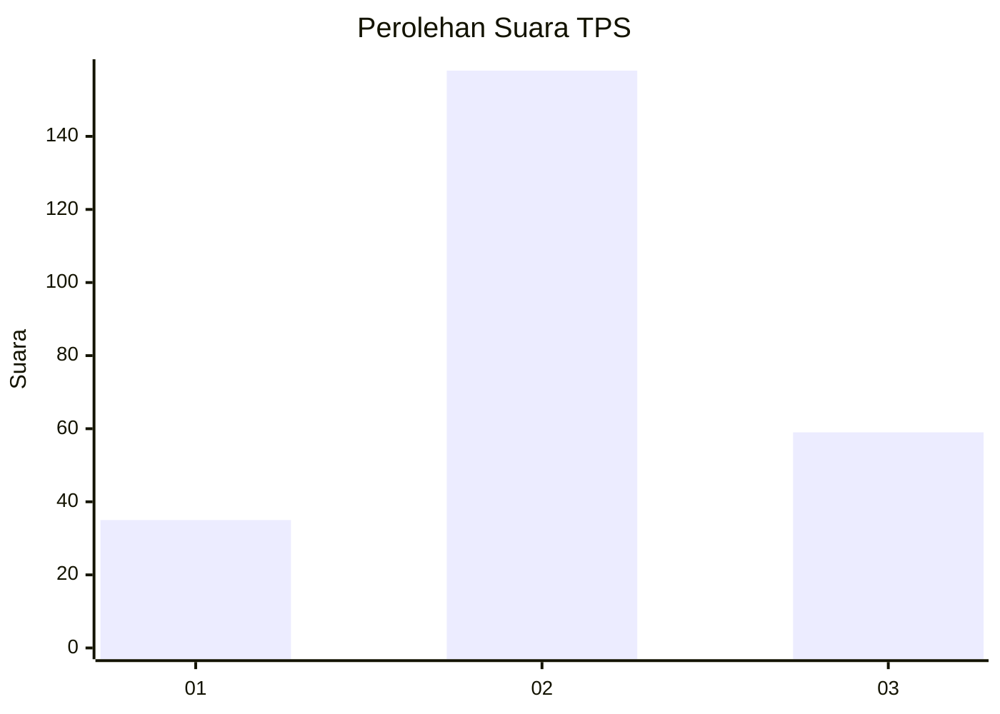
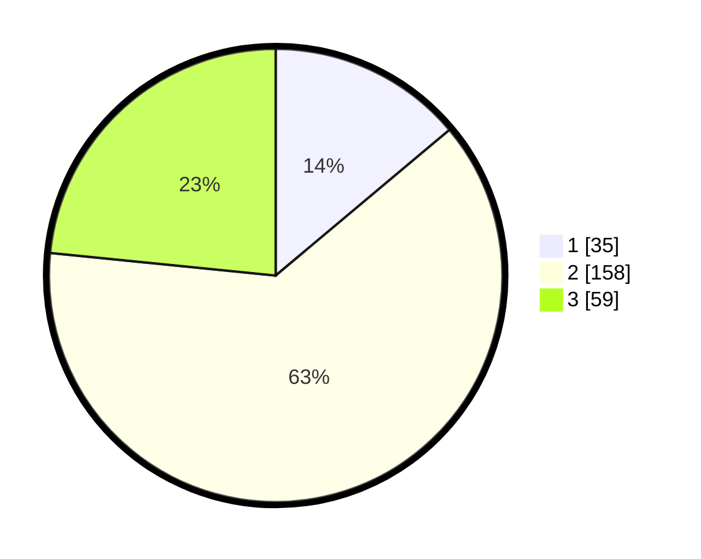

# Hasil

## Grafik

## Tabel

| No. | Nama Paslon    | Suara | Suara (raw) | Persentase |
|:--- |:-------------- | -----:| -----------:| ----------:|
| 1   | ANIES MUHAIMIN | 35    | [35][p-1]   | 13,89      |
| 2   | PRABOWO GIBRAN | 158   | [158][p-2]  | 62,70      |
| 3   | GANJAR MAHFUD  | 59    | [59][p-3]   | 23,41      |

[p-1]: https://github.com/gigit-pemilu/pemilu-2024/blob/main/pilpres/hitung-suara/sub/35-jawa-timur/sub/73-kota-malang/sub/05-lowokwaru/sub/1001-tunggulwulung/sub/020-tps/sub/paslon-1.txt
[p-2]: https://github.com/gigit-pemilu/pemilu-2024/blob/main/pilpres/hitung-suara/sub/35-jawa-timur/sub/73-kota-malang/sub/05-lowokwaru/sub/1001-tunggulwulung/sub/020-tps/sub/paslon-2.txt
[p-3]: https://github.com/gigit-pemilu/pemilu-2024/blob/main/pilpres/hitung-suara/sub/35-jawa-timur/sub/73-kota-malang/sub/05-lowokwaru/sub/1001-tunggulwulung/sub/020-tps/sub/paslon-3.txt

## Foto C Plano

https://sirekap-obj-formc.kpu.go.id/a828/pemilu/ppwp/35/73/05/10/01/3573051001020-20240215-003630--8b00a27d-e71f-442c-903d-b4aa4f09569e.jpg

https://sirekap-obj-formc.kpu.go.id/a828/pemilu/ppwp/35/73/05/10/01/3573051001020-20240215-003745--661a5754-c16d-4985-96d5-2462660d583e.jpg

https://sirekap-obj-formc.kpu.go.id/a828/pemilu/ppwp/35/73/05/10/01/3573051001020-20240215-003835--2435ced6-46af-4f4a-bbf6-31f29ebe32b3.jpg

## Metadata

| Key        | Value               |
| ---------- | ------------------- |
| Time Stamp | 2024-02-25 11:00:00 |

