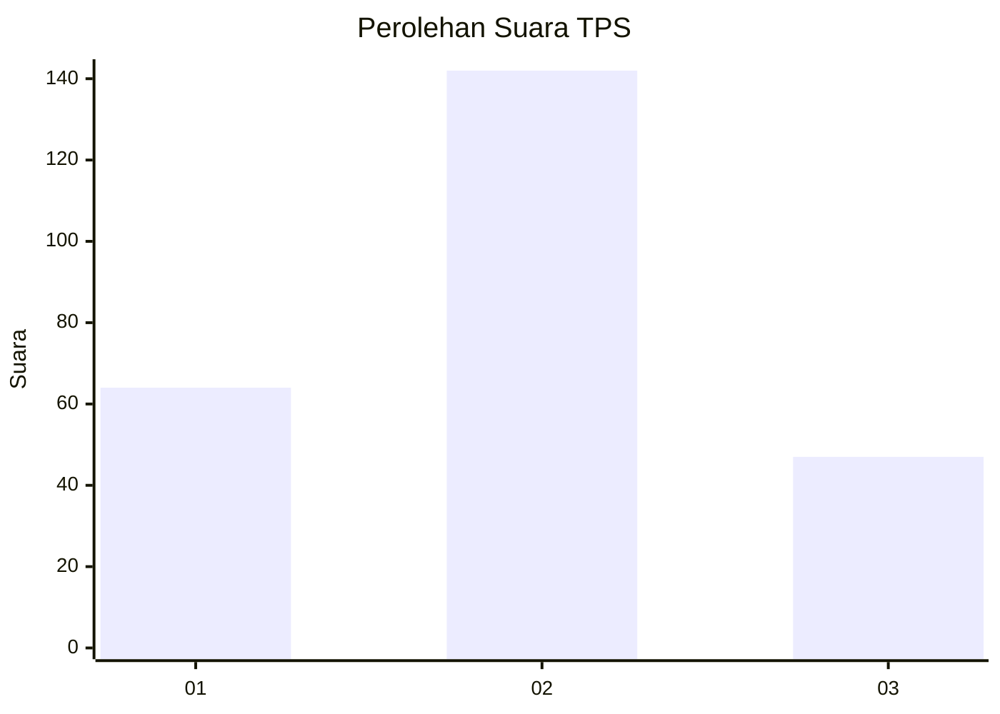
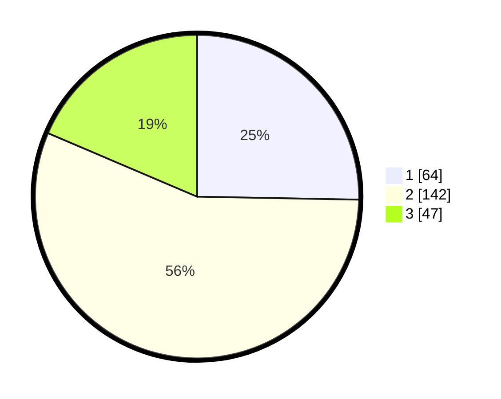

# Hasil

## Grafik

## Tabel

| No. | Nama Paslon    | Suara | Suara (raw) | Persentase |
|:--- |:-------------- | -----:| -----------:| ----------:|
| 1   | ANIES MUHAIMIN | 64    | [64][p-1]   | 25,30      |
| 2   | PRABOWO GIBRAN | 142   | [142][p-2]  | 56,13      |
| 3   | GANJAR MAHFUD  | 47    | [47][p-3]   | 18,58      |

[p-1]: https://github.com/gigit-pemilu/pemilu-2024/blob/main/pilpres/hitung-suara/sub/35-jawa-timur/sub/73-kota-malang/sub/05-lowokwaru/sub/1002-merjosari/sub/001-tps/sub/paslon-1.txt
[p-2]: https://github.com/gigit-pemilu/pemilu-2024/blob/main/pilpres/hitung-suara/sub/35-jawa-timur/sub/73-kota-malang/sub/05-lowokwaru/sub/1002-merjosari/sub/001-tps/sub/paslon-2.txt
[p-3]: https://github.com/gigit-pemilu/pemilu-2024/blob/main/pilpres/hitung-suara/sub/35-jawa-timur/sub/73-kota-malang/sub/05-lowokwaru/sub/1002-merjosari/sub/001-tps/sub/paslon-3.txt

## Foto C Plano

https://sirekap-obj-formc.kpu.go.id/5042/pemilu/ppwp/35/73/05/10/02/3573051002001-20240215-024129--d80db917-564a-46c2-94b4-97db31ea6b36.jpg

https://sirekap-obj-formc.kpu.go.id/5042/pemilu/ppwp/35/73/05/10/02/3573051002001-20240215-024432--c71d2114-d1a6-4b16-8995-1240be5bfce5.jpg

https://sirekap-obj-formc.kpu.go.id/5042/pemilu/ppwp/35/73/05/10/02/3573051002001-20240215-024638--5480c261-6942-4964-ba6b-a9f527b4f062.jpg

## Metadata

| Key        | Value               |
| ---------- | ------------------- |
| Time Stamp | 2024-02-24 22:31:28 |

