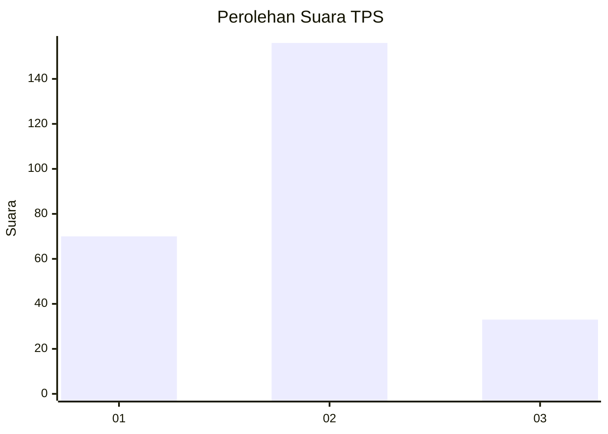
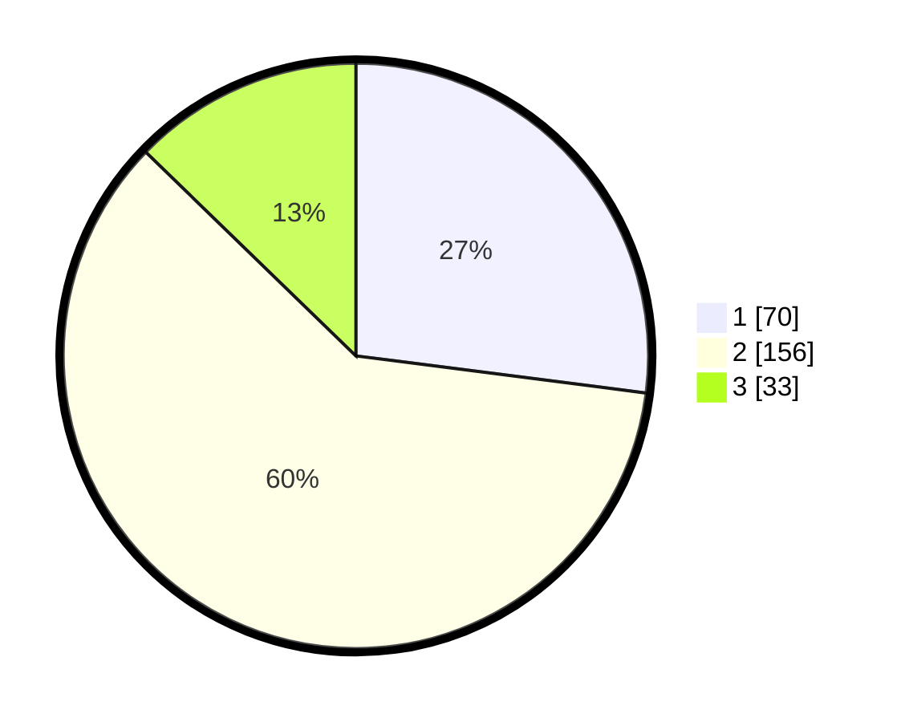

# Hasil

## Grafik

## Tabel

| No. | Nama Paslon    | Suara | Suara (raw) | Persentase |
|:--- |:-------------- | -----:| -----------:| ----------:|
| 1   | ANIES MUHAIMIN | 70    | [70][p-1]   | 27,03      |
| 2   | PRABOWO GIBRAN | 156   | [156][p-2]  | 60,23      |
| 3   | GANJAR MAHFUD  | 33    | [33][p-3]   | 12,74      |

[p-1]: https://github.com/gigit-pemilu/pemilu-2024/blob/main/pilpres/hitung-suara/sub/35-jawa-timur/sub/73-kota-malang/sub/05-lowokwaru/sub/1002-merjosari/sub/002-tps/sub/paslon-1.txt
[p-2]: https://github.com/gigit-pemilu/pemilu-2024/blob/main/pilpres/hitung-suara/sub/35-jawa-timur/sub/73-kota-malang/sub/05-lowokwaru/sub/1002-merjosari/sub/002-tps/sub/paslon-2.txt
[p-3]: https://github.com/gigit-pemilu/pemilu-2024/blob/main/pilpres/hitung-suara/sub/35-jawa-timur/sub/73-kota-malang/sub/05-lowokwaru/sub/1002-merjosari/sub/002-tps/sub/paslon-3.txt

## Foto C Plano

https://sirekap-obj-formc.kpu.go.id/0a92/pemilu/ppwp/35/73/05/10/02/3573051002002-20240215-025742--d54fef01-9b0a-4c65-97b0-957df50b84d4.jpg

https://sirekap-obj-formc.kpu.go.id/0a92/pemilu/ppwp/35/73/05/10/02/3573051002002-20240215-014717--ee77fe10-3002-4a84-b5d0-0a436be1886a.jpg

https://sirekap-obj-formc.kpu.go.id/0a92/pemilu/ppwp/35/73/05/10/02/3573051002002-20240215-025940--7f859b26-7695-45a6-a938-810dfd0767c9.jpg

## Metadata

| Key        | Value               |
| ---------- | ------------------- |
| Time Stamp | 2024-02-25 18:00:00 |

