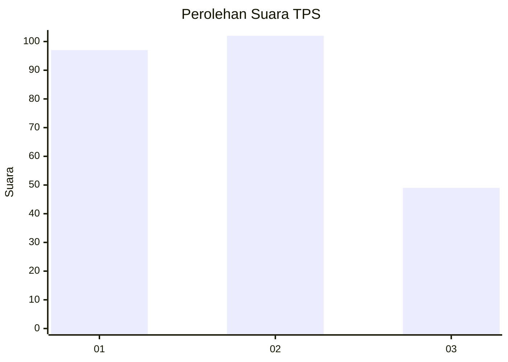
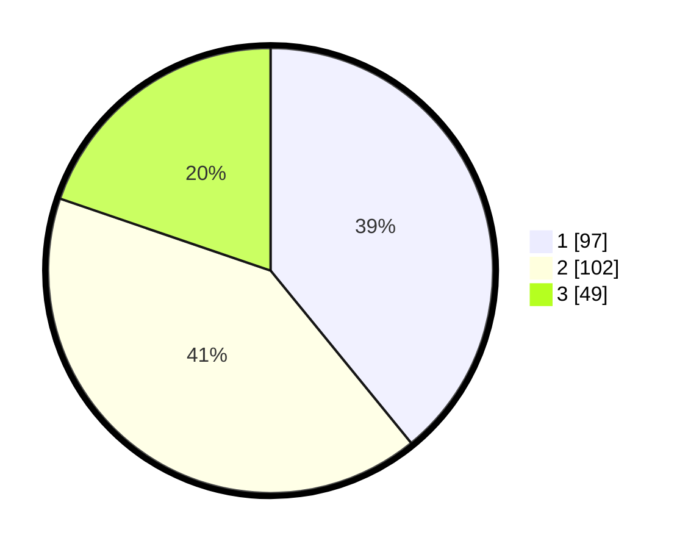

# Hasil

## Grafik

## Tabel

| No. | Nama Paslon    | Suara | Suara (raw) | Persentase |
|:--- |:-------------- | -----:| -----------:| ----------:|
| 1   | ANIES MUHAIMIN | 97    | [97][p-1]   | 39,11      |
| 2   | PRABOWO GIBRAN | 102   | [102][p-2]  | 41,13      |
| 3   | GANJAR MAHFUD  | 49    | [49][p-3]   | 19,76      |

[p-1]: https://github.com/gigit-pemilu/pemilu-2024-35-jawa-timur/blob/main/pilpres/hitung-suara/sub/35-jawa-timur/sub/73-kota-malang/sub/05-lowokwaru/sub/1002-merjosari/sub/020-tps/sub/paslon-1.txt
[p-2]: https://github.com/gigit-pemilu/pemilu-2024-35-jawa-timur/blob/main/pilpres/hitung-suara/sub/35-jawa-timur/sub/73-kota-malang/sub/05-lowokwaru/sub/1002-merjosari/sub/020-tps/sub/paslon-2.txt
[p-3]: https://github.com/gigit-pemilu/pemilu-2024-35-jawa-timur/blob/main/pilpres/hitung-suara/sub/35-jawa-timur/sub/73-kota-malang/sub/05-lowokwaru/sub/1002-merjosari/sub/020-tps/sub/paslon-3.txt

## Foto C Plano

https://sirekap-obj-formc.kpu.go.id/74e4/pemilu/ppwp/35/73/05/10/02/3573051002020-20240214-223653--3ac04a97-512e-4832-8e9e-cad067c0ba54.jpg

https://sirekap-obj-formc.kpu.go.id/74e4/pemilu/ppwp/35/73/05/10/02/3573051002020-20240214-223732--7813582d-9e33-422b-a5a3-4f9e9900e508.jpg

https://sirekap-obj-formc.kpu.go.id/74e4/pemilu/ppwp/35/73/05/10/02/3573051002020-20240214-223802--af2396fc-dd1a-4dbc-b574-c3b5a5f081dc.jpg

## Metadata

| Key        | Value               |
| ---------- | ------------------- |
| Time Stamp | 2024-02-24 22:31:28 |

