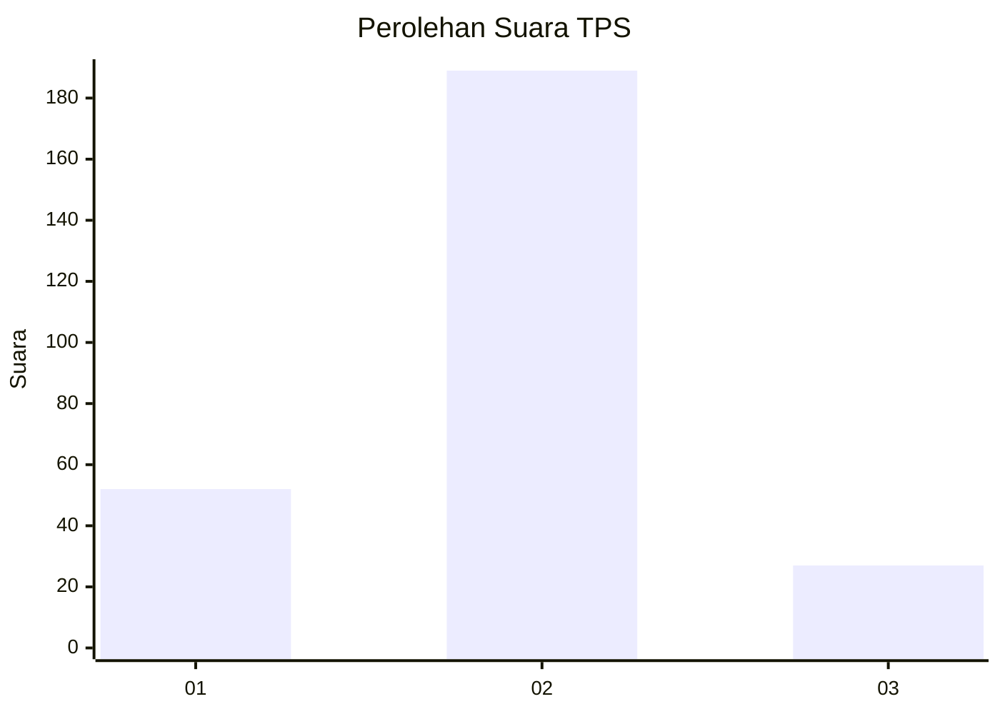
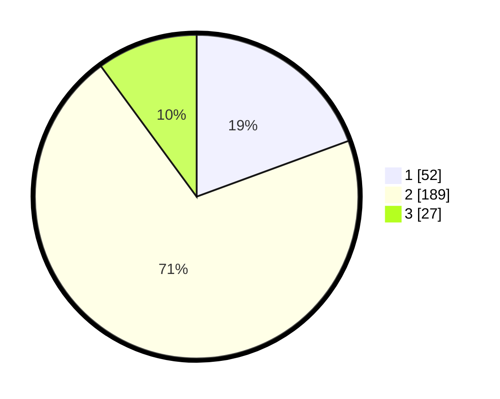

# Hasil

## Grafik

## Tabel

| No. | Nama Paslon    | Suara | Suara (raw) | Persentase |
|:--- |:-------------- | -----:| -----------:| ----------:|
| 1   | ANIES MUHAIMIN | 52    | [52][p-1]   | 19,40      |
| 2   | PRABOWO GIBRAN | 189   | [189][p-2]  | 70,52      |
| 3   | GANJAR MAHFUD  | 27    | [27][p-3]   | 10,07      |

[p-1]: https://github.com/gigit-pemilu/pemilu-2024/blob/main/pilpres/hitung-suara/sub/35-jawa-timur/sub/73-kota-malang/sub/05-lowokwaru/sub/1002-merjosari/sub/023-tps/sub/paslon-1.txt
[p-2]: https://github.com/gigit-pemilu/pemilu-2024/blob/main/pilpres/hitung-suara/sub/35-jawa-timur/sub/73-kota-malang/sub/05-lowokwaru/sub/1002-merjosari/sub/023-tps/sub/paslon-2.txt
[p-3]: https://github.com/gigit-pemilu/pemilu-2024/blob/main/pilpres/hitung-suara/sub/35-jawa-timur/sub/73-kota-malang/sub/05-lowokwaru/sub/1002-merjosari/sub/023-tps/sub/paslon-3.txt

## Foto C Plano

https://sirekap-obj-formc.kpu.go.id/b354/pemilu/ppwp/35/73/05/10/02/3573051002023-20240214-220621--ddb74ce0-b20c-4d5e-b045-82f3072f071c.jpg

https://sirekap-obj-formc.kpu.go.id/b354/pemilu/ppwp/35/73/05/10/02/3573051002023-20240214-220312--f65a70e3-9696-4a77-a8b4-68d0c481c580.jpg

https://sirekap-obj-formc.kpu.go.id/b354/pemilu/ppwp/35/73/05/10/02/3573051002023-20240214-220912--89c5e3e9-e0fc-4376-8acc-554d72402305.jpg

## Metadata

| Key        | Value               |
| ---------- | ------------------- |
| Time Stamp | 2024-02-25 12:00:00 |

