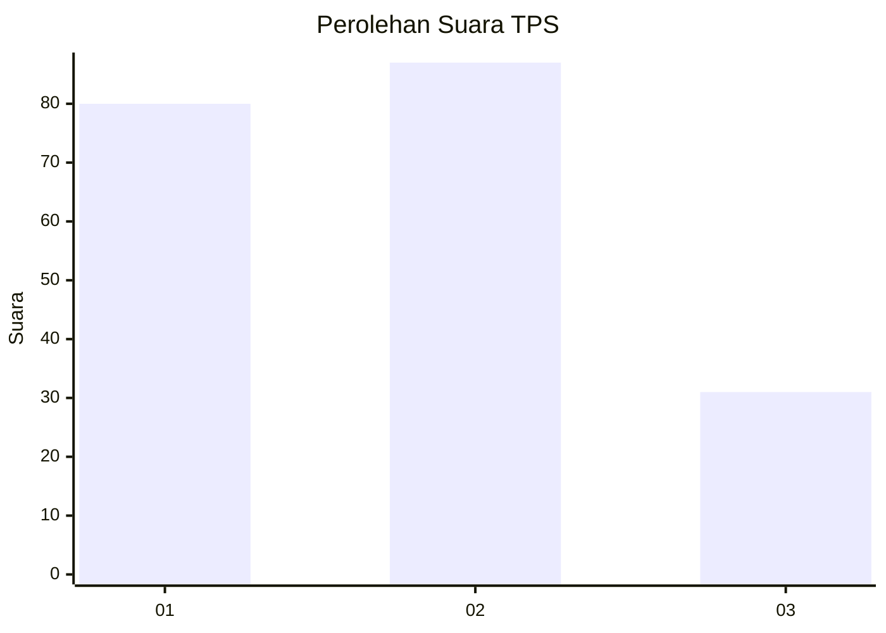
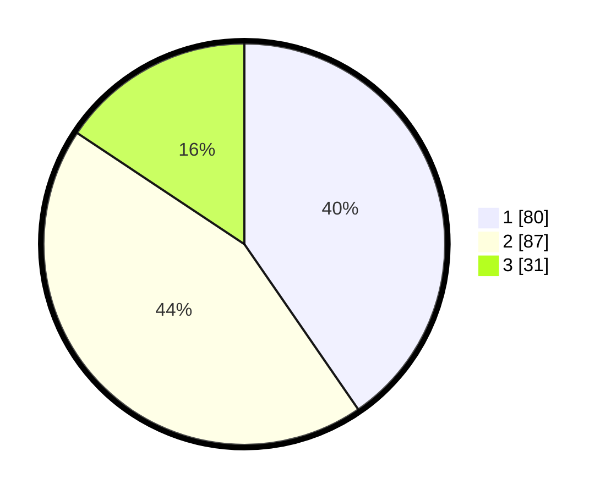

# Hasil

## Grafik

## Tabel

| No. | Nama Paslon    | Suara | Suara (raw) | Persentase |
|:--- |:-------------- | -----:| -----------:| ----------:|
| 1   | ANIES MUHAIMIN | 80    | [80][p-1]   | 40,40      |
| 2   | PRABOWO GIBRAN | 87    | [87][p-2]   | 43,94      |
| 3   | GANJAR MAHFUD  | 31    | [31][p-3]   | 15,66      |

[p-1]: https://github.com/gigit-pemilu/pemilu-2024-35-jawa-timur/blob/main/pilpres/hitung-suara/sub/35-jawa-timur/sub/73-kota-malang/sub/05-lowokwaru/sub/1002-merjosari/sub/029-tps/sub/paslon-1.txt
[p-2]: https://github.com/gigit-pemilu/pemilu-2024-35-jawa-timur/blob/main/pilpres/hitung-suara/sub/35-jawa-timur/sub/73-kota-malang/sub/05-lowokwaru/sub/1002-merjosari/sub/029-tps/sub/paslon-2.txt
[p-3]: https://github.com/gigit-pemilu/pemilu-2024-35-jawa-timur/blob/main/pilpres/hitung-suara/sub/35-jawa-timur/sub/73-kota-malang/sub/05-lowokwaru/sub/1002-merjosari/sub/029-tps/sub/paslon-3.txt

## Foto C Plano

https://sirekap-obj-formc.kpu.go.id/f348/pemilu/ppwp/35/73/05/10/02/3573051002029-20240214-211325--bae63917-e361-48c4-a1d7-44dd52ce287d.jpg

https://sirekap-obj-formc.kpu.go.id/f348/pemilu/ppwp/35/73/05/10/02/3573051002029-20240214-211410--9538306c-35bf-423a-acd0-86be2a4f4a87.jpg

https://sirekap-obj-formc.kpu.go.id/f348/pemilu/ppwp/35/73/05/10/02/3573051002029-20240214-203758--0b8818b1-1897-4b62-b892-b53143ad4c90.jpg

## Metadata

| Key        | Value               |
| ---------- | ------------------- |
| Time Stamp | 2024-02-24 22:31:28 |

