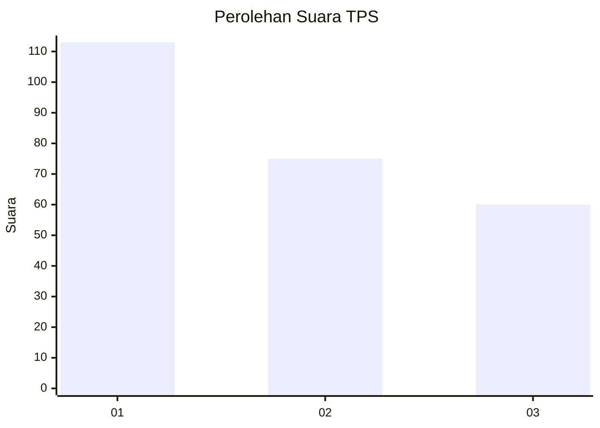
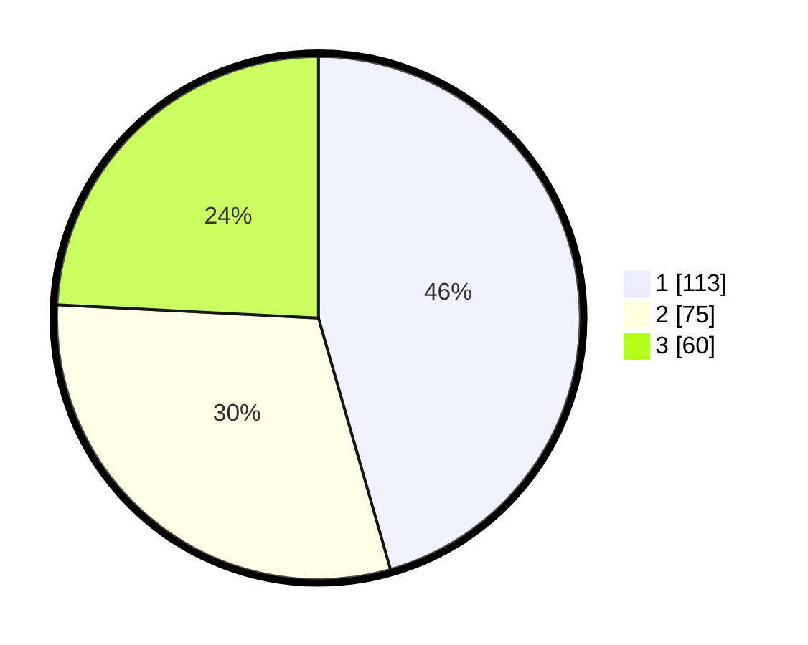

# Hasil

## Grafik

## Tabel

| No. | Nama Paslon    | Suara | Suara (raw) | Persentase |
|:--- |:-------------- | -----:| -----------:| ----------:|
| 1   | ANIES MUHAIMIN | 113   | [113][p-1]  | 45,56      |
| 2   | PRABOWO GIBRAN | 75    | [75][p-2]   | 30,24      |
| 3   | GANJAR MAHFUD  | 60    | [60][p-3]   | 24,19      |

[p-1]: https://github.com/gigit-pemilu/pemilu-2024-35-jawa-timur/blob/main/pilpres/hitung-suara/sub/35-jawa-timur/sub/73-kota-malang/sub/05-lowokwaru/sub/1003-tlogomas/sub/020-tps/sub/paslon-1.txt
[p-2]: https://github.com/gigit-pemilu/pemilu-2024-35-jawa-timur/blob/main/pilpres/hitung-suara/sub/35-jawa-timur/sub/73-kota-malang/sub/05-lowokwaru/sub/1003-tlogomas/sub/020-tps/sub/paslon-2.txt
[p-3]: https://github.com/gigit-pemilu/pemilu-2024-35-jawa-timur/blob/main/pilpres/hitung-suara/sub/35-jawa-timur/sub/73-kota-malang/sub/05-lowokwaru/sub/1003-tlogomas/sub/020-tps/sub/paslon-3.txt

## Foto C Plano

https://sirekap-obj-formc.kpu.go.id/e744/pemilu/ppwp/35/73/05/10/03/3573051003020-20240214-194417--267d870a-9701-434c-ba38-4f01fb8db42a.jpg

https://sirekap-obj-formc.kpu.go.id/e744/pemilu/ppwp/35/73/05/10/03/3573051003020-20240214-194956--16f4c859-a31b-429b-a682-7ea09ce28bfe.jpg

https://sirekap-obj-formc.kpu.go.id/e744/pemilu/ppwp/35/73/05/10/03/3573051003020-20240214-195131--e0c57340-bc72-46cc-b0d7-b4f445d0ef67.jpg

## Metadata

| Key        | Value               |
| ---------- | ------------------- |
| Time Stamp | 2024-02-25 16:00:00 |

