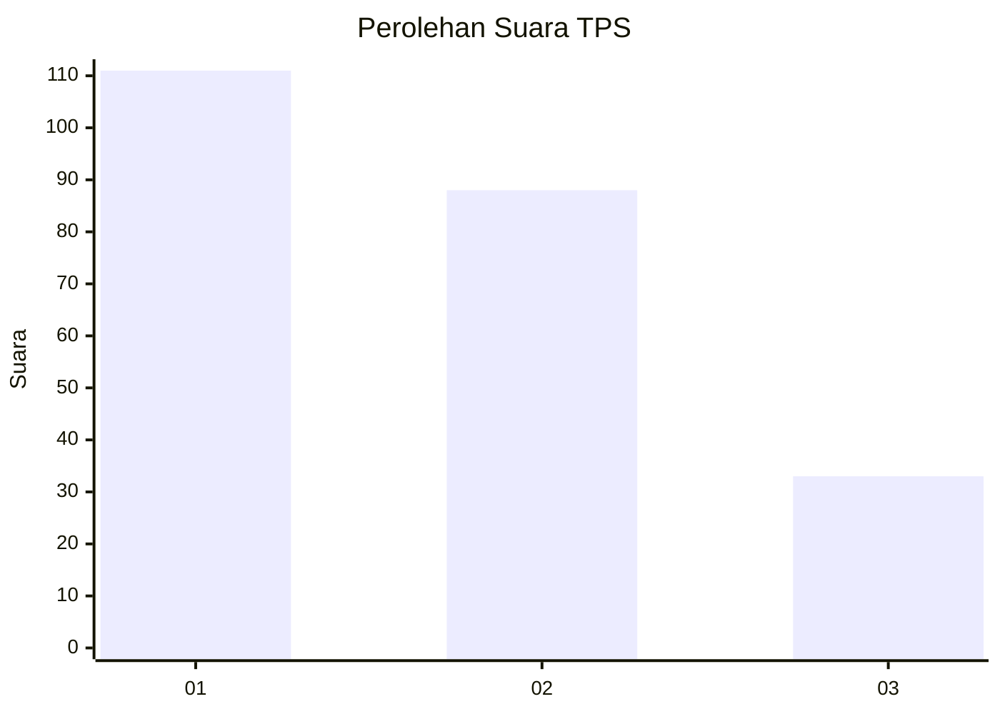
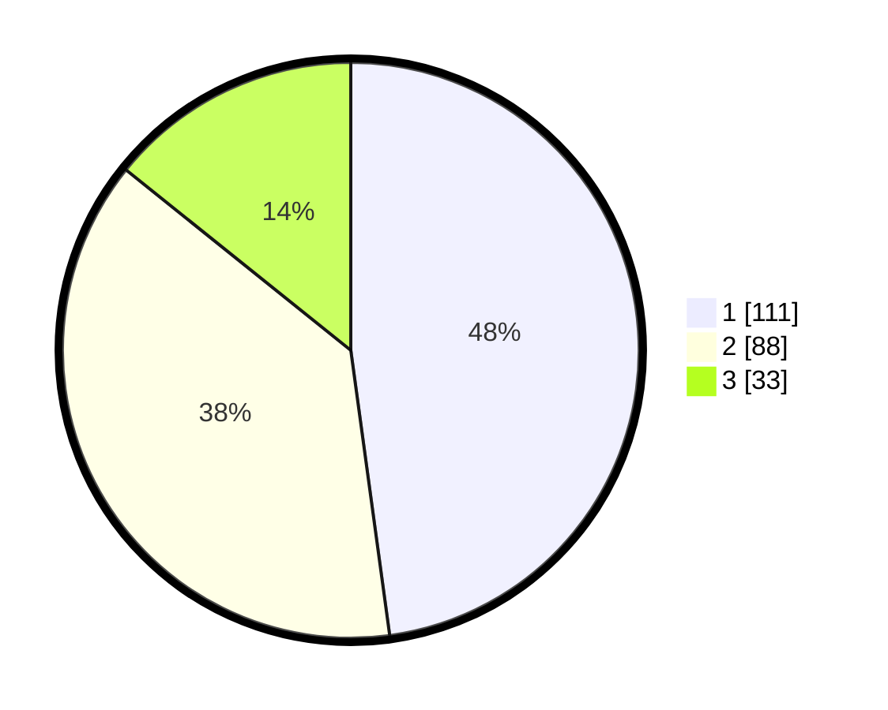

# Hasil

## Grafik

## Tabel

| No. | Nama Paslon    | Suara | Suara (raw) | Persentase |
|:--- |:-------------- | -----:| -----------:| ----------:|
| 1   | ANIES MUHAIMIN | 111   | [111][p-1]  | 47,84      |
| 2   | PRABOWO GIBRAN | 88    | [88][p-2]   | 37,93      |
| 3   | GANJAR MAHFUD  | 33    | [33][p-3]   | 14,22      |

[p-1]: https://github.com/gigit-pemilu/pemilu-2024/blob/main/pilpres/hitung-suara/sub/35-jawa-timur/sub/73-kota-malang/sub/05-lowokwaru/sub/1004-dinoyo/sub/011-tps/sub/paslon-1.txt
[p-2]: https://github.com/gigit-pemilu/pemilu-2024/blob/main/pilpres/hitung-suara/sub/35-jawa-timur/sub/73-kota-malang/sub/05-lowokwaru/sub/1004-dinoyo/sub/011-tps/sub/paslon-2.txt
[p-3]: https://github.com/gigit-pemilu/pemilu-2024/blob/main/pilpres/hitung-suara/sub/35-jawa-timur/sub/73-kota-malang/sub/05-lowokwaru/sub/1004-dinoyo/sub/011-tps/sub/paslon-3.txt

## Foto C Plano

https://sirekap-obj-formc.kpu.go.id/ac16/pemilu/ppwp/35/73/05/10/04/3573051004011-20240214-192448--f30bc7a2-a766-487b-8eb1-de71d82fd932.jpg

https://sirekap-obj-formc.kpu.go.id/ac16/pemilu/ppwp/35/73/05/10/04/3573051004011-20240214-192651--31397ad4-bd12-4ab8-b3a1-b4d8e151ceff.jpg

https://sirekap-obj-formc.kpu.go.id/ac16/pemilu/ppwp/35/73/05/10/04/3573051004011-20240214-192717--ef1e166a-c896-40ea-a8d2-422df5a1aaf8.jpg

## Metadata

| Key        | Value               |
| ---------- | ------------------- |
| Time Stamp | 2024-02-14 21:46:01 |

