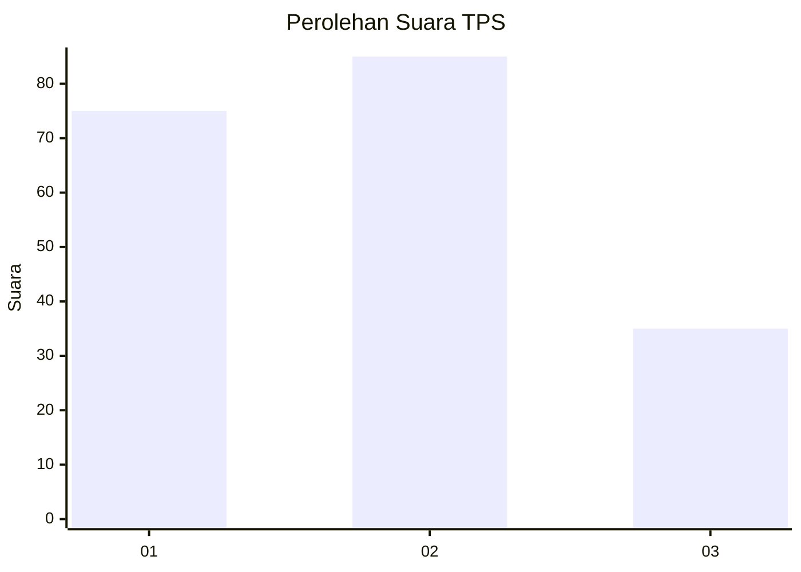
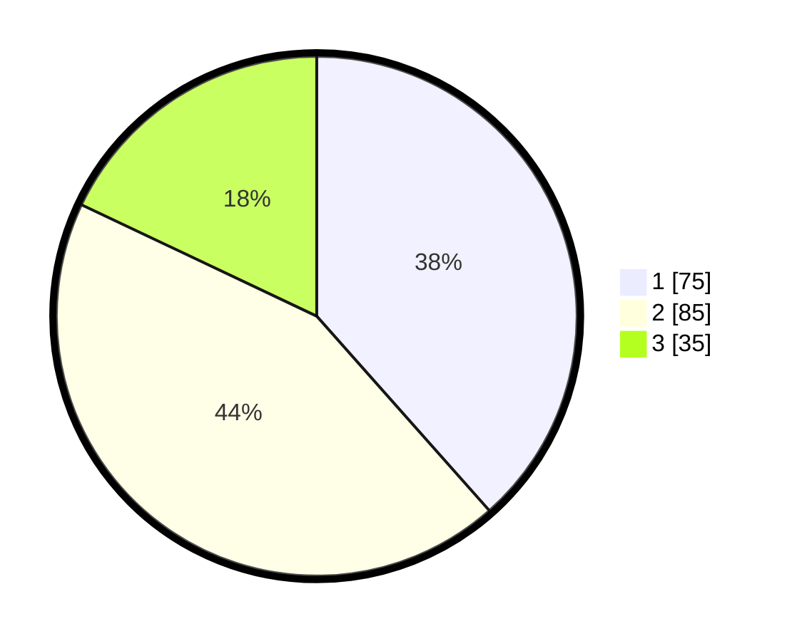

# Hasil

## Grafik

## Tabel

| No. | Nama Paslon    | Suara | Suara (raw) | Persentase |
|:--- |:-------------- | -----:| -----------:| ----------:|
| 1   | ANIES MUHAIMIN | 75    | [75][p-1]   | 38,46      |
| 2   | PRABOWO GIBRAN | 85    | [85][p-2]   | 43,59      |
| 3   | GANJAR MAHFUD  | 35    | [35][p-3]   | 17,95      |

[p-1]: https://github.com/gigit-pemilu/pemilu-2024/blob/main/pilpres/hitung-suara/sub/35-jawa-timur/sub/73-kota-malang/sub/05-lowokwaru/sub/1004-dinoyo/sub/029-tps/sub/paslon-1.txt
[p-2]: https://github.com/gigit-pemilu/pemilu-2024/blob/main/pilpres/hitung-suara/sub/35-jawa-timur/sub/73-kota-malang/sub/05-lowokwaru/sub/1004-dinoyo/sub/029-tps/sub/paslon-2.txt
[p-3]: https://github.com/gigit-pemilu/pemilu-2024/blob/main/pilpres/hitung-suara/sub/35-jawa-timur/sub/73-kota-malang/sub/05-lowokwaru/sub/1004-dinoyo/sub/029-tps/sub/paslon-3.txt

## Foto C Plano

https://sirekap-obj-formc.kpu.go.id/e867/pemilu/ppwp/35/73/05/10/04/3573051004029-20240214-202516--97aadc95-b503-4390-ae54-90101a0265ea.jpg

https://sirekap-obj-formc.kpu.go.id/e867/pemilu/ppwp/35/73/05/10/04/3573051004029-20240214-221007--e0709386-a890-4330-9cac-92eb5d4ffce2.jpg

https://sirekap-obj-formc.kpu.go.id/e867/pemilu/ppwp/35/73/05/10/04/3573051004029-20240214-203001--fd0137d4-ba7f-4a11-af47-57d9de504f7d.jpg

## Metadata

| Key        | Value               |
| ---------- | ------------------- |
| Time Stamp | 2024-02-25 16:00:00 |

