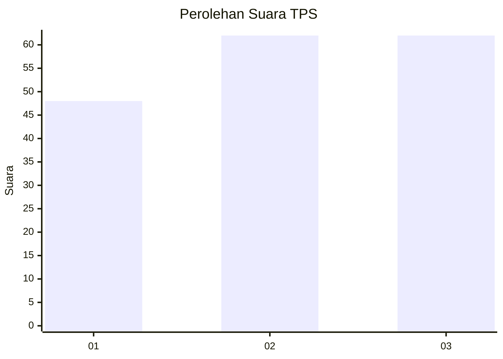
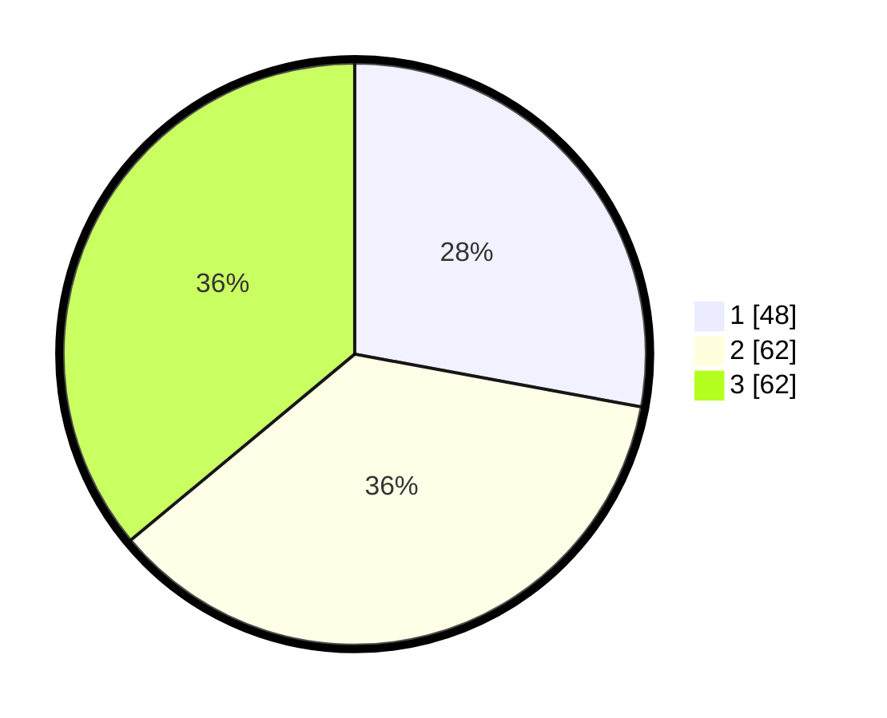

# Hasil

## Grafik

## Tabel

| No. | Nama Paslon    | Suara | Suara (raw) | Persentase |
|:--- |:-------------- | -----:| -----------:| ----------:|
| 1   | ANIES MUHAIMIN | 48    | [48][p-1]   | 27,91      |
| 2   | PRABOWO GIBRAN | 62    | [62][p-2]   | 36,05      |
| 3   | GANJAR MAHFUD  | 62    | [62][p-3]   | 36,05      |

[p-1]: https://github.com/gigit-pemilu/pemilu-2024/blob/main/pilpres/hitung-suara/sub/35-jawa-timur/sub/73-kota-malang/sub/05-lowokwaru/sub/1005-sumbersari/sub/017-tps/sub/paslon-1.txt
[p-2]: https://github.com/gigit-pemilu/pemilu-2024/blob/main/pilpres/hitung-suara/sub/35-jawa-timur/sub/73-kota-malang/sub/05-lowokwaru/sub/1005-sumbersari/sub/017-tps/sub/paslon-2.txt
[p-3]: https://github.com/gigit-pemilu/pemilu-2024/blob/main/pilpres/hitung-suara/sub/35-jawa-timur/sub/73-kota-malang/sub/05-lowokwaru/sub/1005-sumbersari/sub/017-tps/sub/paslon-3.txt

## Foto C Plano

https://sirekap-obj-formc.kpu.go.id/25bf/pemilu/ppwp/35/73/05/10/05/3573051005017-20240214-214826--0c99a73a-d31c-4a1f-874d-ce0d24afc2b8.jpg

https://sirekap-obj-formc.kpu.go.id/25bf/pemilu/ppwp/35/73/05/10/05/3573051005017-20240214-215121--4ca87a38-46b7-415a-832c-33e4856abf3c.jpg

https://sirekap-obj-formc.kpu.go.id/25bf/pemilu/ppwp/35/73/05/10/05/3573051005017-20240215-084838--97be53e8-7d3a-4166-a441-f80fff23778a.jpg

## Metadata

| Key        | Value               |
| ---------- | ------------------- |
| Time Stamp | 2024-02-24 22:31:28 |

## DATA PEMILIH TETAP

Jumlah pemilih dalam DPT: **226**.
 * L: **103**.
 * P: **123**.

## DATA PENGGUNA HAK PILIH

Jumlah pengguna hak pilih dalam DPT: **149**.
 * L: **60**.
 * P: **89**.

Jumlah pengguna hak pilih dalam DPTb: **24**.
 * L: **8**.
 * P: **16**.

Jumlah pengguna hak pilih dalam DPK: **2**.
 * L: **1**.
 * P: **1**.

Jumlah pengguna hak pilih: **175**.
 * L: **69**.
 * P: **106**.

## JUMLAH SUARA SAH DAN TIDAK SAH

JUMLAH SELURUH SUARA SAH: **172**.

JUMLAH SUARA TIDAK SAH: **3**.

JUMLAH SELURUH SUARA SAH DAN SUARA TIDAK SAH: **175**.

