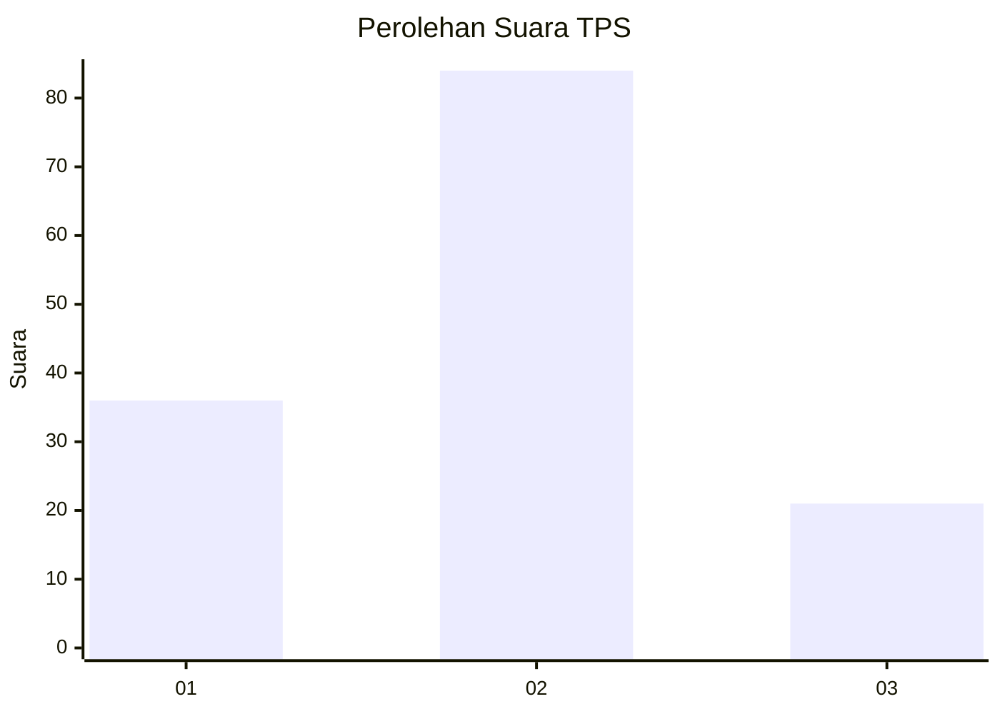
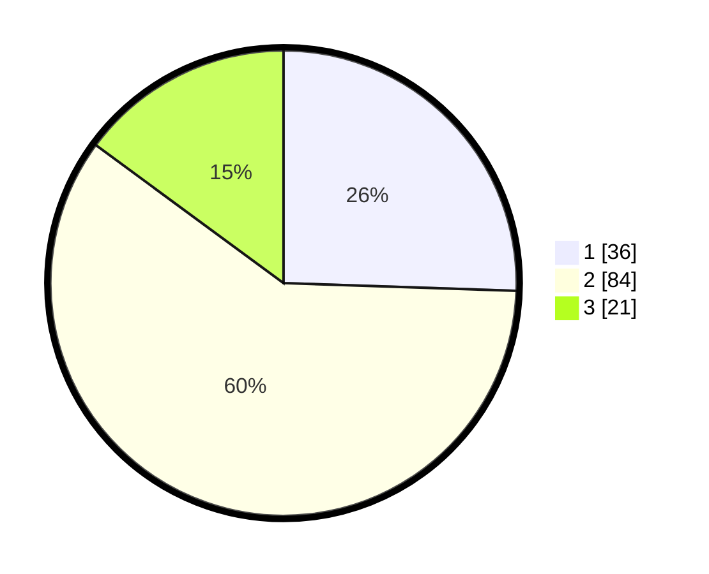

# Hasil

## Grafik

## Tabel

| No. | Nama Paslon    | Suara | Suara (raw) | Persentase |
|:--- |:-------------- | -----:| -----------:| ----------:|
| 1   | ANIES MUHAIMIN | 36    | [36][p-1]   | 25,53      |
| 2   | PRABOWO GIBRAN | 84    | [84][p-2]   | 59,57      |
| 3   | GANJAR MAHFUD  | 21    | [21][p-3]   | 14,89      |

[p-1]: https://github.com/gigit-pemilu/pemilu-2024-35-jawa-timur/blob/main/pilpres/hitung-suara/sub/35-jawa-timur/sub/73-kota-malang/sub/05-lowokwaru/sub/1006-ketawanggede/sub/015-tps/sub/paslon-1.txt
[p-2]: https://github.com/gigit-pemilu/pemilu-2024-35-jawa-timur/blob/main/pilpres/hitung-suara/sub/35-jawa-timur/sub/73-kota-malang/sub/05-lowokwaru/sub/1006-ketawanggede/sub/015-tps/sub/paslon-2.txt
[p-3]: https://github.com/gigit-pemilu/pemilu-2024-35-jawa-timur/blob/main/pilpres/hitung-suara/sub/35-jawa-timur/sub/73-kota-malang/sub/05-lowokwaru/sub/1006-ketawanggede/sub/015-tps/sub/paslon-3.txt

## Foto C Plano

https://sirekap-obj-formc.kpu.go.id/a5f3/pemilu/ppwp/35/73/05/10/06/3573051006015-20240214-141834--ea0d1ccd-bfd7-4d60-893a-8379aba69793.jpg

https://sirekap-obj-formc.kpu.go.id/a5f3/pemilu/ppwp/35/73/05/10/06/3573051006015-20240214-141912--376bd07d-04fa-49d7-ba39-461ea91a97f5.jpg

https://sirekap-obj-formc.kpu.go.id/a5f3/pemilu/ppwp/35/73/05/10/06/3573051006015-20240214-141656--1daaa223-cb3a-42f7-98c9-bac87858d7ff.jpg

## Metadata

| Key        | Value               |
| ---------- | ------------------- |
| Time Stamp | 2024-02-25 18:00:00 |

