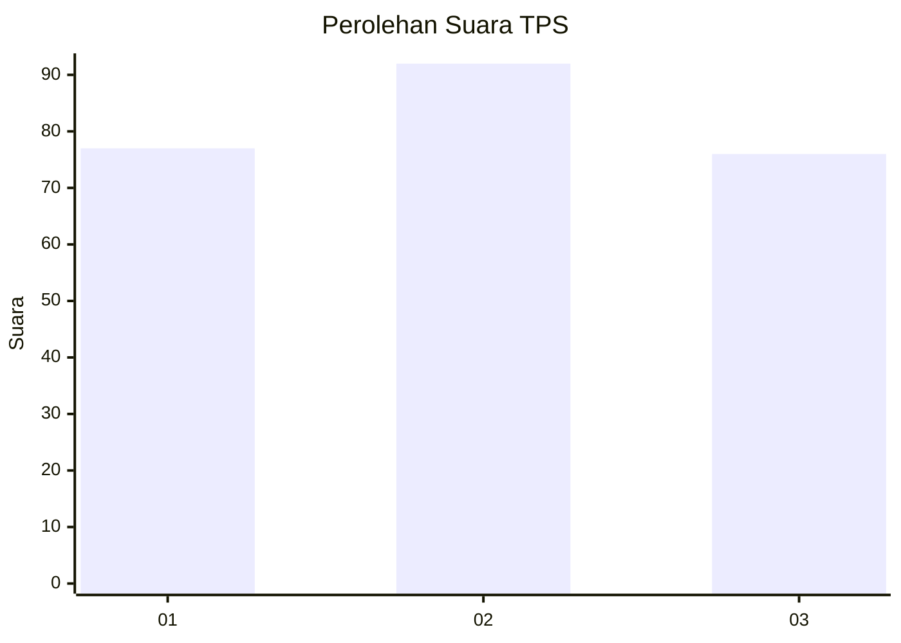
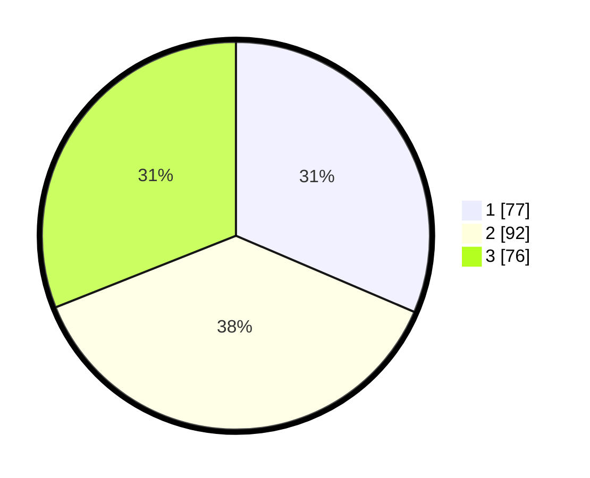

# Hasil

## Grafik

## Tabel

| No. | Nama Paslon    | Suara | Suara (raw) | Persentase |
|:--- |:-------------- | -----:| -----------:| ----------:|
| 1   | ANIES MUHAIMIN | 77    | [77][p-1]   | 31,43      |
| 2   | PRABOWO GIBRAN | 92    | [92][p-2]   | 37,55      |
| 3   | GANJAR MAHFUD  | 76    | [76][p-3]   | 31,02      |

[p-1]: https://github.com/gigit-pemilu/pemilu-2024-35-jawa-timur/blob/main/pilpres/hitung-suara/sub/35-jawa-timur/sub/73-kota-malang/sub/05-lowokwaru/sub/1007-jatimulyo/sub/004-tps/sub/paslon-1.txt
[p-2]: https://github.com/gigit-pemilu/pemilu-2024-35-jawa-timur/blob/main/pilpres/hitung-suara/sub/35-jawa-timur/sub/73-kota-malang/sub/05-lowokwaru/sub/1007-jatimulyo/sub/004-tps/sub/paslon-2.txt
[p-3]: https://github.com/gigit-pemilu/pemilu-2024-35-jawa-timur/blob/main/pilpres/hitung-suara/sub/35-jawa-timur/sub/73-kota-malang/sub/05-lowokwaru/sub/1007-jatimulyo/sub/004-tps/sub/paslon-3.txt

## Foto C Plano

https://sirekap-obj-formc.kpu.go.id/ebbb/pemilu/ppwp/35/73/05/10/07/3573051007004-20240215-085119--a8162634-02a0-4cca-9bd1-14ac5a321f09.jpg

https://sirekap-obj-formc.kpu.go.id/ebbb/pemilu/ppwp/35/73/05/10/07/3573051007004-20240215-092029--41565b6b-53fa-4632-b644-f386b16194bb.jpg

https://sirekap-obj-formc.kpu.go.id/ebbb/pemilu/ppwp/35/73/05/10/07/3573051007004-20240215-092036--3468f649-6582-401f-86c3-161467367d8b.jpg

## Metadata

| Key        | Value               |
| ---------- | ------------------- |
| Time Stamp | 2024-02-25 17:00:00 |

