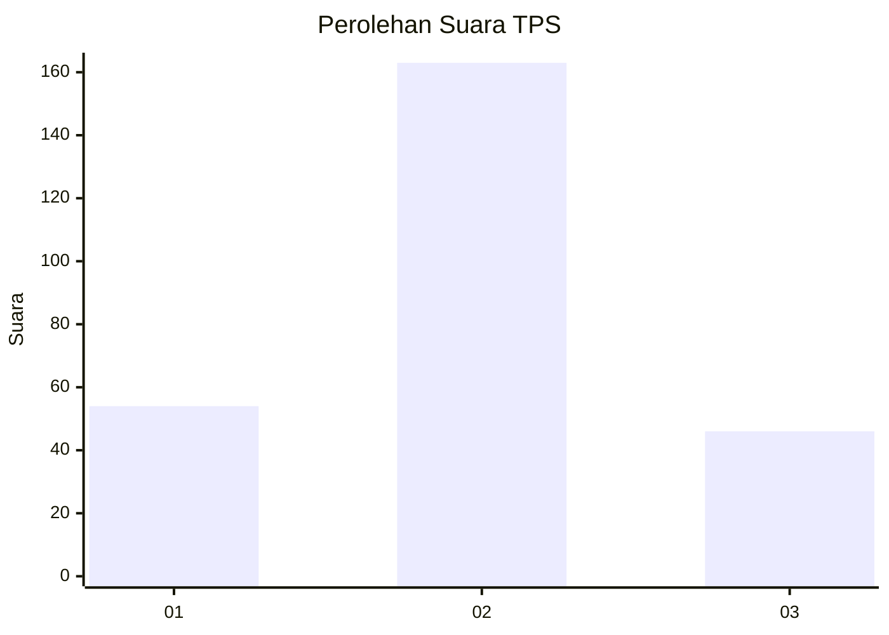

# Hasil

## Grafik

## Tabel

| No. | Nama Paslon    | Suara | Suara (raw) | Persentase |
|:--- |:-------------- | -----:| -----------:| ----------:|
| 1   | ANIES MUHAIMIN | 54    | [54][p-1]   | 20,53      |
| 2   | PRABOWO GIBRAN | 163   | [163][p-2]  | 61,98      |
| 3   | GANJAR MAHFUD  | 46    | [46][p-3]   | 17,49      |

[p-1]: https://github.com/gigit-pemilu/pemilu-2024-35-jawa-timur/blob/main/pilpres/hitung-suara/sub/35-jawa-timur/sub/73-kota-malang/sub/05-lowokwaru/sub/1007-jatimulyo/sub/014-tps/sub/paslon-1.txt
[p-2]: https://github.com/gigit-pemilu/pemilu-2024-35-jawa-timur/blob/main/pilpres/hitung-suara/sub/35-jawa-timur/sub/73-kota-malang/sub/05-lowokwaru/sub/1007-jatimulyo/sub/014-tps/sub/paslon-2.txt
[p-3]: https://github.com/gigit-pemilu/pemilu-2024-35-jawa-timur/blob/main/pilpres/hitung-suara/sub/35-jawa-timur/sub/73-kota-malang/sub/05-lowokwaru/sub/1007-jatimulyo/sub/014-tps/sub/paslon-3.txt

## Foto C Plano

https://sirekap-obj-formc.kpu.go.id/c9cb/pemilu/ppwp/35/73/05/10/07/3573051007014-20240215-104011--f23cd5b1-d8ab-4376-a857-1f380abf7072.jpg

https://sirekap-obj-formc.kpu.go.id/c9cb/pemilu/ppwp/35/73/05/10/07/3573051007014-20240215-104014--b161e3e9-2f1d-402b-8103-91dc0a31ecb6.jpg

https://sirekap-obj-formc.kpu.go.id/c9cb/pemilu/ppwp/35/73/05/10/07/3573051007014-20240215-104018--780379ac-d8f3-41f2-ab05-09f4b8c1d2b2.jpg

## Metadata

| Key        | Value               |
| ---------- | ------------------- |
| Time Stamp | 2024-02-25 16:00:00 |

