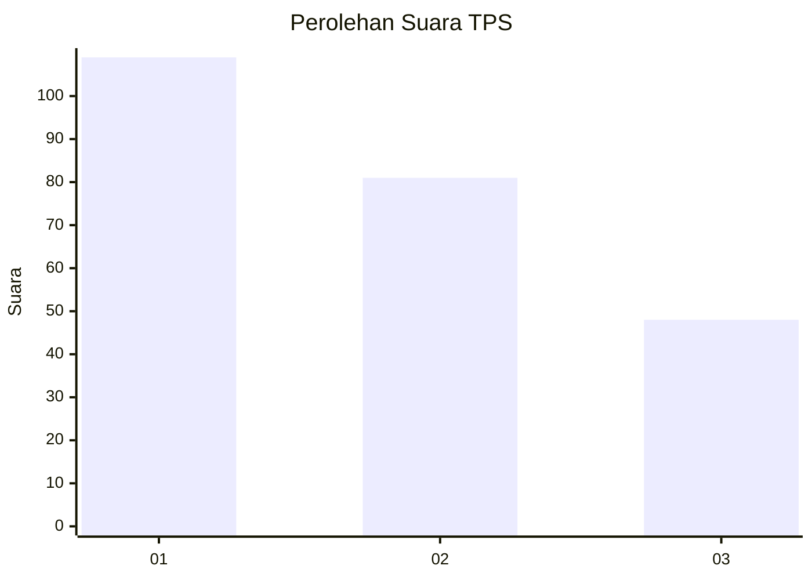
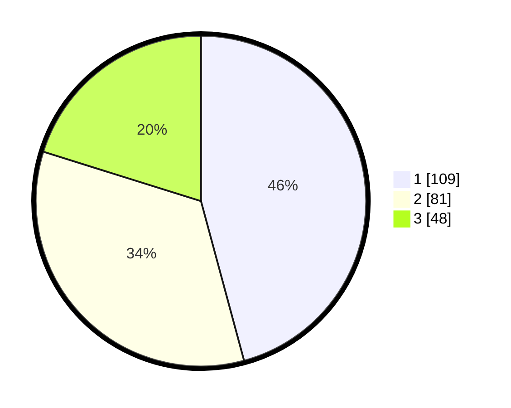

# Hasil

## Grafik

## Tabel

| No. | Nama Paslon    | Suara | Suara (raw) | Persentase |
|:--- |:-------------- | -----:| -----------:| ----------:|
| 1   | ANIES MUHAIMIN | 109   | [109][p-1]  | 45,80      |
| 2   | PRABOWO GIBRAN | 81    | [81][p-2]   | 34,03      |
| 3   | GANJAR MAHFUD  | 48    | [48][p-3]   | 20,17      |

[p-1]: https://github.com/gigit-pemilu/pemilu-2024-35-jawa-timur/blob/main/pilpres/hitung-suara/sub/35-jawa-timur/sub/73-kota-malang/sub/05-lowokwaru/sub/1007-jatimulyo/sub/028-tps/sub/paslon-1.txt
[p-2]: https://github.com/gigit-pemilu/pemilu-2024-35-jawa-timur/blob/main/pilpres/hitung-suara/sub/35-jawa-timur/sub/73-kota-malang/sub/05-lowokwaru/sub/1007-jatimulyo/sub/028-tps/sub/paslon-2.txt
[p-3]: https://github.com/gigit-pemilu/pemilu-2024-35-jawa-timur/blob/main/pilpres/hitung-suara/sub/35-jawa-timur/sub/73-kota-malang/sub/05-lowokwaru/sub/1007-jatimulyo/sub/028-tps/sub/paslon-3.txt

## Foto C Plano

https://sirekap-obj-formc.kpu.go.id/9bee/pemilu/ppwp/35/73/05/10/07/3573051007028-20240217-104514--d9383869-16a3-4e11-8f5b-b15ebaa04787.jpg

https://sirekap-obj-formc.kpu.go.id/9bee/pemilu/ppwp/35/73/05/10/07/3573051007028-20240217-105759--3b21d6c7-1233-4237-b7f7-364568b3fee0.jpg

https://sirekap-obj-formc.kpu.go.id/9bee/pemilu/ppwp/35/73/05/10/07/3573051007028-20240216-132729--199421b9-d432-4a3d-b9ea-e444a7e31ac8.jpg

## Metadata

| Key        | Value               |
| ---------- | ------------------- |
| Time Stamp | 2024-02-24 22:31:28 |

