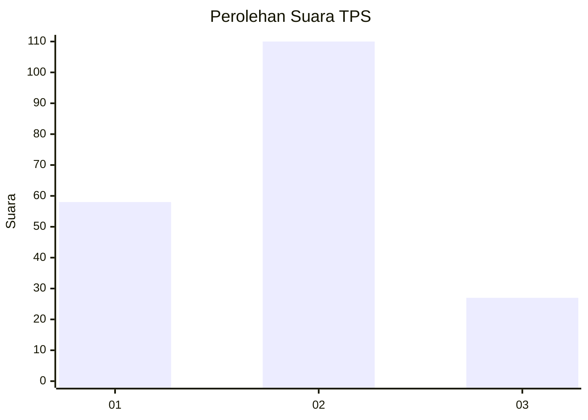
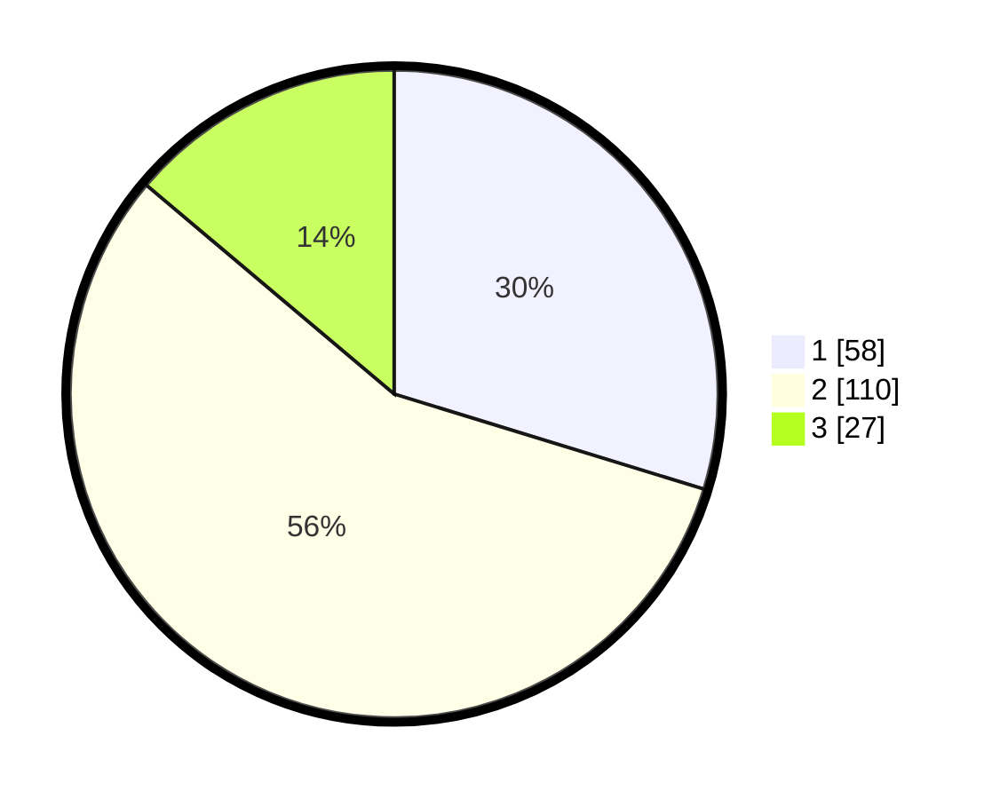

# Hasil

## Grafik

## Tabel

| No. | Nama Paslon    | Suara | Suara (raw) | Persentase |
|:--- |:-------------- | -----:| -----------:| ----------:|
| 1   | ANIES MUHAIMIN | 58    | [58][p-1]   | 29,74      |
| 2   | PRABOWO GIBRAN | 110   | [110][p-2]  | 56,41      |
| 3   | GANJAR MAHFUD  | 27    | [27][p-3]   | 13,85      |

[p-1]: https://github.com/gigit-pemilu/pemilu-2024/blob/main/pilpres/hitung-suara/sub/35-jawa-timur/sub/73-kota-malang/sub/05-lowokwaru/sub/1007-jatimulyo/sub/031-tps/sub/paslon-1.txt
[p-2]: https://github.com/gigit-pemilu/pemilu-2024/blob/main/pilpres/hitung-suara/sub/35-jawa-timur/sub/73-kota-malang/sub/05-lowokwaru/sub/1007-jatimulyo/sub/031-tps/sub/paslon-2.txt
[p-3]: https://github.com/gigit-pemilu/pemilu-2024/blob/main/pilpres/hitung-suara/sub/35-jawa-timur/sub/73-kota-malang/sub/05-lowokwaru/sub/1007-jatimulyo/sub/031-tps/sub/paslon-3.txt

## Foto C Plano

https://sirekap-obj-formc.kpu.go.id/e681/pemilu/ppwp/35/73/05/10/07/3573051007031-20240214-141211--f8cbc778-4014-4170-91aa-ffb64864941d.jpg

https://sirekap-obj-formc.kpu.go.id/e681/pemilu/ppwp/35/73/05/10/07/3573051007031-20240214-141214--32607b68-9537-49f4-90e4-1558f559b5b7.jpg

https://sirekap-obj-formc.kpu.go.id/e681/pemilu/ppwp/35/73/05/10/07/3573051007031-20240214-141343--a6d98675-eda9-4932-844e-721ce4008c21.jpg

## Metadata

| Key        | Value               |
| ---------- | ------------------- |
| Time Stamp | 2024-02-15 22:00:27 |

