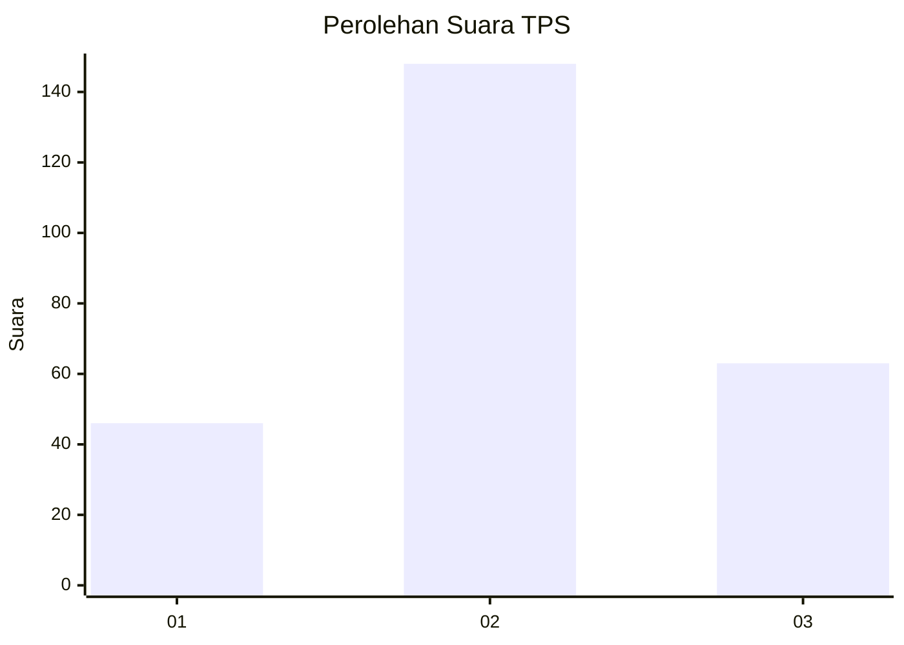
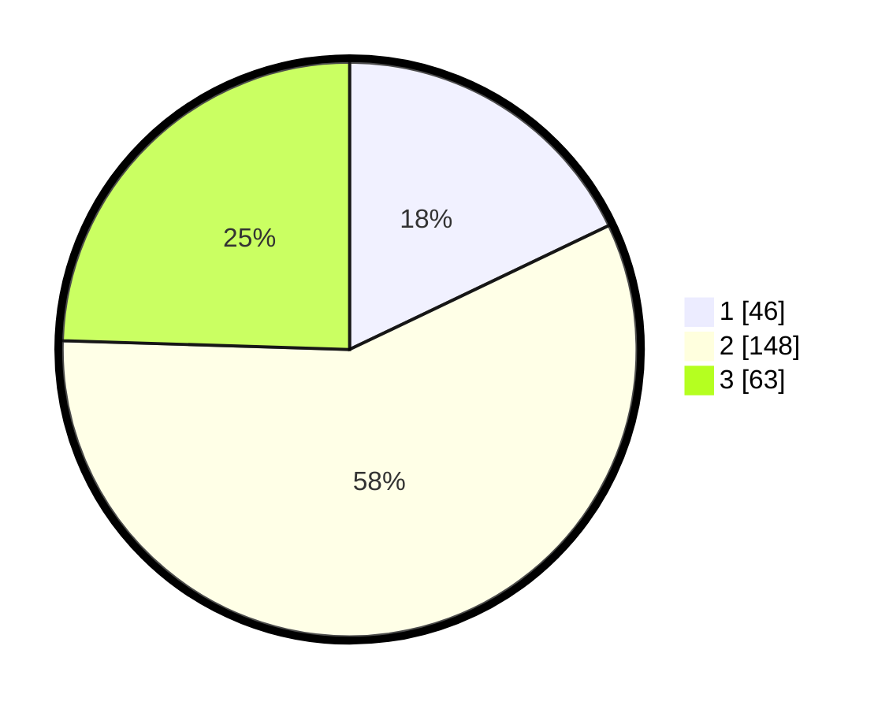

# Hasil

## Grafik

## Tabel

| No. | Nama Paslon    | Suara | Suara (raw) | Persentase |
|:--- |:-------------- | -----:| -----------:| ----------:|
| 1   | ANIES MUHAIMIN | 46    | [46][p-1]   | 17,90      |
| 2   | PRABOWO GIBRAN | 148   | [148][p-2]  | 57,59      |
| 3   | GANJAR MAHFUD  | 63    | [63][p-3]   | 24,51      |

[p-1]: https://github.com/gigit-pemilu/pemilu-2024-35-jawa-timur/blob/main/pilpres/hitung-suara/sub/35-jawa-timur/sub/73-kota-malang/sub/05-lowokwaru/sub/1007-jatimulyo/sub/039-tps/sub/paslon-1.txt
[p-2]: https://github.com/gigit-pemilu/pemilu-2024-35-jawa-timur/blob/main/pilpres/hitung-suara/sub/35-jawa-timur/sub/73-kota-malang/sub/05-lowokwaru/sub/1007-jatimulyo/sub/039-tps/sub/paslon-2.txt
[p-3]: https://github.com/gigit-pemilu/pemilu-2024-35-jawa-timur/blob/main/pilpres/hitung-suara/sub/35-jawa-timur/sub/73-kota-malang/sub/05-lowokwaru/sub/1007-jatimulyo/sub/039-tps/sub/paslon-3.txt

## Foto C Plano

https://sirekap-obj-formc.kpu.go.id/a826/pemilu/ppwp/35/73/05/10/07/3573051007039-20240214-224703--3d3dc1cf-9902-4258-8592-c34dcc490d0a.jpg

https://sirekap-obj-formc.kpu.go.id/a826/pemilu/ppwp/35/73/05/10/07/3573051007039-20240214-224625--55c26455-aa31-4ced-a057-9ba91abdc255.jpg

https://sirekap-obj-formc.kpu.go.id/a826/pemilu/ppwp/35/73/05/10/07/3573051007039-20240214-224519--0d639585-ec55-483f-88e6-f582d8e09f8c.jpg

## Metadata

| Key        | Value               |
| ---------- | ------------------- |
| Time Stamp | 2024-02-25 15:00:00 |

