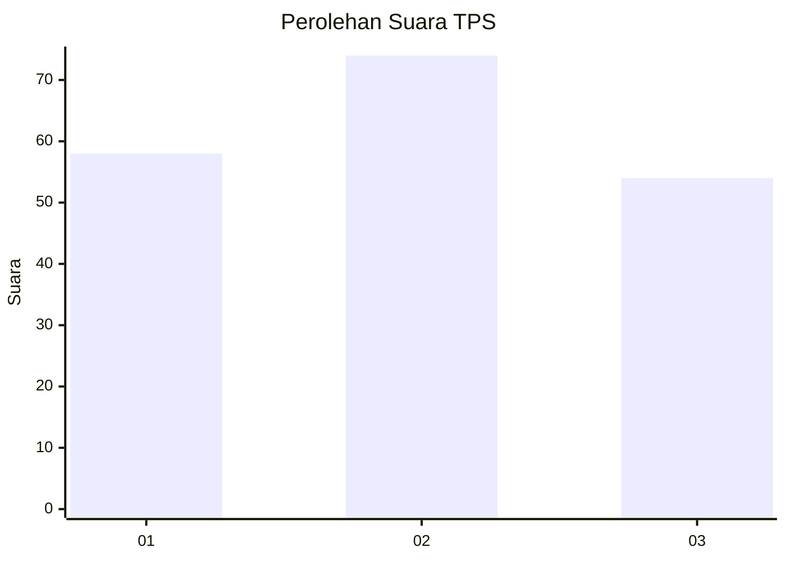
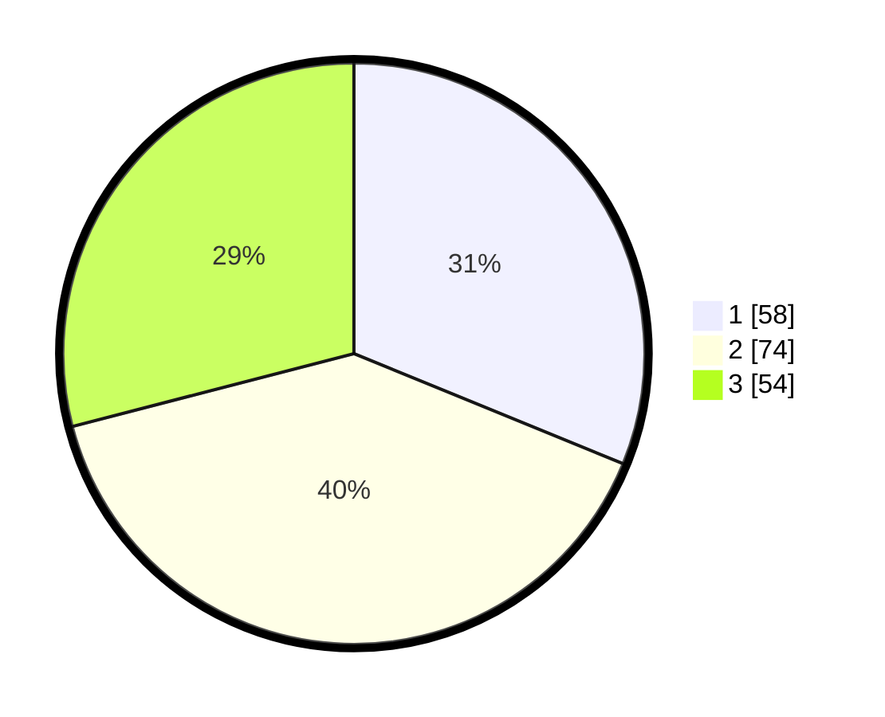

# Hasil

## Grafik

## Tabel

| No. | Nama Paslon    | Suara | Suara (raw) | Persentase |
|:--- |:-------------- | -----:| -----------:| ----------:|
| 1   | ANIES MUHAIMIN | 58    | [58][p-1]   | 31,18      |
| 2   | PRABOWO GIBRAN | 74    | [74][p-2]   | 39,78      |
| 3   | GANJAR MAHFUD  | 54    | [54][p-3]   | 29,03      |

[p-1]: https://github.com/gigit-pemilu/pemilu-2024-35-jawa-timur/blob/main/pilpres/hitung-suara/sub/35-jawa-timur/sub/73-kota-malang/sub/05-lowokwaru/sub/1007-jatimulyo/sub/051-tps/sub/paslon-1.txt
[p-2]: https://github.com/gigit-pemilu/pemilu-2024-35-jawa-timur/blob/main/pilpres/hitung-suara/sub/35-jawa-timur/sub/73-kota-malang/sub/05-lowokwaru/sub/1007-jatimulyo/sub/051-tps/sub/paslon-2.txt
[p-3]: https://github.com/gigit-pemilu/pemilu-2024-35-jawa-timur/blob/main/pilpres/hitung-suara/sub/35-jawa-timur/sub/73-kota-malang/sub/05-lowokwaru/sub/1007-jatimulyo/sub/051-tps/sub/paslon-3.txt

## Foto C Plano

https://sirekap-obj-formc.kpu.go.id/6900/pemilu/ppwp/35/73/05/10/07/3573051007051-20240217-194755--b284ddcb-a477-41fe-965f-c87f480ac08e.jpg

https://sirekap-obj-formc.kpu.go.id/6900/pemilu/ppwp/35/73/05/10/07/3573051007051-20240214-233622--9250d0fb-5ec7-49df-8795-ff8f34c968da.jpg

https://sirekap-obj-formc.kpu.go.id/6900/pemilu/ppwp/35/73/05/10/07/3573051007051-20240215-003716--562a7885-e3b9-420c-a836-09898c27eb3d.jpg

## Metadata

| Key        | Value               |
| ---------- | ------------------- |
| Time Stamp | 2024-02-24 22:31:28 |

