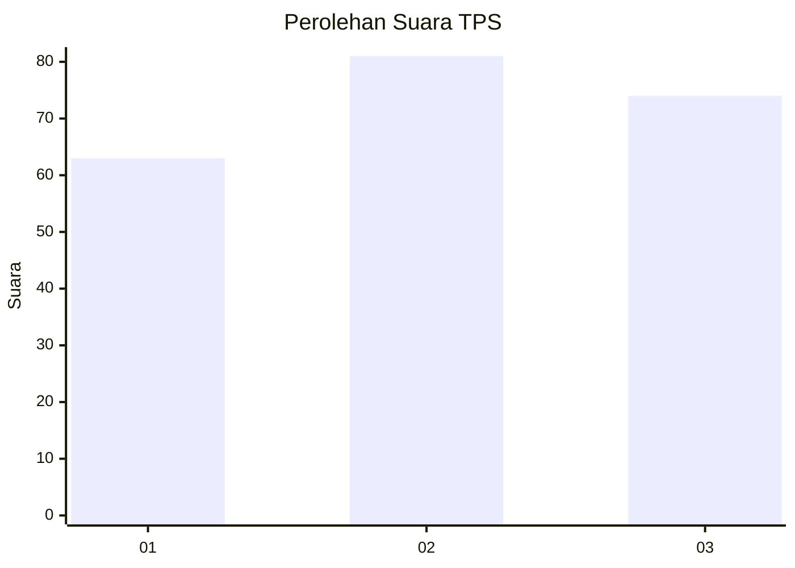
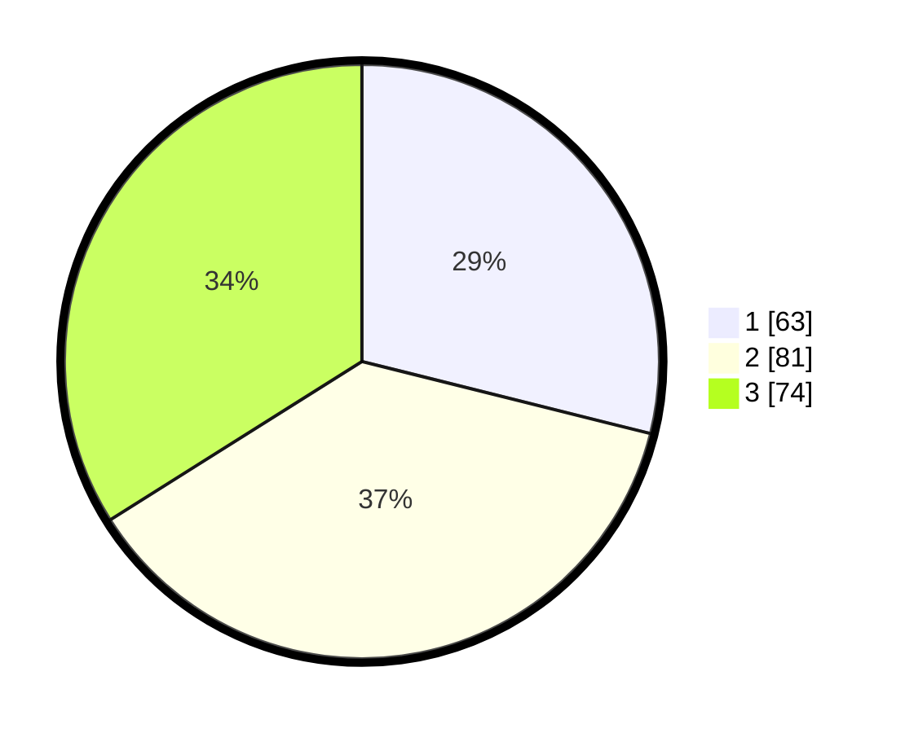

# Hasil

## Grafik

## Tabel

| No. | Nama Paslon    | Suara | Suara (raw) | Persentase |
|:--- |:-------------- | -----:| -----------:| ----------:|
| 1   | ANIES MUHAIMIN | 63    | [63][p-1]   | 28,90      |
| 2   | PRABOWO GIBRAN | 81    | [81][p-2]   | 37,16      |
| 3   | GANJAR MAHFUD  | 74    | [74][p-3]   | 33,94      |

[p-1]: https://github.com/gigit-pemilu/pemilu-2024-35-jawa-timur/blob/main/pilpres/hitung-suara/sub/35-jawa-timur/sub/73-kota-malang/sub/05-lowokwaru/sub/1007-jatimulyo/sub/052-tps/sub/paslon-1.txt
[p-2]: https://github.com/gigit-pemilu/pemilu-2024-35-jawa-timur/blob/main/pilpres/hitung-suara/sub/35-jawa-timur/sub/73-kota-malang/sub/05-lowokwaru/sub/1007-jatimulyo/sub/052-tps/sub/paslon-2.txt
[p-3]: https://github.com/gigit-pemilu/pemilu-2024-35-jawa-timur/blob/main/pilpres/hitung-suara/sub/35-jawa-timur/sub/73-kota-malang/sub/05-lowokwaru/sub/1007-jatimulyo/sub/052-tps/sub/paslon-3.txt

## Foto C Plano

https://sirekap-obj-formc.kpu.go.id/9079/pemilu/ppwp/35/73/05/10/07/3573051007052-20240215-003911--e977dd51-82b6-4863-b536-32dd7d5bda16.jpg

https://sirekap-obj-formc.kpu.go.id/9079/pemilu/ppwp/35/73/05/10/07/3573051007052-20240215-004023--e2b093c1-d327-4388-bd61-663d8ac32354.jpg

https://sirekap-obj-formc.kpu.go.id/9079/pemilu/ppwp/35/73/05/10/07/3573051007052-20240215-005234--49546e27-8889-4fa5-b129-aaa6eee0c938.jpg

## Metadata

| Key        | Value               |
| ---------- | ------------------- |
| Time Stamp | 2024-02-25 11:00:00 |

