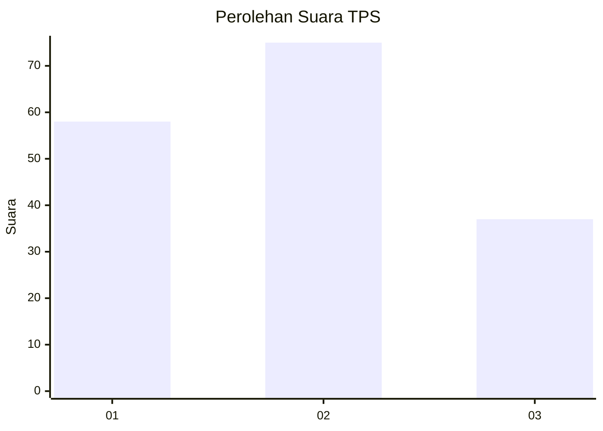
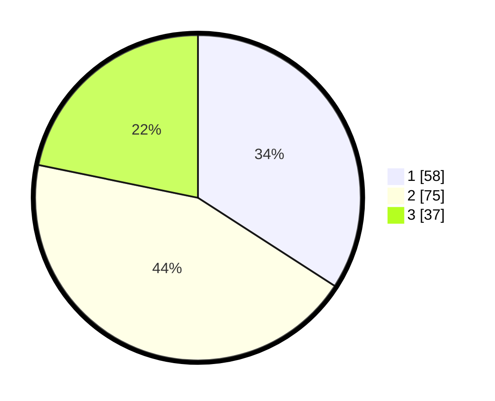

# Hasil

## Grafik

## Tabel

| No. | Nama Paslon    | Suara | Suara (raw) | Persentase |
|:--- |:-------------- | -----:| -----------:| ----------:|
| 1   | ANIES MUHAIMIN | 58    | [58][p-1]   | 34,12      |
| 2   | PRABOWO GIBRAN | 75    | [75][p-2]   | 44,12      |
| 3   | GANJAR MAHFUD  | 37    | [37][p-3]   | 21,76      |

[p-1]: https://github.com/gigit-pemilu/pemilu-2024/blob/main/pilpres/hitung-suara/sub/35-jawa-timur/sub/73-kota-malang/sub/05-lowokwaru/sub/1007-jatimulyo/sub/053-tps/sub/paslon-1.txt
[p-2]: https://github.com/gigit-pemilu/pemilu-2024/blob/main/pilpres/hitung-suara/sub/35-jawa-timur/sub/73-kota-malang/sub/05-lowokwaru/sub/1007-jatimulyo/sub/053-tps/sub/paslon-2.txt
[p-3]: https://github.com/gigit-pemilu/pemilu-2024/blob/main/pilpres/hitung-suara/sub/35-jawa-timur/sub/73-kota-malang/sub/05-lowokwaru/sub/1007-jatimulyo/sub/053-tps/sub/paslon-3.txt

## Foto C Plano

https://sirekap-obj-formc.kpu.go.id/0ac0/pemilu/ppwp/35/73/05/10/07/3573051007053-20240215-023339--76ee1f6e-a0ae-4025-8713-39572687a761.jpg

https://sirekap-obj-formc.kpu.go.id/0ac0/pemilu/ppwp/35/73/05/10/07/3573051007053-20240215-023710--a2c129e3-0ee8-4085-8765-7aca75b91aa4.jpg

https://sirekap-obj-formc.kpu.go.id/0ac0/pemilu/ppwp/35/73/05/10/07/3573051007053-20240215-023939--5772ba47-f1e9-4a95-bb7a-502e8870829d.jpg

## Metadata

| Key        | Value               |
| ---------- | ------------------- |
| Time Stamp | 2024-02-15 12:00:28 |

