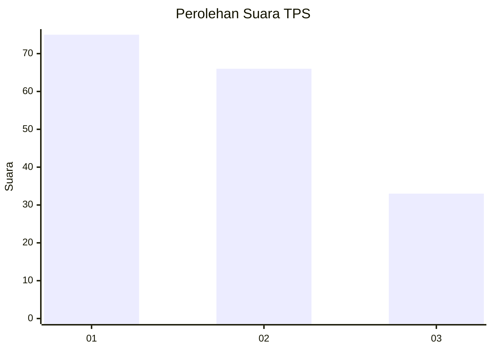
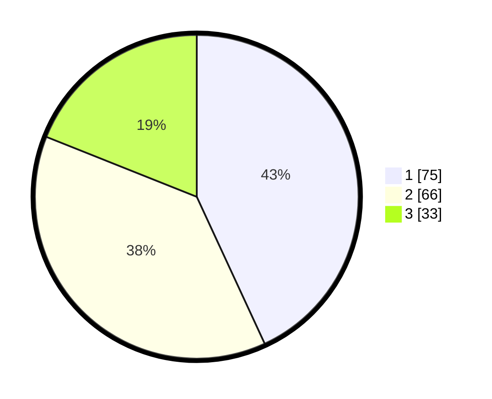

# Hasil

## Grafik

## Tabel

| No. | Nama Paslon    | Suara | Suara (raw) | Persentase |
|:--- |:-------------- | -----:| -----------:| ----------:|
| 1   | ANIES MUHAIMIN | 75    | [75][p-1]   | 43,10      |
| 2   | PRABOWO GIBRAN | 66    | [66][p-2]   | 37,93      |
| 3   | GANJAR MAHFUD  | 33    | [33][p-3]   | 18,97      |

[p-1]: https://github.com/gigit-pemilu/pemilu-2024-35-jawa-timur/blob/main/pilpres/hitung-suara/sub/35-jawa-timur/sub/73-kota-malang/sub/05-lowokwaru/sub/1008-tunjungsekar/sub/023-tps/sub/paslon-1.txt
[p-2]: https://github.com/gigit-pemilu/pemilu-2024-35-jawa-timur/blob/main/pilpres/hitung-suara/sub/35-jawa-timur/sub/73-kota-malang/sub/05-lowokwaru/sub/1008-tunjungsekar/sub/023-tps/sub/paslon-2.txt
[p-3]: https://github.com/gigit-pemilu/pemilu-2024-35-jawa-timur/blob/main/pilpres/hitung-suara/sub/35-jawa-timur/sub/73-kota-malang/sub/05-lowokwaru/sub/1008-tunjungsekar/sub/023-tps/sub/paslon-3.txt

## Foto C Plano

https://sirekap-obj-formc.kpu.go.id/60e2/pemilu/ppwp/35/73/05/10/08/3573051008023-20240215-021647--5003dfc6-3ee8-4952-babb-adb3547b5d2e.jpg

https://sirekap-obj-formc.kpu.go.id/60e2/pemilu/ppwp/35/73/05/10/08/3573051008023-20240214-155245--f69d9a82-9202-44f4-ba77-45c79437769f.jpg

https://sirekap-obj-formc.kpu.go.id/60e2/pemilu/ppwp/35/73/05/10/08/3573051008023-20240214-155854--e68de3cd-099c-49fc-9323-0cd9b36e6bac.jpg

## Metadata

| Key        | Value               |
| ---------- | ------------------- |
| Time Stamp | 2024-02-15 19:30:26 |

