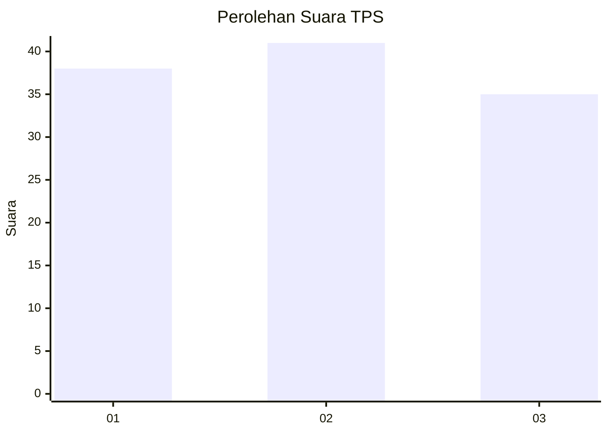
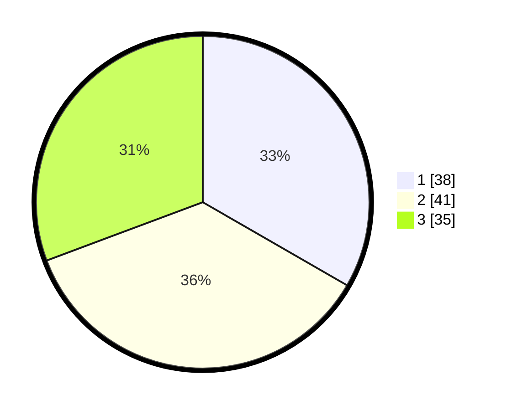

# Hasil

## Grafik

## Tabel

| No. | Nama Paslon    | Suara | Suara (raw) | Persentase |
|:--- |:-------------- | -----:| -----------:| ----------:|
| 1   | ANIES MUHAIMIN | 38    | [38][p-1]   | 33,33      |
| 2   | PRABOWO GIBRAN | 41    | [41][p-2]   | 35,96      |
| 3   | GANJAR MAHFUD  | 35    | [35][p-3]   | 30,70      |

[p-1]: https://github.com/gigit-pemilu/pemilu-2024/blob/main/pilpres/hitung-suara/sub/35-jawa-timur/sub/73-kota-malang/sub/05-lowokwaru/sub/1008-tunjungsekar/sub/041-tps/sub/paslon-1.txt
[p-2]: https://github.com/gigit-pemilu/pemilu-2024/blob/main/pilpres/hitung-suara/sub/35-jawa-timur/sub/73-kota-malang/sub/05-lowokwaru/sub/1008-tunjungsekar/sub/041-tps/sub/paslon-2.txt
[p-3]: https://github.com/gigit-pemilu/pemilu-2024/blob/main/pilpres/hitung-suara/sub/35-jawa-timur/sub/73-kota-malang/sub/05-lowokwaru/sub/1008-tunjungsekar/sub/041-tps/sub/paslon-3.txt

## Foto C Plano

https://sirekap-obj-formc.kpu.go.id/747b/pemilu/ppwp/35/73/05/10/08/3573051008041-20240216-095139--d07d3d2f-d985-4123-a170-ca2fa5b61bbe.jpg

https://sirekap-obj-formc.kpu.go.id/747b/pemilu/ppwp/35/73/05/10/08/3573051008041-20240216-095316--6d63ae58-f879-4614-bd7d-4e4615bc5022.jpg

https://sirekap-obj-formc.kpu.go.id/747b/pemilu/ppwp/35/73/05/10/08/3573051008041-20240216-095440--c09baed7-e3d7-417a-9330-6c5e50568095.jpg

## Metadata

| Key        | Value               |
| ---------- | ------------------- |
| Time Stamp | 2024-02-24 22:31:28 |

