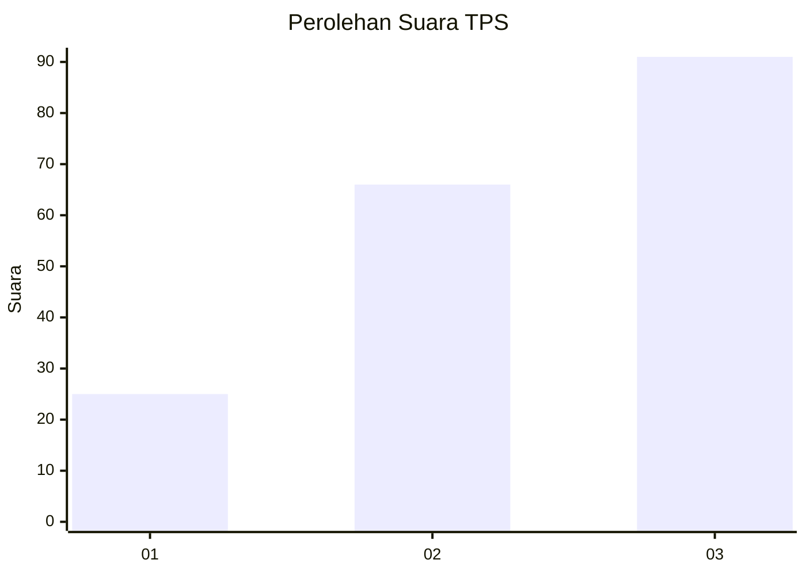
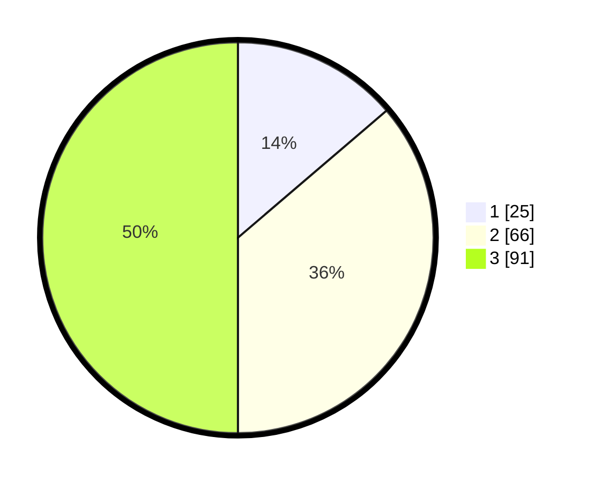

# Hasil

## Grafik

## Tabel

| No. | Nama Paslon    | Suara | Suara (raw) | Persentase |
|:--- |:-------------- | -----:| -----------:| ----------:|
| 1   | ANIES MUHAIMIN | 25    | [25][p-1]   | 13,74      |
| 2   | PRABOWO GIBRAN | 66    | [66][p-2]   | 36,26      |
| 3   | GANJAR MAHFUD  | 91    | [91][p-3]   | 50,00      |

[p-1]: https://github.com/gigit-pemilu/pemilu-2024-35-jawa-timur/blob/main/pilpres/hitung-suara/sub/35-jawa-timur/sub/73-kota-malang/sub/05-lowokwaru/sub/1008-tunjungsekar/sub/048-tps/sub/paslon-1.txt
[p-2]: https://github.com/gigit-pemilu/pemilu-2024-35-jawa-timur/blob/main/pilpres/hitung-suara/sub/35-jawa-timur/sub/73-kota-malang/sub/05-lowokwaru/sub/1008-tunjungsekar/sub/048-tps/sub/paslon-2.txt
[p-3]: https://github.com/gigit-pemilu/pemilu-2024-35-jawa-timur/blob/main/pilpres/hitung-suara/sub/35-jawa-timur/sub/73-kota-malang/sub/05-lowokwaru/sub/1008-tunjungsekar/sub/048-tps/sub/paslon-3.txt

## Foto C Plano

https://sirekap-obj-formc.kpu.go.id/f7c0/pemilu/ppwp/35/73/05/10/08/3573051008048-20240214-210444--5036cac5-9fec-48bc-bef0-6e4fde3e775a.jpg

https://sirekap-obj-formc.kpu.go.id/f7c0/pemilu/ppwp/35/73/05/10/08/3573051008048-20240214-211001--31acd42e-172c-4aea-adca-f3fea6d18093.jpg

https://sirekap-obj-formc.kpu.go.id/f7c0/pemilu/ppwp/35/73/05/10/08/3573051008048-20240214-210652--d969754b-76bd-4419-b217-5fcdbb9c7e44.jpg

## Metadata

| Key        | Value               |
| ---------- | ------------------- |
| Time Stamp | 2024-02-15 00:41:44 |

