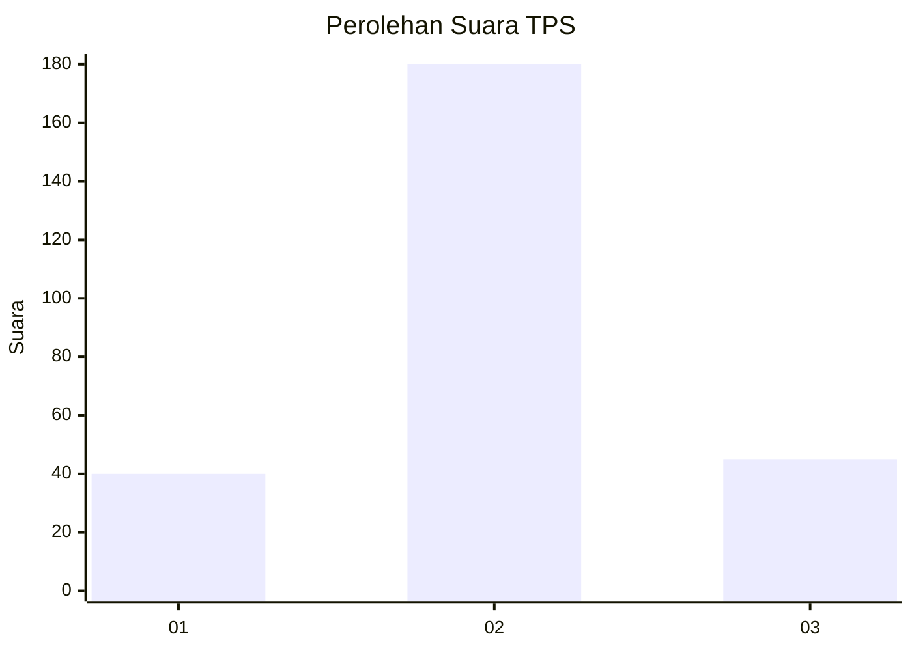
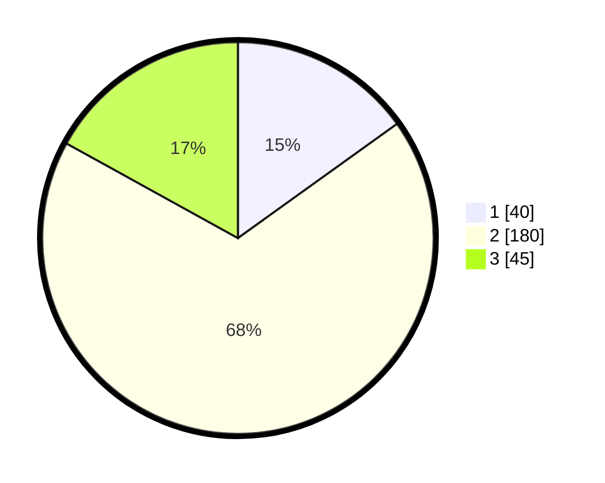

# Hasil

## Grafik

## Tabel

| No. | Nama Paslon    | Suara | Suara (raw) | Persentase |
|:--- |:-------------- | -----:| -----------:| ----------:|
| 1   | ANIES MUHAIMIN | 40    | [40][p-1]   | 15,09      |
| 2   | PRABOWO GIBRAN | 180   | [180][p-2]  | 67,92      |
| 3   | GANJAR MAHFUD  | 45    | [45][p-3]   | 16,98      |

[p-1]: https://github.com/gigit-pemilu/pemilu-2024/blob/main/pilpres/hitung-suara/sub/35-jawa-timur/sub/73-kota-malang/sub/05-lowokwaru/sub/1009-mojolangu/sub/026-tps/sub/paslon-1.txt
[p-2]: https://github.com/gigit-pemilu/pemilu-2024/blob/main/pilpres/hitung-suara/sub/35-jawa-timur/sub/73-kota-malang/sub/05-lowokwaru/sub/1009-mojolangu/sub/026-tps/sub/paslon-2.txt
[p-3]: https://github.com/gigit-pemilu/pemilu-2024/blob/main/pilpres/hitung-suara/sub/35-jawa-timur/sub/73-kota-malang/sub/05-lowokwaru/sub/1009-mojolangu/sub/026-tps/sub/paslon-3.txt

## Foto C Plano

https://sirekap-obj-formc.kpu.go.id/ab10/pemilu/ppwp/35/73/05/10/09/3573051009026-20240214-202042--778df731-8beb-46f0-83d1-b21a71dc58e7.jpg

https://sirekap-obj-formc.kpu.go.id/ab10/pemilu/ppwp/35/73/05/10/09/3573051009026-20240215-220726--9301ac19-bf21-4181-8cc7-7e3201f09f12.jpg

https://sirekap-obj-formc.kpu.go.id/ab10/pemilu/ppwp/35/73/05/10/09/3573051009026-20240215-190119--1bb7582b-1f75-41e0-a102-8d79c1f7f15b.jpg

## Metadata

| Key        | Value               |
| ---------- | ------------------- |
| Time Stamp | 2024-02-15 22:30:27 |

