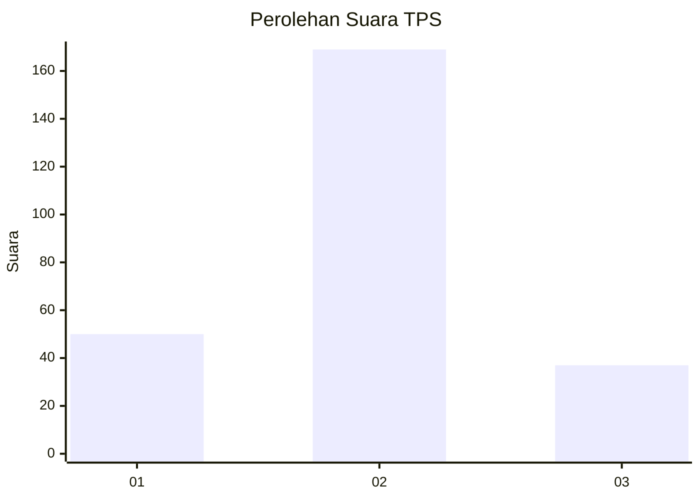
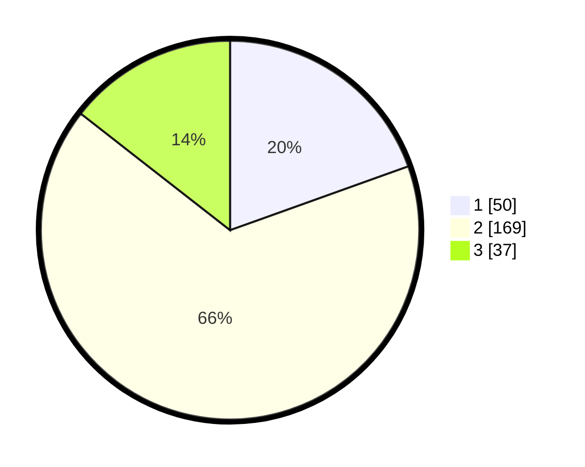

# Hasil

## Grafik

## Tabel

| No. | Nama Paslon    | Suara | Suara (raw) | Persentase |
|:--- |:-------------- | -----:| -----------:| ----------:|
| 1   | ANIES MUHAIMIN | 50    | [50][p-1]   | 19,53      |
| 2   | PRABOWO GIBRAN | 169   | [169][p-2]  | 66,02      |
| 3   | GANJAR MAHFUD  | 37    | [37][p-3]   | 14,45      |

[p-1]: https://github.com/gigit-pemilu/pemilu-2024-35-jawa-timur/blob/main/pilpres/hitung-suara/sub/35-jawa-timur/sub/73-kota-malang/sub/05-lowokwaru/sub/1009-mojolangu/sub/034-tps/sub/paslon-1.txt
[p-2]: https://github.com/gigit-pemilu/pemilu-2024-35-jawa-timur/blob/main/pilpres/hitung-suara/sub/35-jawa-timur/sub/73-kota-malang/sub/05-lowokwaru/sub/1009-mojolangu/sub/034-tps/sub/paslon-2.txt
[p-3]: https://github.com/gigit-pemilu/pemilu-2024-35-jawa-timur/blob/main/pilpres/hitung-suara/sub/35-jawa-timur/sub/73-kota-malang/sub/05-lowokwaru/sub/1009-mojolangu/sub/034-tps/sub/paslon-3.txt

## Foto C Plano

https://sirekap-obj-formc.kpu.go.id/86b5/pemilu/ppwp/35/73/05/10/09/3573051009034-20240214-202743--b317bf3e-3fc1-445c-bbed-e805c736499a.jpg

https://sirekap-obj-formc.kpu.go.id/86b5/pemilu/ppwp/35/73/05/10/09/3573051009034-20240214-202818--ed043eb6-0bf1-4423-8630-d0b7b43c0b78.jpg

https://sirekap-obj-formc.kpu.go.id/86b5/pemilu/ppwp/35/73/05/10/09/3573051009034-20240214-202828--596049ed-ca8b-491f-a46b-c4634cdd424d.jpg

## Metadata

| Key        | Value               |
| ---------- | ------------------- |
| Time Stamp | 2024-02-15 00:41:44 |

