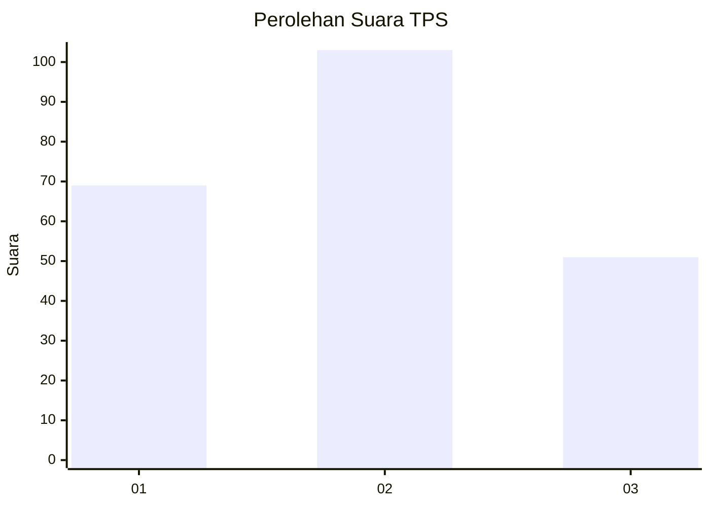
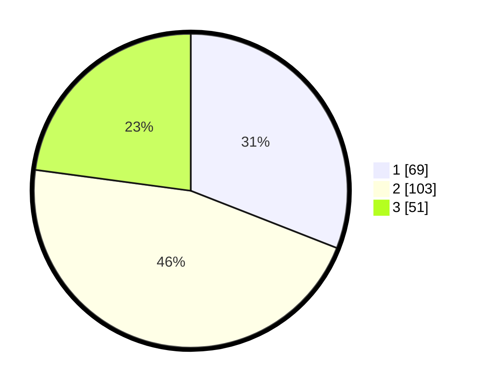

# Hasil

## Grafik

## Tabel

| No. | Nama Paslon    | Suara | Suara (raw) | Persentase |
|:--- |:-------------- | -----:| -----------:| ----------:|
| 1   | ANIES MUHAIMIN | 69    | [69][p-1]   | 30,94      |
| 2   | PRABOWO GIBRAN | 103   | [103][p-2]  | 46,19      |
| 3   | GANJAR MAHFUD  | 51    | [51][p-3]   | 22,87      |

[p-1]: https://github.com/gigit-pemilu/pemilu-2024/blob/main/pilpres/hitung-suara/sub/35-jawa-timur/sub/73-kota-malang/sub/05-lowokwaru/sub/1009-mojolangu/sub/035-tps/sub/paslon-1.txt
[p-2]: https://github.com/gigit-pemilu/pemilu-2024/blob/main/pilpres/hitung-suara/sub/35-jawa-timur/sub/73-kota-malang/sub/05-lowokwaru/sub/1009-mojolangu/sub/035-tps/sub/paslon-2.txt
[p-3]: https://github.com/gigit-pemilu/pemilu-2024/blob/main/pilpres/hitung-suara/sub/35-jawa-timur/sub/73-kota-malang/sub/05-lowokwaru/sub/1009-mojolangu/sub/035-tps/sub/paslon-3.txt

## Foto C Plano

https://sirekap-obj-formc.kpu.go.id/c1a3/pemilu/ppwp/35/73/05/10/09/3573051009035-20240218-134300--bb4f3fc4-857b-4ae2-8037-1d45d0c400dd.jpg

https://sirekap-obj-formc.kpu.go.id/c1a3/pemilu/ppwp/35/73/05/10/09/3573051009035-20240218-134318--b0bac905-df45-4342-bd91-12efa9dc8d73.jpg

https://sirekap-obj-formc.kpu.go.id/c1a3/pemilu/ppwp/35/73/05/10/09/3573051009035-20240218-134332--ab7b27cc-d515-41cc-b9b9-43b8162b0ec4.jpg

## Metadata

| Key        | Value               |
| ---------- | ------------------- |
| Time Stamp | 2024-02-25 16:00:00 |

