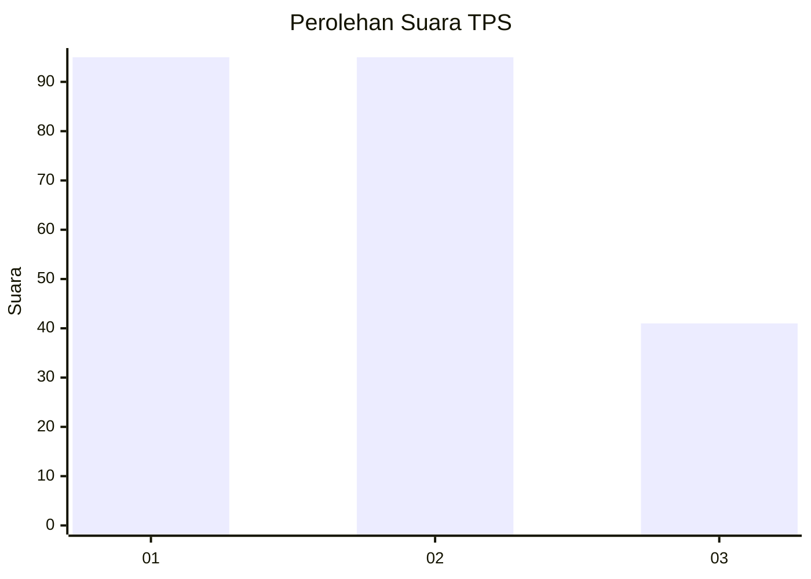
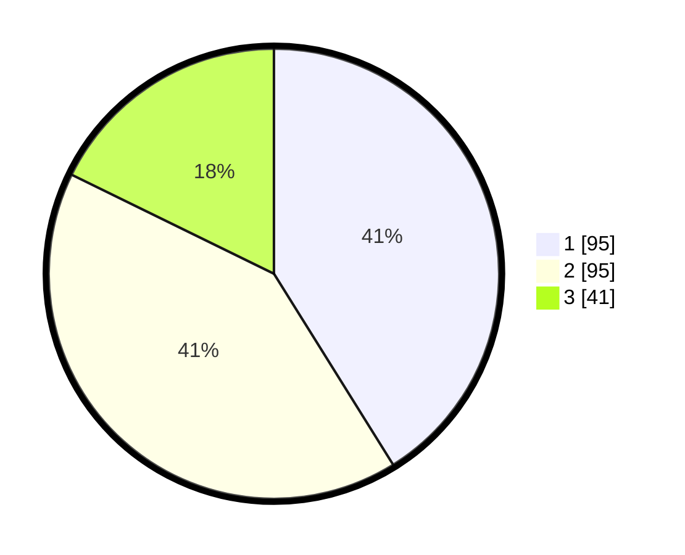

# Hasil

## Grafik

## Tabel

| No. | Nama Paslon    | Suara | Suara (raw) | Persentase |
|:--- |:-------------- | -----:| -----------:| ----------:|
| 1   | ANIES MUHAIMIN | 95    | [95][p-1]   | 41,13      |
| 2   | PRABOWO GIBRAN | 95    | [95][p-2]   | 41,13      |
| 3   | GANJAR MAHFUD  | 41    | [41][p-3]   | 17,75      |

[p-1]: https://github.com/gigit-pemilu/pemilu-2024-35-jawa-timur/blob/main/pilpres/hitung-suara/sub/35-jawa-timur/sub/73-kota-malang/sub/05-lowokwaru/sub/1009-mojolangu/sub/045-tps/sub/paslon-1.txt
[p-2]: https://github.com/gigit-pemilu/pemilu-2024-35-jawa-timur/blob/main/pilpres/hitung-suara/sub/35-jawa-timur/sub/73-kota-malang/sub/05-lowokwaru/sub/1009-mojolangu/sub/045-tps/sub/paslon-2.txt
[p-3]: https://github.com/gigit-pemilu/pemilu-2024-35-jawa-timur/blob/main/pilpres/hitung-suara/sub/35-jawa-timur/sub/73-kota-malang/sub/05-lowokwaru/sub/1009-mojolangu/sub/045-tps/sub/paslon-3.txt

## Foto C Plano

https://sirekap-obj-formc.kpu.go.id/1aa9/pemilu/ppwp/35/73/05/10/09/3573051009045-20240214-155043--fe4a40f7-c251-4d62-8316-b61885e17028.jpg

https://sirekap-obj-formc.kpu.go.id/1aa9/pemilu/ppwp/35/73/05/10/09/3573051009045-20240214-155512--8a2db4c6-38e9-4420-9c6c-1cbba7eb216e.jpg

https://sirekap-obj-formc.kpu.go.id/1aa9/pemilu/ppwp/35/73/05/10/09/3573051009045-20240214-155345--26bd922d-2428-4cbf-857e-54cb9f1b1505.jpg

## Metadata

| Key        | Value               |
| ---------- | ------------------- |
| Time Stamp | 2024-02-24 22:31:28 |

